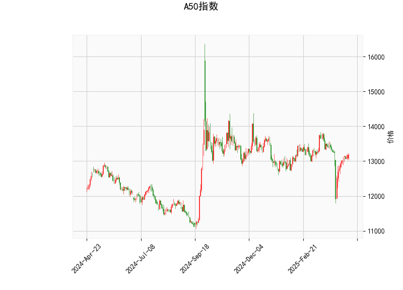

### A50指数技术分析解读

#### 1. 技术指标分析
- **当前价与布林轨道**：当前价13185略低于布林线中轨（13206.29），表明价格处于中性区域，但靠近中轨可能暗示短期方向选择。布林带收窄（上下轨间距约1200点）显示市场波动性较低，未来可能出现突破行情。
- **RSI（52.19）**：处于50中轴附近，表明多空力量暂时平衡，未进入超买或超卖区间，但需警惕趋势反转信号。
- **MACD指标**：MACD线（-37.49）上穿信号线（-77.17），且柱状图（39.68）显著扩大为正值，形成“金叉”，暗示短期反弹动能增强。
- **K线形态**：
  - **CDLGAPSIDESIDEWHITE**（并列阳线）：通常出现在趋势延续阶段，需结合位置判断。当前处于中轨附近，可能预示震荡后选择方向。
  - **CDLLONGLINE**（长影线十字星）：反映多空博弈激烈，若出现在支撑位附近可能暗示反转，但需后续K线确认。

#### 2. 投资机会与策略
**短期机会**：
- **反弹策略**：MACD金叉叠加价格接近中轨，若价格站稳中轨（13206）上方，可轻仓试多，目标看向布林上轨（13807），止损设于中轨下方1-2%。
- **波段套利**：若价格突破中轨后回踩确认支撑，可分批加仓；若未能突破则反向操作（下破中轨后做空）。

**风险提示**：
- MACD仍处于负值区，表明长期空头趋势未改，反弹可能为短期修正。
- 布林带收窄后若突破失败，可能回归区间震荡，需警惕假突破。

**中长期观察**：
- 若价格站稳中轨且MACD持续走强，可能开启上行趋势，可逐步布局多单。
- 若跌破布林下轨（12604），需警惕加速下跌风险。

#### 总结
当前市场处于关键转折点，MACD金叉与价格中轨共振提供短期做多窗口，但需结合量能及后续K线形态确认。建议轻仓参与反弹，严格止损，并关注宏观经济数据对趋势的强化作用。