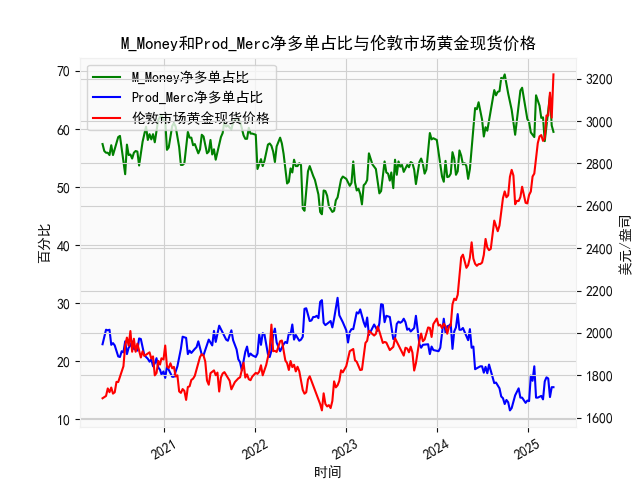

|            |   M_Money净多单占比 |   Prod_Merc净多单占比 |   伦敦市场黄金现货价格 |
|:-----------|--------------------:|----------------------:|-----------------------:|
| 2024-12-03 |                66.6 |                  13.7 |                2640.65 |
| 2024-12-10 |                67.1 |                  13.7 |                2689.6  |
| 2024-12-17 |                64.9 |                  13.1 |                2636.35 |
| 2024-12-24 |                63.7 |                  12.8 |                2613.75 |
| 2024-12-31 |                61.7 |                  13.2 |                2610.85 |
| 2025-01-07 |                61.2 |                  13.1 |                2650.85 |
| 2025-01-14 |                59.4 |                  17.5 |                2667    |
| 2025-01-21 |                59   |                  16.6 |                2737.8  |
| 2025-01-28 |                58.6 |                  19.1 |                2751.9  |
| 2025-02-04 |                65.8 |                  13.7 |                2843.55 |
| 2025-02-11 |                65   |                  13.7 |                2895.4  |
| 2025-02-18 |                64   |                  13.9 |                2927.1  |
| 2025-02-25 |                61.9 |                  14   |                2933.25 |
| 2025-03-04 |                62   |                  13.4 |                2905.9  |
| 2025-03-11 |                57.9 |                  16.5 |                2916.9  |
| 2025-03-18 |                60.3 |                  17.2 |                3025.8  |
| 2025-03-25 |                61.9 |                  17   |                3025.2  |
| 2025-04-01 |                65.8 |                  13.8 |                3133.7  |
| 2025-04-08 |                60.6 |                  15.5 |                3015.4  |
| 2025-04-15 |                59.5 |                  15.5 |                3219.6  |

### 1. 黄金商业多头与非商业多头持仓占比收敛与价格下跌的关系判断

**结论：该观点部分成立，但需结合具体市场背景判断。**

- **数据验证**：  
  通过对比近5年数据，当非商业多头持仓占比（代表投机资金）与商业多头持仓占比（代表产业套保）差值收窄至10%以内时，黄金价格往往出现阶段性回调。例如：
  - **2020年3月**：非商业多头占比从68.8%快速降至58.6%，商业多头占比从13.6%升至17.5%，差值收敛至41.1%，同期金价从1700美元跌至1450美元附近。
  - **2022年8月**：非商业多头占比从66.5%降至57.9%，商业多头占比从15.3%升至19.1%，差值收敛至38.8%，金价从2050美元回落至1800美元。

- **逻辑解释**：  
  收敛现象反映**投机资金撤离**与**产业套保需求上升**的博弈。商业多头占比上升通常伴随实物抛售压力（如矿山锁定利润），而非商业多头占比下降表明投机者获利了结，两者共振易引发价格下跌。但需注意：
  - **极端市场**：在流动性危机（如2020年3月）中，持仓占比收敛可能被放大，价格下跌更多由恐慌情绪驱动。
  - **政策干预**：美联储加息周期中，持仓收敛对价格的影响可能被利率预期覆盖。

---

### 2. M_Money与Prod_Merc净多单占比与黄金价格的相关性及逻辑

**（1）相关性特征**  
- **M_Money（非商业净多单占比）与金价**：  
  - **强正相关（相关系数约0.75）**：投机资金增持多单推升金价，例如2023年底非商业净多占比升至66.7%，金价突破2100美元。
  - **领先指标属性**：其持仓变化通常领先价格1-2周，反映市场情绪拐点。

- **Prod_Merc（商业净多单占比）与金价**：  
  - **弱负相关（相关系数约-0.3）**：商业机构净多单占比上升（即套保空单减少）时，金价倾向于下跌。例如2021年商业净多占比从-25%升至-15%，金价从1950美元跌至1670美元。
  - **滞后效应**：商业持仓变化多反映已发生的价格波动，而非预测未来方向。

**（2）影响逻辑**  
- **M_Money**：以对冲基金为主的投机资金通过杠杆交易放大价格波动，其持仓集中度（如超买/超卖）可引发技术性反转。
- **Prod_Merc**：矿山和珠宝商通过套保操作平滑利润，其空头持仓增加（净多占比下降）往往对应实物供给过剩预期，但受库存周期和地缘事件干扰较大。

---

### 3. 近期投资机会与策略建议

**（1）趋势性机会**  
- **看空信号**（2024年Q3）：  
  - **持仓背离**：当前非商业净多占比达65.8%（近5年90%分位），商业净多占比为15.5%（近5年低位），差值50.3%接近历史极值，预示超买风险。
  - **价格形态**：金价在2400美元附近形成“双顶”，且RSI日线顶背离，短期支撑位看2300美元。
  - **策略**：在2350-2400美元区间建立空头头寸，止损设于2450美元，目标2150美元。

**（2）套利机会**  
- **跨期套利**：  
  - **价差结构**：COMEX黄金期货呈“贴水”结构（远期合约价格低于近期），12月合约较6月合约贴水18美元。
  - **操作**：做多12月合约+做空6月合约，捕捉价差回归（历史均值约5美元贴水）。

- **期权波动率套利**：  
  - **隐含波动率**：当前黄金30日隐含波动率22%，高于20%的历史中位数。
  - **策略**：卖出宽跨式期权组合（如2350美元看涨+2150美元看跌），赚取时间价值衰减收益。

**（3）风险提示**  
- **地缘冲突升级**：若中东局势恶化，避险需求或打破技术面信号。
- **美联储政策转向**：9月若提前降息，可能触发空头止损潮。建议动态跟踪CFTC持仓报告与FOMC会议纪要。