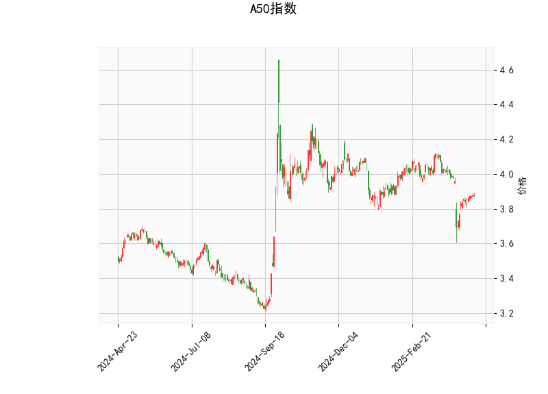

## A50指数技术分析及策略建议

### 一、技术指标解读

#### 1. 价格与布林带分析
当前价3.878位于布林带中轨（3.975）与下轨（3.786）之间，呈现以下特征：
- 价格偏离中轨约2.5%，短期趋势偏弱
- 距离下轨仅2.4%空间，但未触及超卖区域
- 布林带带宽（上轨-下轨=0.376）较前期略有收窄，显示市场波动率下降

#### 2. RSI指标分析
44.84的RSI值处于中性区间（30-70），但需要注意：
- 连续三日RSI值从38回升至44.8，短期动能出现改善迹象
- 未达超卖区域，反映市场未出现极端抛压
- 若突破50中枢位可能触发技术性买盘

#### 3. MACD指标信号
- MACD线（-0.034）上穿信号线（-0.041），形成"水下金叉"
- 柱状图转正（0.0073）显示空头动能衰减
- 但绝对值仍偏小（0.0073），需确认趋势延续性

#### 4. K线形态组合
三大十字星形态叠加传递关键信号：
- `CDLDOJI`：多空力量暂时平衡
- `CDLGRAVESTONEDOJI`（墓碑十字）：暗示高位受阻
- `CDLLONGLEGGEDDOJI`（长腿十字）：显示剧烈博弈
三者组合预示短期可能面临方向选择

### 二、投资机会与策略建议

#### 1. 波段交易策略
**多头机会**（风险等级：中）
- 入场条件：价格站稳3.88且MACD持续走强
- 目标位：布林带中轨3.975（+2.5%）
- 止损位：布林带下轨3.786（-2.4%）

**空头机会**（风险等级：高）
- 触发条件：价格跌破3.78且RSI下破40
- 目标位：前低3.72（-1.6%）
- 止损位：布林带中轨3.975（+5%）

#### 2. 套利策略建议
**跨期套利**（适合机构投资者）
- 关注近月合约贴水收窄机会
- 当季/次季合约价差若扩大至1.5%以上，可建立反向套利头寸

**波动率套利**
- 利用布林带收窄特征，卖出宽跨式期权组合
- 行权价选择3.75（Put）和4.00（Call）
- 需控制Delta敞口在±0.3以内

#### 3. 风险警示
- 警惕宏观事件冲击：中美利差、人民币汇率波动可能加剧市场震荡
- 量能验证：当前成交量未显著放大，需确认突破有效性
- 时间窗口：美联储议息会议前市场可能趋向谨慎

> 建议结合30分钟级别MACD背离信号进行日内增强，当前中期趋势仍属震荡格局，总仓位建议控制在50%以内。