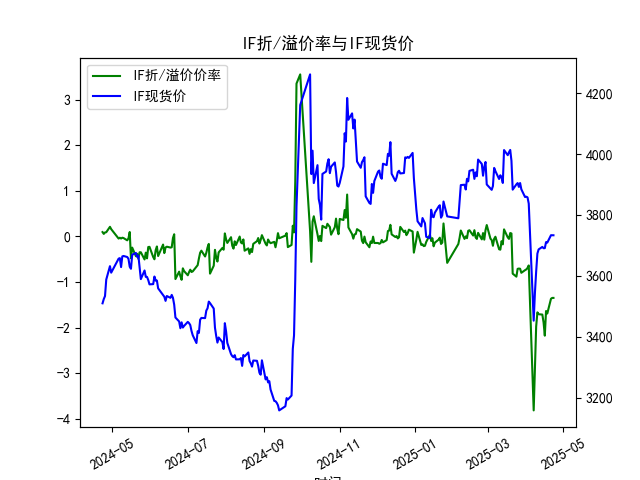
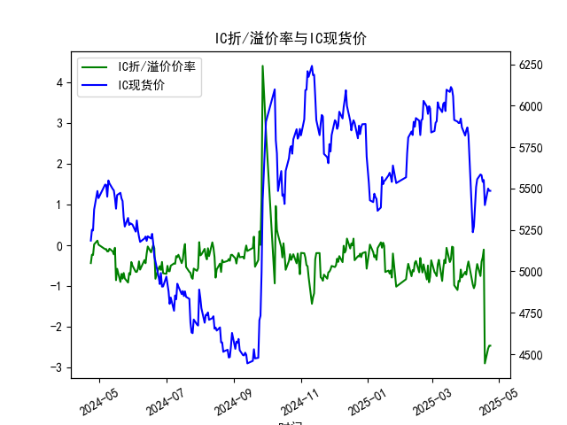
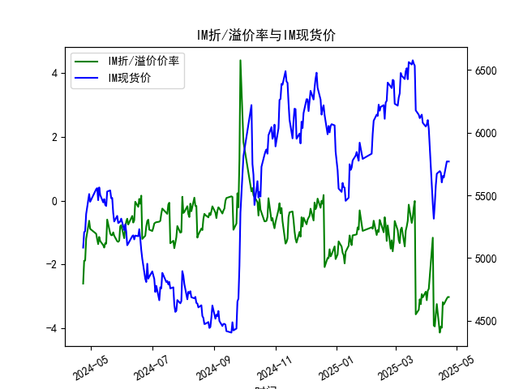

|            |   IF折/溢价率 |   IF现货价 |   IH折/溢价率 |   IH现货价 |   IC折/溢价率 |   IC现货价 |   IH折/溢价率 |   IH现货价 |
|:-----------|--------------:|-----------:|--------------:|-----------:|--------------:|-----------:|--------------:|-----------:|
| 2025-03-26 |     -0.70309  |     3891.8 |     -0.885914 |     5895.8 |     -0.885914 |     5895.8 |      -3.24405 |     6129.4 |
| 2025-03-27 |     -0.707243 |     3904.6 |     -0.594227 |     5922.2 |     -0.594227 |     5922.2 |      -2.92895 |     6143.4 |
| 2025-03-28 |     -0.796038 |     3884   |     -0.78484  |     5869.6 |     -0.78484  |     5869.6 |      -3.02986 |     6078.4 |
| 2025-03-31 |     -0.738445 |     3858.6 |     -0.651649 |     5819.6 |     -0.651649 |     5819.6 |      -2.85304 |     6049   |
| 2025-04-01 |     -0.722386 |     3859.6 |     -0.716974 |     5850.6 |     -0.716974 |     5850.6 |      -3.11981 |     6064.2 |
| 2025-04-02 |     -0.689576 |     3857.6 |     -0.5168   |     5868.6 |     -0.5168   |     5868.6 |      -2.82374 |     6100   |
| 2025-04-03 |     -0.634556 |     3837   |     -0.395252 |     5822.4 |     -0.395252 |     5822.4 |      -2.76398 |     6031.8 |
| 2025-04-07 |     -3.81231  |     3452.6 |     -0.961471 |     5236.2 |     -0.961471 |     5236.2 |      -1.16153 |     5432.6 |
| 2025-04-08 |     -2.92977  |     3543.8 |     -1.04965  |     5271   |     -1.04965  |     5271   |      -3.91353 |     5313.6 |
| 2025-04-09 |     -1.97446  |     3614   |     -0.96643  |     5387.2 |     -0.96643  |     5387.2 |      -3.9405  |     5429.6 |
| 2025-04-10 |     -1.663    |     3673   |     -0.632471 |     5509   |     -0.632471 |     5509   |      -3.56785 |     5578.2 |
| 2025-04-11 |     -1.70421  |     3686.6 |     -0.457211 |     5555.8 |     -0.457211 |     5555.8 |      -3.2409  |     5672.2 |
| 2025-04-14 |     -1.71162  |     3694.8 |     -0.752381 |     5584.8 |     -0.752381 |     5584.8 |      -4.13446 |     5693   |
| 2025-04-15 |     -1.88329  |     3690.4 |     -0.402211 |     5580   |     -0.402211 |     5580   |      -3.95041 |     5680.4 |
| 2025-04-16 |     -2.17398  |     3690.8 |     -0.296286 |     5540.4 |     -0.296286 |     5540.4 |      -3.98173 |     5603   |
| 2025-04-17 |     -1.63358  |     3710.6 |     -0.104562 |     5551.2 |     -0.104562 |     5551.2 |      -3.18113 |     5653.8 |
| 2025-04-18 |     -1.68913  |     3708.8 |     -2.89029  |     5400   |     -2.89029  |     5400   |      -3.25269 |     5642   |
| 2025-04-21 |     -1.36545  |     3733.2 |     -2.52696  |     5499.8 |     -2.52696  |     5499.8 |      -3.06818 |     5770   |
| 2025-04-22 |     -1.34653  |     3733   |     -2.45739  |     5486   |     -2.45739  |     5486   |      -3.02072 |     5769.6 |
| 2025-04-23 |     -1.34653  |     3733   |     -2.45739  |     5486   |     -2.45739  |     5486   |      -3.02072 |     5769.6 |

# 股指期货折/溢价率与现货价的相关性及影响逻辑分析

## 1. 折/溢价率与现货价的相关性及影响逻辑

### （1）相关性特征
折/溢价率（基差率）反映期货价格与现货价格的偏离程度。从数据看：
- **IF（沪深300）**：2024年4月呈现正基差（溢价），而2025年4月转为深度负基差（折价），与现货价上涨趋势形成背离。
- **IH（上证50）**：基差波动剧烈，2025年4月18日基差骤降至-2.89%，同期现货价下跌至5400点。
- **IC/IM（中证500/中证1000）**：长期维持负基差，IM基差率持续低于-3%，显示小盘股期货市场情绪更为悲观。

**整体相关性**：  
- **短期**：正基差常伴随现货价上涨（如IF在2024年4月），反映市场乐观预期推动期货溢价；负基差加剧时（如IH在2025年4月），现货价往往承压。  
- **长期**：基差方向与市场风格相关。大盘股（IH）基差波动剧烈，小盘股（IM）长期深度贴水，反映投资者对中小盘股风险补偿要求更高。

### （2）影响逻辑
- **市场预期驱动**：  
  正基差（溢价）表明市场预期未来现货上涨，或存在套利成本（如资金利率）覆盖；负基差（折价）则隐含对市场下跌或流动性风险的担忧。  
- **套利机制传导**：  
  当基差偏离无套利区间时，期现套利（如买入期货+卖空现货）会推动基差收敛。例如，IM持续深度贴水可能吸引套利资金入场，压制现货价格。  
- **分红与资金成本**：  
  股指成分股分红季（通常5-8月）会系统性压低期货价格，导致负基差扩大。数据中2025年4月基差走弱可能隐含分红预期。  
- **市场流动性分层**：  
  小盘股（IM）流动性较差，期货需更高折价补偿流动性风险，形成长期贴水结构。

---

## 2. 近期投资及套利机会分析

### （1）期现套利机会
- **IM跨期收敛机会**：  
  IM基差率持续低于-3%，若市场情绪修复或分红预期兑现，可做多IM期货+做空现货（如ETF），等待基差收敛。需关注交割日前后的价差修复窗口。  
- **IH事件性套利**：  
  2025年4月18日IH基差骤降至-2.89%，但次日现货反弹至5486点，基差部分修复。此类极端波动可能源于程序化交易踩踏，可建立均值回归策略。

### （2）跨品种套利
- **大小盘风格对冲**：  
  IF（大盘）基差波动方向与IM（小盘）存在分化，若预期市场风格切换，可多IF空IM（或反向），利用基差变动放大收益。  
- **IH与IC价差策略**：  
  IH基差波动幅度（-2.89%至0.11%）显著大于IC（-2.89%至0.12%），可通过统计套利捕捉两者基差波动率的差异。

### （3）趋势性策略
- **IF基差反转信号**：  
  IF基差在2025年4月持续走弱（-1.63%至-1.34%），但现货价稳步上涨至3733点。若基差偏离度达到历史极值（如-2%），可布局期货多单，博弈预期修正。  
- **IM贴水收窄交易**：  
  IM基差长期贴水，若政策利好小盘股（如专精特新扶持），贴水可能快速收窄，提前布局期货多单可捕获超额收益。

### （4）风险提示
- **流动性风险**：小盘股期货（IM）买卖价差较大，可能侵蚀套利收益。  
- **分红冲击**：2025年二季度分红集中期可能加剧基差波动，需动态调整仓位。  
- **市场情绪传染**：极端行情下基差可能非理性扩大（如IH在2025年4月18日），需设置严格止损。

