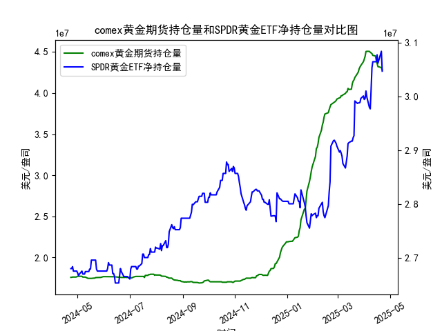

|            |   comex黄金期货持仓量 |   SPDR黄金ETF净持仓量 |
|:-----------|----------------------:|----------------------:|
| 2025-03-25 |           4.25535e+07 |           2.98798e+07 |
| 2025-03-26 |           4.29362e+07 |           2.98798e+07 |
| 2025-03-27 |           4.31683e+07 |           2.98891e+07 |
| 2025-03-28 |           4.33476e+07 |           2.99628e+07 |
| 2025-03-31 |           4.38069e+07 |           3.0009e+07  |
| 2025-04-01 |           4.41117e+07 |           2.99444e+07 |
| 2025-04-02 |           4.4464e+07  |           2.99628e+07 |
| 2025-04-03 |           4.50467e+07 |           3.01012e+07 |
| 2025-04-04 |           4.50717e+07 |           2.99905e+07 |
| 2025-04-07 |           4.50642e+07 |           2.97969e+07 |
| 2025-04-08 |           4.49537e+07 |           2.97692e+07 |
| 2025-04-09 |           4.4872e+07  |           3.01284e+07 |
| 2025-04-10 |           4.47928e+07 |           3.05341e+07 |
| 2025-04-11 |           4.4576e+07  |           3.06448e+07 |
| 2025-04-14 |           4.45116e+07 |           3.06448e+07 |
| 2025-04-15 |           4.40124e+07 |           3.06448e+07 |
| 2025-04-16 |           4.36175e+07 |           3.07739e+07 |
| 2025-04-17 |           4.32097e+07 |           3.06171e+07 |
| 2025-04-21 |           4.30949e+07 |           3.08384e+07 |
| 2025-04-22 |           4.28033e+07 |           3.04696e+07 |

# MSCI新兴市场指数和铜价相关性及影响逻辑分析

## 1. MSCI新兴市场指数与铜价的相关性及逻辑

### （1）正相关性表现
MSCI新兴市场指数与铜价长期呈现**正向联动**，核心逻辑如下：
- **需求驱动**：新兴市场（如中国、印度）占全球铜消费量超60%，其经济扩张（基建/制造业投资）直接拉动铜需求。
- **经济周期同步**：新兴市场股市（MSCI指数）走强反映经济增长预期，而铜作为工业金属“经济晴雨表”，价格同步受提振。
- **风险偏好传导**：新兴市场风险资产（股票）与大宗商品（铜）均受益于全球流动性宽松周期，美元走弱时两者常同步上涨。

### （2）影响机制
- **正向反馈循环**：新兴市场基建刺激政策→铜需求预期升温→铜价上涨→矿业企业盈利改善→MSCI指数成分股（资源类）股价抬升。
- **反向风险信号**：若铜价因供应过剩或衰退预期下跌，可能预示新兴市场需求疲软，进而压制MSCI指数表现。

---

# 近期投资及套利机会分析

## 2. 基于持仓数据的黄金市场机会

### （1）趋势性机会
- **看涨黄金**：COMEX黄金期货持仓量近1年从1,700万盎司攀升至4,500万盎司，SPDR ETF持仓亦从2,680万盎司增至3,064万盎司，显示**机构与散户同步增持**。叠加美联储降息预期升温，可逢回调配置黄金多头。

### （2）套利策略
- **期现价差套利**：COMEX持仓量创历史高位（4,500万盎司）而SPDR ETF增速放缓，若期货溢价（Contango）扩大，可做空期货+买入ETF锁定价差收益。
- **跨品种对冲**：若铜价因新兴市场疲软承压（如MSCI指数回调），而黄金受避险需求支撑，可构建“多黄金/空铜”组合，捕捉两者走势分化。

### （3）风险提示
- **持仓背离风险**：COMEX投机多头占比过高（如持仓量>4,000万盎司时），需警惕获利了结引发的短期抛压。
- **美元反弹冲击**：若美国经济数据超预期强劲导致降息预期修正，可能同时压制黄金及新兴市场资产。