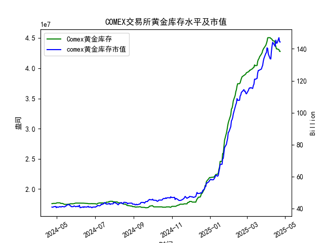

|            |   comex黄金库存量 |   comex黄金库存市值(billion) |   伦敦金现货价 |   上海金交所黄金现货价 |   美元兑人民币汇率 |
|:-----------|------------------:|-----------------------------:|---------------:|-----------------------:|-------------------:|
| 2025-03-27 |       4.31683e+07 |                       3064.5 |        3056.55 |                 709.29 |             7.1763 |
| 2025-03-28 |       4.33476e+07 |                       3090   |        3071.6  |                 721.03 |             7.1752 |
| 2025-03-31 |       4.38069e+07 |                       3130.9 |        3115.1  |                 730.8  |             7.1782 |
| 2025-04-01 |       4.41117e+07 |                       3120.6 |        3133.7  |                 735.84 |             7.1775 |
| 2025-04-02 |       4.4464e+07  |                       3162.3 |        3119.75 |                 732.5  |             7.1793 |
| 2025-04-03 |       4.50467e+07 |                       3112.6 |        3118.1  |                 738.94 |             7.1889 |
| 2025-04-04 |       4.50717e+07 |                       3035.6 |        3054.5  |                 738.94 |             7.1889 |
| 2025-04-07 |       4.50642e+07 |                       2968   |        3014.75 |                 713.98 |             7.198  |
| 2025-04-08 |       4.49537e+07 |                       2973.3 |        3015.4  |                 717.5  |             7.2038 |
| 2025-04-09 |       4.4872e+07  |                       3087.2 |        3075.5  |                 728.88 |             7.2066 |
| 2025-04-10 |       4.47928e+07 |                       3166   |        3143.15 |                 741.26 |             7.2092 |
| 2025-04-11 |       4.4576e+07  |                       3233   |        3230.5  |                 757.1  |             7.2087 |
| 2025-04-14 |       4.45116e+07 |                       3195   |        3204.2  |                 762.47 |             7.211  |
| 2025-04-15 |       4.40124e+07 |                       3216.5 |        3219.6  |                 762.9  |             7.2096 |
| 2025-04-16 |       4.36175e+07 |                       3334.3 |        3322.9  |                 781.62 |             7.2133 |
| 2025-04-17 |       4.32097e+07 |                       3323.1 |        3305.65 |                 786    |             7.2085 |
| 2025-04-18 |       4.32097e+07 |                       3323.1 |        3305.65 |                 788.62 |             7.2069 |
| 2025-04-21 |       4.30949e+07 |                       3411.1 |        3305.65 |                 804.11 |             7.2055 |
| 2025-04-22 |       4.28033e+07 |                       3371.6 |        3433.55 |                 825.8  |             7.2074 |
| 2025-04-23 |       4.28033e+07 |                       3371.6 |        3433.55 |                 825.8  |             7.2116 |

### 近期COMEX黄金市场套利机会分析与策略建议

#### **1. 跨市场套利（伦敦 vs. 上海）**
- **价差分析**：  
  在最近一个月（2025年3月底至4月23日），伦敦金价从3305.65美元/盎司升至3433.55美元/盎司，而上海金价从786元/克涨至825.80元/克。  
  **换算后价差**：  
  上海金价（825.80元/克）按汇率7.2116折算为 **3561美元/盎司**（825.80 × 31.1035 ÷ 7.2116），较伦敦金价（3433.55美元/盎司）高 **127.45美元/盎司**。  
  **机会判断**：  
  若扣除运输、保险等成本（约50-80美元/盎司），当前价差仍存在显著套利空间。可执行**买入伦敦现货黄金，在上海市场卖出**的策略。

- **风险与操作建议**：  
  - **汇率锁定**：美元兑人民币汇率近期波动较小（7.20-7.21），但需通过远期合约锁定汇率以避免波动风险。  
  - **政策限制**：需确认中国黄金进口政策及税费（如增值税、关税），确保净收益覆盖成本。

#### **2. COMEX期现套利**
- **库存与市值关系**：  
  COMEX库存从4.32亿盎司降至4.28亿盎司（最近一个月），而市值从约144.32（十亿美元）对应单价**3373美元/盎司**（市值 ÷ 库存量），低于同期伦敦现货价（3433.55美元/盎司）。  
  **机会判断**：  
  COMEX黄金隐含价格较伦敦低约60美元/盎司，可能存在**买入COMEX期货/现货，卖出伦敦现货**的套利机会，但需验证交割规则与持仓成本。

- **操作建议**：  
  - **交割可行性**：需确认COMEX仓单是否可直接用于伦敦市场交割，或需通过跨市场对冲（如期货合约）锁定价差。  
  - **时间成本**：若为期货合约，需计算持有成本（资金利息、仓储费）是否低于价差收益。

#### **3. 库存变化与价格趋势**
- **库存下降的潜在影响**：  
  COMEX库存连续减少（尤其4月21-22日单日降幅显著）或反映实物交割需求增加，叠加金价上涨（市值攀升），可能暗示市场对黄金的**看涨情绪**。  
  **策略建议**：  
  - **多头持仓**：短期可持有黄金多头，但需结合美联储政策、通胀数据等宏观因素判断趋势延续性。  
  - **库存监控**：若库存持续下降且期货升水扩大，可布局期现正套（卖期货、买现货）。

#### **4. 风险提示**
- **政策风险**：中国对黄金进口的管制可能影响跨市场套利效率，需提前确认合规性。  
- **市场流动性**：上海与伦敦市场的交易时段及流动性差异可能导致价差快速收敛。  
- **数据时效性**：套利机会依赖实时价差监控，延迟操作可能导致收益缩水。

### **总结建议**
- **优先策略**：  
  聚焦**伦敦-上海跨市场套利**，近期价差扩大至历史高位，可快速执行并锁定汇率与运输成本。  
- **辅助策略**：  
  关注COMEX库存变化与期现价差，若期货升水超过持有成本，可布局期现套利。  
- **风险对冲**：  
  使用期权或期货对冲价格波动风险，确保套利收益稳定性。