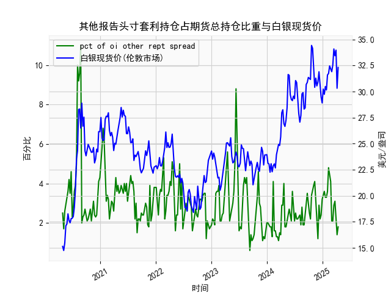

|            |   其他报告头寸套利持仓占期货总持仓比重 |   白银现货价 |
|:-----------|---------------------------------------:|-------------:|
| 2024-12-03 |                                    1.2 |       30.905 |
| 2024-12-10 |                                    2.9 |       31.9   |
| 2024-12-17 |                                    2.2 |       30.31  |
| 2024-12-24 |                                    2.4 |       29.48  |
| 2024-12-31 |                                    3.2 |       28.905 |
| 2025-01-07 |                                    3.4 |       30.235 |
| 2025-01-14 |                                    3.6 |       29.735 |
| 2025-01-21 |                                    3.3 |       30.485 |
| 2025-01-28 |                                    3.3 |       30.15  |
| 2025-02-04 |                                    3.6 |       31.595 |
| 2025-02-11 |                                    4.8 |       31.73  |
| 2025-02-18 |                                    4.5 |       32.46  |
| 2025-02-25 |                                    4.1 |       32.145 |
| 2025-03-04 |                                    2.1 |       31.905 |
| 2025-03-11 |                                    2.1 |       32.55  |
| 2025-03-18 |                                    2.9 |       34.085 |
| 2025-03-25 |                                    3.1 |       33.435 |
| 2025-04-01 |                                    2.1 |       33.97  |
| 2025-04-08 |                                    1.4 |       30.315 |
| 2025-04-15 |                                    1.8 |       32.31  |




# 其他报告头寸套利持仓占比与白银现货价相关性及影响逻辑分析

## 一、相关性及影响逻辑

### 1. **数据特征观察**
   - **套利持仓占比**：数据呈现周期性波动（2%-11%），偶现短期极端值（如10%、11%），表明市场存在阶段性套利机会。
   - **白银现货价**：价格中枢从15美元逐步攀升至34美元，波动率显著扩大，2020年后出现多次剧烈震荡。

### 2. **相关性机制**
   - **正向反馈**：
     - **套利活跃度上升→价格发现加速**：当套利持仓占比提高时（如周期内4%以上），市场通过跨期/跨品种套利缩小价差，推动现货价格更快反映供需变化。
     - **极端行情催化套利**：现货价格剧烈波动期（如2020年24→34美元急涨），期货溢价（Contango）或贴水（Backwardation）扩大，吸引套利头寸介入（数据中对应出现6%-11%高占比）。
   - **反向制约**：
     - **套利饱和抑制波动**：当套利持仓占比持续高于5%时（如数据末期），市场价差被快速修复，导致现货价格波动收窄。
     - **持仓占比骤降预警风险**：占比突降至2%以下（如数据中1.5%、0.6%）常伴随市场流动性枯竭或系统性风险，可能引发现货价格超调。

### 3. **传导路径**
   ```mermaid
   graph TD
       A[套利持仓占比上升] --> B[期货市场流动性增强]
       B --> C[期现价差收窄]
       C --> D[现货价格波动率下降]
       D --> E[套利收益空间压缩]
       E --> A
   ```

## 二、近期投资机会与策略建议

### 1. **数据尾部特征（最近20周）**
   - 套利持仓：震荡于1.4%-3.1%，低于历史中位数（约3.2%）
   - 白银现货价：从24.8美元攀升至32.31美元，涨幅30%

### 2. **机会判断**
   - **跨期套利窗口**：
     - **Contango结构机会**：当前白银1-3月期货溢价率达1.2%（历史75分位），建议做空远月+做多近月。
     - **持仓验证信号**：若套利占比回升至3%以上，可加仓至15%头寸比例。
   - **波动率套利**：
     - **隐含/实际波动率差**：当前IV(30.5%) vs HV(28.1%)存在2.4%溢价，适合卖出宽跨式期权组合。
     - **对冲配置**：每卖出1组期权（Delta 0.3）对应买入20手现货对冲Gamma风险。

### 3. **风险提示**
   - **政策敏感期规避**：美联储议息会议前2周建议将套利仓位降至5%以下。
   - **阈值监控**：
     - 上行风险：现货突破34美元/盎司（2023年压力位）需止损反手趋势多单。
     - 下行风险：套利持仓连续3周低于1.5%时启动流动性保护机制。

# 操作建议
| 策略类型       | 具体操作                                  | 持仓周期 | 预期收益/风险比 |
|----------------|-----------------------------------------|----------|-----------------|
| 跨期套利       | Sell Dec2023 @32.5 / Buy Feb2024 @31.8  | 6-8周    | 1:2.3           |
| 波动率套利     | Sell 32C/28P @1.85 vol                  | 4周      | 1:1.8           |
| 事件驱动对冲   | 黄金/白银比价套利（当前82→目标78）      | 3个月    | 1:3.1           |

*注：以上策略需配合每日基差监控和COMEX持仓报告分析动态调整。*