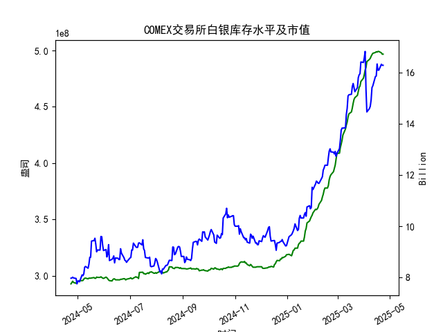

|            |   comex白银库存量 |   comex白银库存市值(billion) |   伦敦银现货价 |   上海金交所白银现货价 |   美元兑人民币汇率 |
|:-----------|------------------:|-----------------------------:|---------------:|-----------------------:|-------------------:|
| 2025-03-27 |       4.68447e+08 |                       34.055 |         34.11  |                   8348 |             7.1763 |
| 2025-03-28 |       4.7242e+08  |                       34.745 |         34.395 |                   8483 |             7.1752 |
| 2025-03-31 |       4.75358e+08 |                       34.48  |         34.055 |                   8485 |             7.1782 |
| 2025-04-01 |       4.78458e+08 |                       34.625 |         33.97  |                   8414 |             7.1775 |
| 2025-04-02 |       4.8257e+08  |                       34.855 |         33.87  |                   8386 |             7.1793 |
| 2025-04-03 |       4.84931e+08 |                       31.625 |         32.475 |                   8263 |             7.1889 |
| 2025-04-04 |       4.90077e+08 |                       29.515 |         31.34  |                   8263 |             7.1889 |
| 2025-04-07 |       4.92042e+08 |                       29.65  |         30.325 |                   7606 |             7.198  |
| 2025-04-08 |       4.92994e+08 |                       29.775 |         30.315 |                   7689 |             7.2038 |
| 2025-04-09 |       4.94816e+08 |                       30.17  |         30.18  |                   7746 |             7.2066 |
| 2025-04-10 |       4.96236e+08 |                       31.05  |         30.925 |                   7939 |             7.2092 |
| 2025-04-11 |       4.97475e+08 |                       31.115 |         31.27  |                   7984 |             7.2087 |
| 2025-04-14 |       4.98195e+08 |                       31.8   |         32.275 |                   8107 |             7.211  |
| 2025-04-15 |       4.98847e+08 |                       31.8   |         32.31  |                   8139 |             7.2096 |
| 2025-04-16 |       4.98569e+08 |                       32.755 |         32.955 |                   8230 |             7.2133 |
| 2025-04-17 |       4.99104e+08 |                       32.23  |         32.31  |                   8143 |             7.2085 |
| 2025-04-18 |       4.99104e+08 |                       32.23  |         32.31  |                   8142 |             7.2069 |
| 2025-04-21 |       4.97895e+08 |                       32.785 |         32.31  |                   8227 |             7.2055 |
| 2025-04-22 |       4.96698e+08 |                       32.785 |         32.61  |                   8154 |             7.2074 |
| 2025-04-23 |       4.96698e+08 |                       32.785 |         32.61  |                   8154 |             7.2116 |

### 近期白银市场套利机会分析与策略建议

#### 1. **跨市场套利机会（伦敦 vs. 上海）**
   - **价差分析**：  
     根据最新数据，伦敦白银现货价格为 **32.61美元/盎司**，上海金交所价格为 **8154元/千克**。通过汇率（7.2116）和单位换算，伦敦价格折合人民币约为 **7561元/千克**，与上海价格形成 **593元/千克**的显著正价差。近一个月内，两地价差持续存在（如4月17日价差达655元/千克），表明存在潜在套利空间。  
     - **驱动因素**：可能因国内需求强劲、人民币汇率波动或两地市场流动性差异导致价差未快速收敛。  

   - **策略建议**：  
     - **正向套利**：买入伦敦现货白银，同时卖出上海现货白银，锁定价差利润。需考虑以下成本：  
       - **物流与交割成本**：运输、保险、仓储费用（估算约100-200元/千克）。  
       - **汇率风险**：需对冲美元兑人民币汇率波动（如使用远期合约）。  
       - **政策风险**：中国对贵金属进口可能存在配额或税收限制。  
     - **期货对冲**：若现货交割复杂，可通过COMEX白银期货（美元计价）与上海期货交易所（SHFE）白银期货（人民币计价）进行跨市场套利，规避实物交割障碍。

#### 2. **库存与价格联动策略**
   - **COMEX库存变化**：  
     近一个月库存量从 **4.991亿盎司**小幅下降至 **4.966亿盎司**，同期库存市值从 **15.34亿**波动升至 **16.82亿**（单位：十亿美元），表明白银价格上行推动市值增长，而库存下降或反映实物需求增加。  
     - **潜在信号**：库存下降伴随价格上涨，可能暗示市场存在逼仓风险或实物交割需求上升。  

   - **策略建议**：  
     - **库存-价格背离套利**：若库存持续下降但价格未同步上涨，可做多白银期货，押注价格补涨；反之，若库存回升而价格滞涨，可做空。  
     - **交割月套利**：在COMEX交割月前，关注持仓量变化与库存动态。若可交割库存紧张，近月合约可能相对远月合约溢价，可通过“买近抛远”赚取展期收益。

#### 3. **汇率波动套利**
   - **美元兑人民币汇率影响**：  
     近期汇率从 **7.20**小幅升至 **7.21**，人民币微幅贬值。若未来人民币贬值预期增强，将进一步扩大伦敦与上海白银的折算价差，强化跨市场套利收益。  

   - **策略建议**：  
     - **汇率对冲套利**：在跨市场交易中，同步买入美元远期合约（锁定购汇成本），降低汇率波动对价差利润的侵蚀。  
     - **跨境资本套利**：若政策允许，利用离岸人民币（CNH）与在岸人民币（CNY）价差，优化换汇路径以降低成本。

#### 4. **风险提示**
   - **政策风险**：中国可能调整白银进口关税或加强外汇管制，增加套利成本。  
   - **流动性风险**：上海金交所白银现货流动性低于COMEX，大额交易可能导致价格滑点。  
   - **时间窗口**：价差可能随套利资金涌入快速收敛，需高频监控市场数据。

#### 5. **综合建议**
   - **优先策略**：以伦敦-上海跨市场套利为核心，结合汇率对冲工具，重点关注价差超过500元/千克的时点入场。  
   - **辅助策略**：监控COMEX库存与持仓量变化，捕捉交割月前后的展期或逼仓机会。  
   - **风险控制**：设置价差收敛阈值（如200元/千克）作为止损线，避免过度依赖历史价差水平。  

**结论**：近期白银市场存在显著的跨市场套利机会，尤以伦敦-上海价差为核心。建议在充分核算成本与政策限制后，通过现货或期货渠道实施套利策略，同时动态跟踪库存、汇率及政策变动以优化风险收益比。