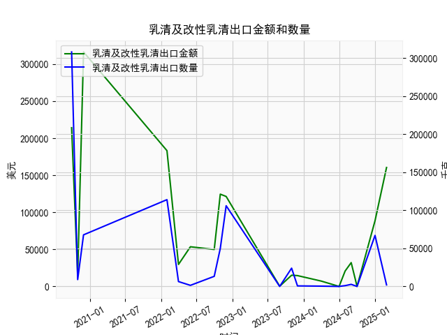

|            |   北京二手房屋价格指数同比增速 |   M1同比增速 |   M1同比增速(3个月的移动平均) |
|:-----------|-------------------------------:|-------------:|------------------------------:|
| 2023-08-31 |                            0.8 |          2.2 |                      2.53333  |
| 2023-09-30 |                            1.1 |          2.1 |                      2.2      |
| 2023-10-31 |                           -0.2 |          1.9 |                      2.06667  |
| 2023-11-30 |                           -1.4 |          1.3 |                      1.76667  |
| 2023-12-31 |                           -2.2 |          1.3 |                      1.5      |
| 2024-01-31 |                           -3.7 |          3.3 |                      1.96667  |
| 2024-02-29 |                           -5.3 |          2.6 |                      2.4      |
| 2024-03-31 |                           -6.4 |          2.3 |                      2.73333  |
| 2024-04-30 |                           -8   |          0.6 |                      1.83333  |
| 2024-05-31 |                           -8.6 |         -0.8 |                      0.7      |
| 2024-06-30 |                           -7.8 |         -1.7 |                     -0.633333 |
| 2024-07-31 |                           -7.2 |         -2.6 |                     -1.7      |
| 2024-08-31 |                           -8.5 |         -3   |                     -2.43333  |
| 2024-09-30 |                          -10.3 |         -3.3 |                     -2.96667  |
| 2024-10-31 |                           -8.4 |         -2.3 |                     -2.86667  |
| 2024-11-30 |                           -6.2 |         -0.7 |                     -2.1      |
| 2024-12-31 |                           -4.5 |          1.2 |                     -0.6      |
| 2025-01-31 |                           -3.8 |          0.4 |                      0.3      |
| 2025-02-28 |                           -2.9 |          0.1 |                      0.566667 |
| 2025-03-31 |                           -2.1 |          1.6 |                      0.7      |

### 1. 北京二手房价指数同比增速与M1同比增速的相关性及影响逻辑

#### （1）相关性分析
从数据趋势来看，北京二手房价同比增速与M1同比增速存在**阶段性正相关性**，但存在一定滞后性：
- **扩张期（前2-3年）**：M1增速上行时（如初期从6.3%攀升至11.1%），房价增速随之攀升至10.1%的高点，表明流动性宽松推动购房需求。
- **收缩期（后2年）**：M1增速持续下行（从5.8%降至-2.4%），房价增速同步转负（从9.3%降至-10.3%），显示货币紧缩抑制市场热度。
- **近期企稳**：M1增速触底反弹（从-2.4%回升至0.7%），房价跌幅收窄（从-10.3%回升至-2.1%），反映流动性边际改善对房价的托底作用。

#### （2）影响逻辑
- **流动性传导机制**：M1增速代表市场短期流动性水平，直接影响购房者信贷能力和开发商融资成本。M1扩张时，居民按揭贷款和企业开发贷更易获取，推动房价上涨；反之则抑制需求。
- **政策调节效应**：中国货币政策与房地产调控政策通常联动。例如，M1增速下行周期中可能伴随限购限贷政策，进一步压制房价；而M1回升时可能释放政策宽松信号（如降准、房贷利率下调），刺激市场回暖。
- **预期引导作用**：M1增速变化影响市场对未来经济及通胀的预期，进而改变购房者“追涨杀跌”行为。例如，M1持续收缩时，购房者可能延迟置业以等待更低价格。

---

### 2. 近期投资/套利机会及策略

#### （1）趋势性机会
- **左侧布局窗口**：当前M1增速已触底回升（近6个月从-2.4%反弹至0.7%），而房价同比跌幅同步收窄，显示流动性改善正传导至房地产市场。若后续M1持续回升，可关注**核心区位学区房/地铁房**等抗跌性强的标的。
- **政策博弈机会**：近期央行可能推出降息、降低首付比例等政策组合拳，可提前布局**房地产ETF（如沪深300地产指数）**或**头部房企债券**，捕捉政策催化下的估值修复。

#### （2）套利策略
- **区域分化套利**：北京内部市场分化加剧，近郊房价跌幅（-8%~-10%）显著大于核心城区（-2%~-5%）。若流动性持续改善，可通过**卖出远郊房产+买入核心区房产**进行价差收敛套利。
- **跨市场联动**：M1回升通常伴随股市流动性改善，历史数据显示地产股反弹领先于房价约3-6个月。可构建**“多房地产股票+空二手房价格指数衍生品”**的配对交易，对冲系统性风险。

#### （3）风险提示
- **政策不确定性**：若房地产税试点扩大或限购政策加码，可能中断价格修复。
- **流动性传导时滞**：M1改善到房价企稳通常需6-12个月，需关注成交量是否同步回暖。
- **尾部风险防范**：配置高折价法拍房或不良资产处置项目时，需严格评估产权瑕疵和流动性风险。

---

### 结论
当前M1与房价增速的背离已显著收敛，流动性改善与政策宽松周期共振下，北京二手房市场或进入筑底阶段。建议优先关注政策敏感性强、流动性高的标的，并通过跨资产、跨区域策略分散风险。密切跟踪每月M1数据及LPR报价，以验证复苏持续性。