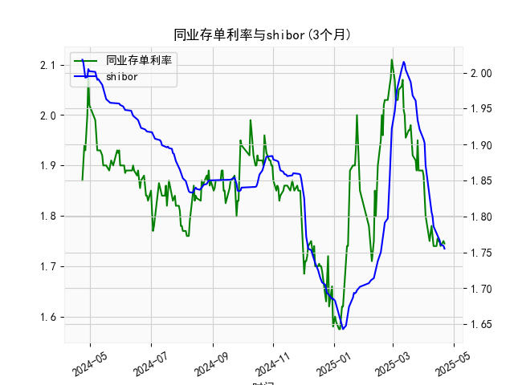

|            |   同业存单利率(3个月) |   shibor(3个月) |
|:-----------|----------------------:|----------------:|
| 2025-03-25 |                 1.89  |           1.942 |
| 2025-03-26 |                 1.95  |           1.934 |
| 2025-03-27 |                 1.89  |           1.924 |
| 2025-03-28 |                 1.89  |           1.921 |
| 2025-03-31 |                 1.89  |           1.912 |
| 2025-04-01 |                 1.88  |           1.907 |
| 2025-04-02 |                 1.85  |           1.902 |
| 2025-04-03 |                 1.8   |           1.871 |
| 2025-04-07 |                 1.75  |           1.824 |
| 2025-04-08 |                 1.77  |           1.81  |
| 2025-04-09 |                 1.78  |           1.806 |
| 2025-04-10 |                 1.76  |           1.8   |
| 2025-04-11 |                 1.74  |           1.786 |
| 2025-04-14 |                 1.74  |           1.777 |
| 2025-04-15 |                 1.755 |           1.775 |
| 2025-04-16 |                 1.75  |           1.772 |
| 2025-04-17 |                 1.75  |           1.767 |
| 2025-04-18 |                 1.74  |           1.761 |
| 2025-04-21 |                 1.75  |           1.759 |
| 2025-04-22 |                 1.745 |           1.755 |

# 同业存单利率与SHIBOR的相关性及影响逻辑

## 1. 相关性及影响逻辑
同业存单利率（NCD）与SHIBOR均反映银行间市场的资金价格，但存在以下关系：
- **同源驱动因素**：两者均受货币政策（如MLF利率、存款准备金率）、市场流动性（央行公开市场操作）、季节性资金需求（如季末考核）影响。当市场流动性趋紧时，两者往往同步上行。
- **定价机制差异**：
  - **SHIBOR**是报价利率，由18家银行对无担保同业拆借的报价均值形成，反映银行间**信用最优主体**的融资成本预期，具有前瞻性。
  - **同业存单利率**是实际发行利率，包含银行信用风险溢价（尤其是中小银行）和供需博弈结果，更贴近市场真实成交价格。
- **利差波动逻辑**：
  - 当SHIBOR显著低于同业存单利率时，可能反映市场对流动性宽松的预期未完全传导至实际发行市场，或因信用分层导致中小银行融资成本上升。
  - 若两者利差收窄甚至倒挂，可能表明市场流动性实际改善或大行资金需求下降，推动NCD发行利率向报价利率靠拢。

## 2. 近期投资或套利机会分析

### 数据观察（近期趋势）：
- **同业存单利率**：从历史低点1.58%快速反弹至2.11%后回落，当前中枢约1.75%-1.85%，波动性显著。
- **SHIBOR 3M**：整体呈震荡下行趋势，近期稳定在1.75%-1.76%，与NCD利差收窄至接近零。

### 潜在机会与策略：
#### （1）利差收敛套利
- **机会**：当前NCD利率与SHIBOR接近平价，但历史数据显示两者利差常维持在10-30bps。若未来SHIBOR因流动性宽松进一步下行，而NCD利率受信用分层支撑回落较慢，可能形成套利窗口。
- **策略**：
  - **正向套利**：通过质押式回购（以SHIBOR附近利率融资）购买高评级同业存单，赚取利差。
  - **对冲风险**：搭配利率互换（IRS）锁定融资成本，防范资金面波动。

#### （2）波段交易机会
- **机会**：NCD利率近期波动率放大（如单日跳升20bps），反映市场对货币政策预期分歧。
- **策略**：
  - **做陡曲线**：若预期央行降准，可增配3个月NCD（短端利率敏感度更高），同时做空1年期NCD期货。
  - **事件驱动**：关注季末、税期等流动性扰动时点，提前布局NCD利率冲高后的回落机会。

#### （3）信用分层策略
- **机会**：AAA级NCD与中小银行存单利差走阔（数据未提供但隐含于市场），AAA级品种安全性溢价凸显。
- **策略**：
  - **择优配置**：在流动性宽松周期，优先持有高评级同业存单以规避信用风险。
  - **骑乘效应**：选择剩余期限2-3个月的存单，利用收益率曲线陡峭化获取资本利得。

### 风险提示：
- **政策超预期调整**：若央行重启紧缩工具（如MLF缩量），可能导致利差反向走阔。
- **信用事件冲击**：区域性银行风险暴露可能引发NCD市场流动性分层。
- **市场流动性摩擦**：套利策略需考虑实际交易中的滑点和手续费成本。

（注：以上分析基于历史数据，实际决策需结合实时市场信号和宏观政策跟踪。）