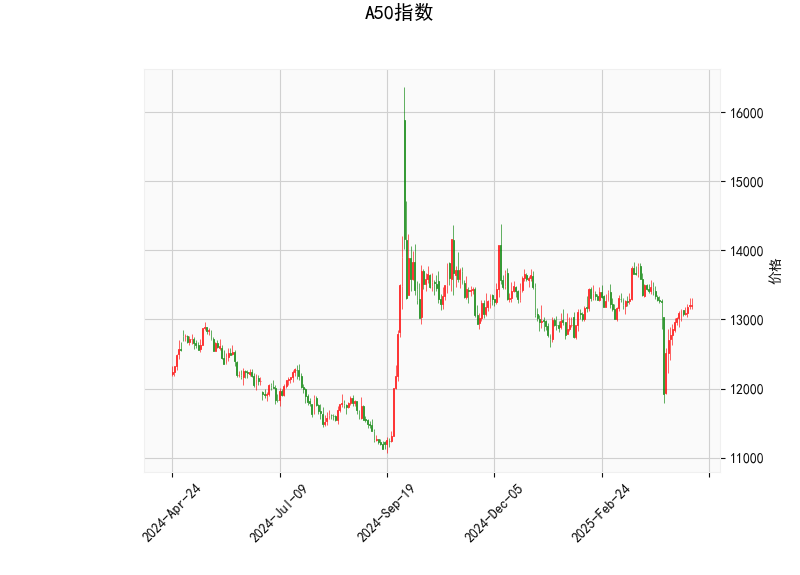

# A50指数技术分析

## 1. 关键指标分析
以下是对A50指数当前技术分析结果的详细解读，基于提供的指标数据。分析将从多个角度评估市场趋势、动量和波动性。

### 当前价格与整体定位
- **当前价格：13202.0**  
  当前价格位于Bollinger Bands的中轨（13214.84）附近，这表明指数处于中性区域，没有明显突破上轨（13803.28）或下轨（12626.39）。这通常反映市场波动性适中，价格可能在短期内保持盘整。如果价格向上突破上轨，可能预示看涨；反之，向下突破下轨则可能转为看跌。

### 动量指标分析
- **RSI（相对强弱指数）：52.64**  
  RSI值处于中性区间（30-70），略高于50，表明市场当前处于轻微看涨状态，但没有过度买入或卖出的迹象。这暗示短期内指数可能维持稳定，如果RSI升至70以上，将进入超买区，可能引发回调；反之，若跌至30以下，则可能出现超卖反弹机会。

- **MACD指标：MACD线(-23.28)、信号线(-66.17)、柱状图(42.89)**  
  MACD线高于信号线（-23.28 > -66.17），且柱状图为正值（42.89），这显示出潜在的看涨信号，表明短期动量可能正在从负向正转变。然而，MACD线整体仍为负值，暗示熊市势头尚未完全逆转。如果MACD线继续向上交叉信号线，将强化买入信号；反之，若回落，可能加剧下行风险。

### 波动性与K线形态分析
- **Bollinger Bands：上轨(13803.28)、中轨(13214.84)、下轨(12626.39)**  
  当前价格紧邻中轨，带宽相对正常，显示市场波动性不高。这是一个中性信号，适合观望。如果价格向上下轨扩展，将增加交易机会，例如向上突破上轨可能表示强势上涨。

- **K线形态：CDLDOJI、CDLGAPSIDESIDEWHITE、CDLHIGHWAVE、CDLLONGLEGGEDDOJI、CDLSPINNINGTOP**  
  这些形态主要反映市场不确定性和潜在反转。CDLDOJI和CDLLONGLEGGEDDOJI表示犹豫不决，可能预示反转；CDLGAPSIDESIDEWHITE和CDLHIGHWAVE显示波动性增加，暗示价格可能出现间隙或剧烈变动；CDLSPINNINGTOP进一步强调市场顶部的犹豫。这种组合整体上显示短期内缺乏明确方向，投资者应关注后续K线确认信号。

总体而言，A50指数当前处于中性偏看涨状态。RSI和MACD显示轻微积极动量，但K线形态的犹豫性提醒潜在风险。市场可能在盘整后寻求突破，需密切监控全球经济事件（如中国经济数据或地缘政治因素）对指数的影响。

## 2. 近期投资或套利机会和策略判断
基于上述分析，以下是对A50指数近期可能投资或套利机会的评估。策略将结合技术指标，强调风险管理，并假设投资者使用工具如期货、期权或相关衍生品。

### 可能的机会
- **看涨机会：**  
  RSI略高于50且MACD柱状图为正，暗示短期内可能出现向上突破。如果价格突破Bollinger Bands上轨（13803.28），这将是一个买入信号，尤其在K线形态确认后（如出现强势阳线）。此外，A50指数与A股或全球市场相关性高，如果中国经济数据向好（如PMI数据改善），可能放大这一机会。

- **看跌或回调机会：**  
  K线形态显示不确定性，如果MACD线回落至信号线以下，或RSI接近70引发超买回调，价格可能下探至下轨（12626.39）。这为短期卖出或做空提供机会，尤其在全球风险事件（如利率上升）影响下。

- **套利机会：**  
  A50指数期货或期权市场可能存在价差套利。例如，如果现货指数与期货价格出现异常偏差（如由于市场情绪导致的溢价），投资者可通过现货-期货套利获利。鉴于K线的高波动性，跨期套利（如买入近期合约、卖出远期合约）也值得关注，但需注意流动性风险。

### 推荐策略
- **多头策略（适合看涨场景）：**  
  - **买入点：** 当MACD线向上交叉信号线且价格站上中轨时，考虑买入A50指数ETF或期货。设置止损在下轨附近（12600左右），目标位上轨（13800以上）。  
  - **风险管理：** 结合RSI监控超买，避免追高。持仓比例控制在总仓位的30%以内。

- **空头策略（适合看跌场景）：**  
  - **卖出点：** 如果K线形态出现更多犹豫信号（如连续Doji）并价格跌破中轨，考虑做空期货或买入看跌期权。目标位下轨（12600以下），止盈在RSI跌至30附近。  
  - **风险管理：** 快速设置止损在13800以上，以防意外反弹。

- **中性套利策略：**  
  - **价差套利：** 监控A50指数与相关资产（如恒生指数或A股）的价差。如果发现异常（如A50期货溢价过高），可进行反向套利（例如，卖出期货、买入现货）。  
  - **波动率套利：** 利用Bollinger Bands的收缩期，通过期权策略（如铁蝶式）捕捉波动性回归。建议在K线不确定时采用，目标是低风险获利。

- **总体建议：**  
  近期市场不确定性较高，建议采用短线交易为主，结合技术指标与基本面新闻（如中国政策动态）确认信号。风险偏好高的投资者可小仓位试探，但保守型投资者应等待更明确突破。始终使用止损机制，并考虑整体市场环境，如全球通胀或利率变化对A50的影响。定期复盘指标变化，以调整策略。