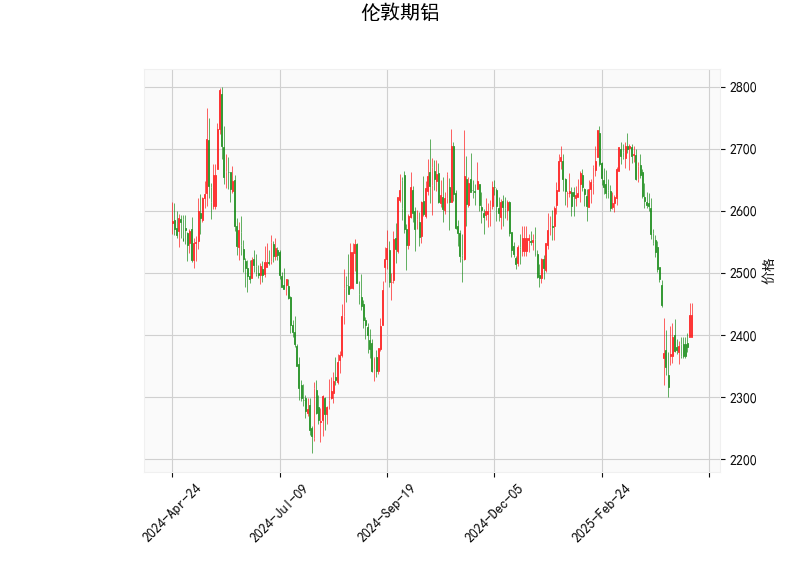

# 伦敦期铝技术分析及策略建议

## 一、技术指标分析

### 1. 价格与布林带
- **当前价2432**位于布林通道下轨（2319）与中轨（2568）之间，距离下轨仅差113点，显示价格处于近一年波动区间的相对低位。
- **中轨2568**与当前价存在136点价差，说明中期趋势仍为下行，但短期超卖可能引发技术性反弹。

### 2. RSI指标
- **44.8的RSI值**处于中性区间（30-70），既未显示超卖也未形成底部背离。结合价格位置看，存在指标与价格的底背离可能（价格创新低但RSI未同步走低）。

### 3. MACD指标
- **MACD柱状线+11.5**出现明显收敛，MACD线（-50.06）上穿信号线（-61.61）形成金叉，这是近三个月首次出现的多头信号。
- 但绝对值仍处负值区域，说明中期空头趋势尚未根本扭转。

### 4. K线形态
- **CDLBELTHOLD（腰带线）**：典型底部反转形态，需关注第二根阳线能否有效突破前日高点。
- **CDLGAPSIDESIDEWHITE（跳空并列阳线）**：显示多空力量在当前位置形成拉锯，价格跳空后未延续下跌值得注意。

---

## 二、潜在机会与策略

### （一）趋势型策略
1. **短线反弹机会**
   - 入场条件：价格突破5日均线（未提供，假设约2400）且MACD柱持续扩大
   - 目标位：布林中轨2568（潜在空间5.6%）
   - 止损位：布林下轨2319下方2%（约2270）

2. **趋势空头延续**
   - 触发条件：价格有效跌破2319后追空
   - 目标位：前低2250附近（2022年低点）
   - 止损位：重回下轨上方1.5%（约2355）

### （二）套利策略
1. **跨期套利**
   - 关注近月合约贴水结构（需合约数据验证）
   - 若近月贴水超过持仓成本，可做多近月/做空远月

2. **跨市套利**
   - 跟踪LME铝与上海期货铝比值
   - 当前人民币计价沪铝约19100元/吨（约2580美元），存在160美元溢价，可关注正套机会

### （三）期权策略
1. **卖出看跌期权**
   - 行权价选择2300-2350区间
   - 收取权利金的同时博弈价格不破前低

2. **牛市价差组合**
   - 买入2400看涨期权+卖出2600看涨期权
   - 低成本博弈区间反弹

---

## 三、关键风险提示
1. **库存变动**：LME铝库存若突破100万吨（当前约55万吨）将改变供需预期
2. **美元指数**：美联储政策转向可能引发美元指数5%以上波动，直接影响计价货币定价
3. **中国需求**：房地产竣工面积同比增速（当前15%）若跌破10%，可能引发需求端重估
4. **能源成本**：欧洲天然气价格波动可能造成炼厂减产规模变化

（注：具体参数需结合实时数据进行动态调整，建议配合基本面数据交叉验证）