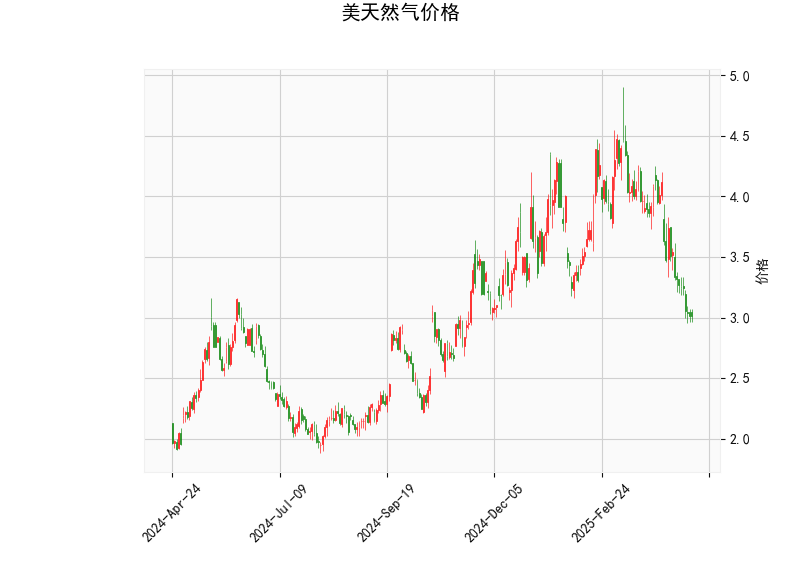

### 美天然气价格的技术分析结果分析

#### 1. 整体技术指标解读
基于提供的美天然气价格数据（当前价为3.014），我们从多个技术指标入手进行分析。这些指标共同揭示了价格的当前状态和潜在趋势。

- **RSI（Relative Strength Index，相对强弱指数）**：当前RSI值为30.294，这处于超卖区域（通常低于30）。RSI超卖暗示市场可能已被过度抛售，短期内可能出现反弹或修正。如果买盘增加，价格可能向上回升，但需警惕假突破。

- **MACD（Moving Average Convergence Divergence，移动平均收敛散度）**：MACD线为-0.2487，信号线为-0.1958，直方图为-0.0529（负值）。MACD线低于信号线，显示出看跌信号，表明短期趋势可能仍偏向下行。然而，直方图值虽负但较小，暗示下行动能正在减弱，这可能预示着潜在的反转或横盘整理。如果MACD线向上穿越信号线，将是一个看涨信号。

- **Bollinger Bands（布林带）**：上轨为4.6158，中轨为3.8191，下轨为3.0224。目前价格（3.014）非常接近下轨，这进一步强化了超卖状态。价格靠近下轨通常表示波动率较低，可能即将出现反弹或向上突破。如果价格突破中轨（3.8191），则可能转为看涨；反之，如果跌破下轨，可能加剧下行风险。

- **K线形态**：检测到“CDLMATCHINGLOW”（匹配低点）和“CDLSHORTLINE”（短线蜡烛）形态。“CDLMATCHINGLOW”暗示价格可能在低点附近形成双底或类似反转模式，潜在表示短期底部支撑。“CDLSHORTLINE”则显示蜡烛实体较小，反映市场不确定性，可能处于整理阶段或等待新趋势。这些形态结合其他指标，增加了短期反弹的可能性。

总体而言，技术指标显示美天然气价格目前处于超卖状态，短期下行动能减弱，但尚未出现明确的反转信号。价格可能在当前水平附近震荡或反弹，需关注后续确认。

#### 2. 近期可能存在的投资或套利机会和策略判断
基于上述分析，我们评估近期投资或套利机会。美天然气市场受季节性需求（如冬季取暖）和全球能源动态影响，技术指标显示当前为潜在买入窗口，但需结合基本面（如天气、库存数据）验证。以下是关键机会和策略建议：

- **投资机会**：
  - **短期反弹机会**：RSI超卖、价格接近Bollinger Bands下轨，以及K线形态的潜在反转信号，表明可能存在买入机会。预计价格可能向上测试中轨（3.8191）或更高。如果全球需求回升（如冬季来临），这将放大反弹潜力。
  - **风险点**：如果MACD直方图继续恶化或价格跌破下轨（3.0224），可能触发进一步下行，目标可能降至2.80-3.00区间。

- **套利机会**：
  - **跨市场套利**：天然气价格与相关商品（如原油或电力期货）相关性较高。如果天然气价格超卖而原油价格相对稳定，可考虑天然气与原油的价差套利。例如，利用天然气当前低价买入，同时做空原油（如果其价差扩大），待价差收窄后获利。但需监控全球能源市场，如OPEC动态或美国库存报告。
  - **季节性套利**：天然气需求季节性强（冬季需求高峰），当前价格低位可能为布局冬季反弹提供机会。投资者可通过期货合约锁定当前低价，待需求季节到来时获利。
  - **期权套利**：在超卖区域，可考虑买入看涨期权（Call Option）作为低风险押注反弹。如果价格反弹至上轨（4.6158），期权价值将放大；反之，损失有限。

- **投资策略建议**：
  - **买入策略**：在当前价位（3.014）附近买入多头头寸，目标设在中轨（3.8191）或上轨（4.6158）。等待MACD线向上交叉信号线作为入场确认，并设置止损在下轨以下（例如2.95）以控制风险。适合短期交易者或波动率爱好者。
  - **观望或中性策略**：如果不确定，可采用区间交易（Range Trading），在下轨附近买入、在中轨附近卖出，捕捉震荡行情。同时，结合K线形态监控反转信号。
  - **风险管理**：始终设置止盈止损（如利润目标10%、止损5%），并关注外部因素（如地缘政治或天气变化）。多元化投资，例如结合股票或ETF（如UNGL），以降低单一资产风险。
  - **整体建议**：当前指标偏向乐观，但市场波动大，建议保守投资者等待更多确认（如RSI回升至40以上）。长期投资者可关注基本面支撑，如美国天然气出口增长。