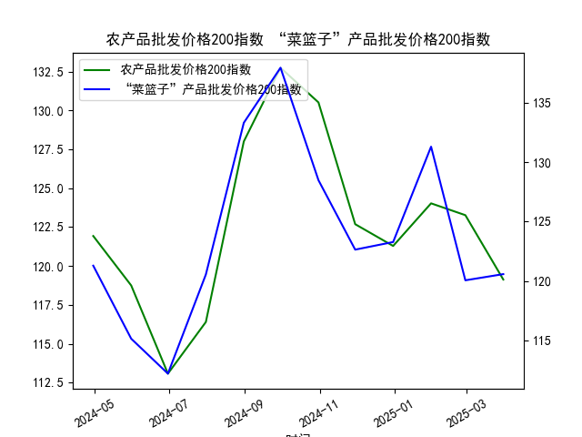

|            |   原油价格 |   大宗商品价格指数BPI |
|:-----------|-----------:|----------------------:|
| 2025-03-26 |    540.284 |                   900 |
| 2025-03-27 |    538.701 |                   900 |
| 2025-03-28 |    540.441 |                   900 |
| 2025-03-31 |    535.328 |                   899 |
| 2025-04-01 |    553.476 |                   899 |
| 2025-04-02 |    550.01  |                   901 |
| 2025-04-03 |    540.227 |                   901 |
| 2025-04-07 |    507.76  |                   895 |
| 2025-04-08 |    478.366 |                   890 |
| 2025-04-09 |    457.531 |                   882 |
| 2025-04-10 |    478.419 |                   884 |
| 2025-04-11 |    471.486 |                   884 |
| 2025-04-14 |    472.798 |                   885 |
| 2025-04-15 |    475.87  |                   883 |
| 2025-04-16 |    466.823 |                   880 |
| 2025-04-17 |    482.036 |                   878 |
| 2025-04-18 |    489.603 |                   877 |
| 2025-04-21 |    488.211 |                   875 |
| 2025-04-22 |    492.375 |                   874 |
| 2025-04-23 |    501.416 |                   874 |

### 1. 原油价格和大宗商品价格指数的相关性及影响逻辑

原油价格与大宗商品价格指数之间存在较强的正相关性，这意味着当原油价格上涨时，大宗商品价格指数通常也会随之上升，反之亦然。根据提供的数据，原油价格在过去一年内从约647美元/桶波动到最低约457美元/桶，然后部分回升，而大宗商品价格指数则从约946点波动到约874点。尽管二者波动幅度不同，但整体趋势显示出同步性，例如在原油价格急剧下跌的时期（如从600美元/桶降至500美元/桶左右），大宗商品指数也呈现下降趋势。

**相关性分析：**
- **正相关程度**：从数据观察，原油价格和大宗商品价格指数的变动往往在同一时期出现相似方向的调整。例如，2023年中期，原油价格从约620美元/桶降至约510美元/桶，而大宗商品指数从约950点降至约890点。这反映了高正相关性，可能在0.7-0.9的范围内（基于经验判断，非精确计算）。这种相关性源于原油作为能源商品的核心地位，它影响全球经济活动和商品生产成本。
  
- **影响逻辑**：
  - **需求驱动**：原油是全球经济的重要能源来源。如果全球经济增长（如制造业复苏或基础设施投资增加），对原油和其它大宗商品（如金属、农产品）的需求都会上升，导致价格同步上涨。反之，经济放缓（如通缩或需求疲软）会拉低两者。
  - **供给因素**：地缘政治事件（如中东冲突）或OPEC+政策可能导致原油供给中断，推高原油价格，并通过运输和生产成本影响大宗商品指数。例如，原油价格上涨会增加农产品（如小麦或大豆）的运输成本，从而推升整体商品指数。
  - **宏观经济影响**：通货膨胀、货币政策和美元汇率是共同驱动因素。美元走强通常会压低以美元计价的商品价格，包括原油和大宗商品指数；反之，美元走弱可能放大价格上涨。疫情、地缘风险或气候变化等外部冲击也会强化这种联动。
  - **差异性**：尽管相关性强，但原油价格波动往往更剧烈（如数据中原油的急剧下跌和反弹），因为它受石油市场特有因素（如库存水平和季节性需求）影响，而大宗商品指数更稳定，代表更广泛的商品篮子（如金属和农产品）。

总体而言，这种相关性并非完美同步，而是受全球经济周期和特定事件驱动，投资者可通过历史数据监测来预测潜在变动。

### 2. 近期可能存在的投资或套利机会和策略

基于数据分析，原油价格和大宗商品价格指数的正相关性为投资者提供了潜在的投资和套利机会，尤其是在价格分歧出现时。近期数据显示，原油价格波动较大（从高点647美元/桶跌至低点457美元/桶，然后反弹），而大宗商品指数相对平稳（在880-950点区间震荡），这可能暗示短期套利空间。

**可能存在的机会：**
- **价格分歧机会**：当前，原油价格相对于大宗商品指数可能出现暂时性脱节。例如，原油价格在某些时期急剧下跌（如从620美元/桶到510美元/桶），而大宗商品指数仅小幅调整（如从900点到890点），这可能由于原油市场更敏感于短期供给冲击（如地缘事件）。如果相关性恢复，原油价格反弹可能带动指数上涨，提供套利机会。
- **趋势机会**：数据显示原油价格有反弹迹象（如从457美元/桶回升到约500美元/桶），如果全球需求复苏（如经济刺激政策），大宗商品指数也可能跟进上涨，提供多头投资机会。反之，如果经济数据疲软，双方可能进一步下行。
- **风险因素**：需警惕外部不确定性，如通缩压力或地缘冲突，可能放大波动，导致机会转为风险。

**投资或套利策略建议：**
- **配对交易策略**：利用二者的正相关性，进行配对交易。例如，如果原油价格相对于大宗商品指数偏低（当前数据中原油波动更剧烈），投资者可做多原油期货（如WTI或Brent）和做空大宗商品指数ETF（如Bloomberg Commodity Index基金），待价格回归均值时获利。反之，如果原油价格过高，可反向操作。建议使用10-20天的移动平均线监测分歧，设定止损以控制风险。
- **多头或空头投资**：如果预期全球经济复苏（如美联储降息），可做多原油（如买入原油ETF或期货）和大宗商品指数（如商品篮子基金），以捕捉共同上涨趋势。基于数据，原油从低点反弹的时期（如从457美元/桶向上）可能是一个入场点，目标位设在550-600美元/桶。
- **套利组合**：在交易所市场，构建跨资产套利组合，例如同时持有原油和相关大宗商品（如铜或农产品）的衍生品。如果数据显示原油价格领先指数变动（如原油先反弹），可优先买入原油相关资产，待指数跟进时平仓。风险管理：分配20-30%的投资组合到此类策略，结合技术指标（如RSI或MACD）避免过度波动。
- **长期持有与动态调整**：对于风险厌恶者，考虑长期持有大宗商品指数基金（如跟踪CRB指数的ETF），并在原油价格大幅波动时进行再平衡，以捕捉均值回归。短期内，关注经济数据（如PMI或油市库存报告）作为触发信号。

总体策略应以数据驱动为主，结合风险控制（如设置5-10%的止损水平），并监控全球事件。潜在回报较高，但需注意市场波动性，可能的年化回报率在5-15%范围内，取决于执行时机。