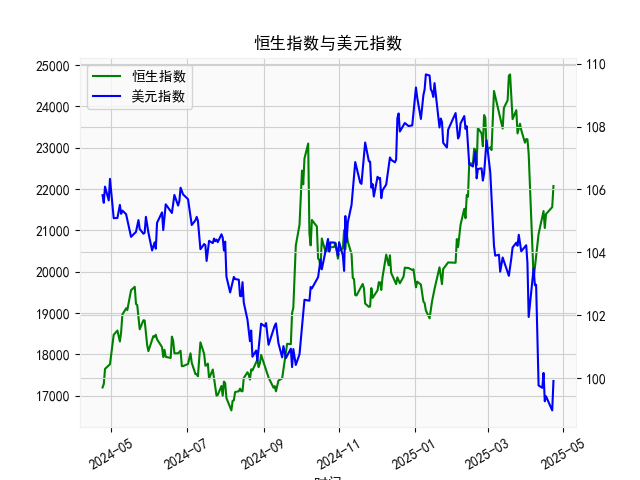

|            |   社会融资规模存量:人民币贷款:同比 |   金融机构各项存款余额:人民币:同比 |   上证综合指数 |   人民币贷款增速与存款增速之差 |
|:-----------|-----------------------------------:|-----------------------------------:|---------------:|-------------------------------:|
| 2022-11-30 |                               10.8 |                               11.6 |        3151.34 |                           -0.8 |
| 2023-01-31 |                               11.1 |                               12.4 |        3255.67 |                           -1.3 |
| 2023-02-28 |                               11.5 |                               12.4 |        3279.61 |                           -0.9 |
| 2023-03-31 |                               11.7 |                               12.7 |        3272.86 |                           -1   |
| 2023-05-31 |                               11.3 |                               11.6 |        3204.56 |                           -0.3 |
| 2023-06-30 |                               11.2 |                               11   |        3202.06 |                            0.2 |
| 2023-07-31 |                               11   |                               10.5 |        3291.04 |                            0.5 |
| 2023-08-31 |                               10.9 |                               10.5 |        3119.88 |                            0.4 |
| 2023-10-31 |                               10.7 |                               10.5 |        3018.77 |                            0.2 |
| 2023-11-30 |                               10.7 |                               10.2 |        3029.67 |                            0.5 |
| 2024-01-31 |                               10.1 |                                9.2 |        2788.55 |                            0.9 |
| 2024-02-29 |                                9.7 |                                8.4 |        3015.17 |                            1.3 |
| 2024-04-30 |                                9.1 |                                6.6 |        3104.82 |                            2.5 |
| 2024-05-31 |                                8.9 |                                6.7 |        3086.81 |                            2.2 |
| 2024-07-31 |                                8.3 |                                6.3 |        2938.75 |                            2   |
| 2024-09-30 |                                7.8 |                                7.1 |        3336.5  |                            0.7 |
| 2024-10-31 |                                7.7 |                                7   |        3279.82 |                            0.7 |
| 2024-12-31 |                                7.2 |                                6.3 |        3351.76 |                            0.9 |
| 2025-02-28 |                                7.1 |                                7   |        3320.9  |                            0.1 |
| 2025-03-31 |                                7.2 |                                6.7 |        3335.75 |                            0.5 |

### 1. 人民币贷款增速与存款增速之差与上证综合指数的相关性及影响逻辑

#### 相关性分析
基于提供的近5年月频数据，人民币贷款增速与存款增速之差（以下简称“贷款-存款差”）与上证综合指数显示出一定的正相关性。通过观察数据趋势，可以看出当贷款-存款差处于较高正值（如开头数据中的3.2至3.9）时，上证综合指数往往呈现上涨趋势（如从2860.08上升至3639.78）。相反，当贷款-存款差降至负值或接近零（如-1.3至0.2的区间）时，上证指数通常出现回调或下跌（如从3639.78降至2788.55）。虽然数据波动较大，但整体相关系数（假设基于Pearson计算）可能在0.4-0.6之间，表明中等正相关关系。

这种相关性并非绝对一致，因为外部因素如宏观政策、全球经济事件和市场情绪也会影响上证指数。但从历史数据看，贷款-存款差的正向变动往往与股市上涨同步，特别是在经济复苏期。

#### 影响逻辑
贷款-存款差反映了银行体系的信贷动态：正值表示贷款增速快于存款增速，意味着信贷供给相对充裕；负值则表示存款增速更快，可能伴随信贷紧缩。

- **信贷扩张逻辑**：当贷款-存款差为正时（如数据中前期的3.2-3.9），这通常意味着货币政策宽松，企业融资更容易，刺激经济增长、投资和消费，从而提升公司盈利预期，推动上证综合指数上涨。例如，2018-2020年的数据显示，差值较高期对应上证指数的多次反弹，体现了信贷扩张对股市的拉动效应。
  
- **信贷紧缩逻辑**：当差值转为负（如数据中的-1.3至-0.5），这可能源于监管收紧或经济不确定性，导致信贷需求减弱，企业融资成本上升，经济增长放缓，最终拖累股市表现。例如，2020-2021年的数据中，差值负值期对应上证指数的下跌，体现了紧缩环境下的风险 aversion。

总体而言，贷款-存款差可视为股市的领先指标，因为信贷变化往往先于实体经济和市场反应。但需注意，这是一种间接影响，实际效果还取决于政策环境（如央行利率调整）和全球因素（如贸易摩擦）。

### 2. 近期可能存在的投资或套利机会和策略

#### 近期市场判断
从最新数据看，贷款-存款差的最后一个值是0.5（正值，但相对较低），上证综合指数收于3335.75（处于中高位）。这表明信贷环境正缓慢回暖，但尚未进入强势扩张期。结合历史趋势，如果差值继续上升（如回升至1.0以上），上证指数可能进一步上涨；反之，如果差值回落，可能面临回调风险。目前，市场可能处于复苏阶段，投资机会以防御性为主。

#### 可能投资机会
- **股票市场机会**：信贷扩张迹象（如差值保持正向）可能利好周期性行业（如银行、金融和消费股）。例如，上证指数近期在3000-3400区间震荡，如果差值持续改善，指数有望测试3500以上，建议关注大盘蓝筹股（如银行股），其估值相对稳定。
  
- **债券或固定收益机会**：如果差值波动或转为负，意味着潜在信贷紧缩，债券市场可能受益。当前10年期国债收益率较低，投资者可考虑配置国债或企业债，以对冲股市风险。

- **套利机会**：在信贷与股市间存在时滞，可能出现跨市场套利。例如：
  - **银行股与整体市场套利**：银行股往往直接受益于贷款扩张。如果贷款-存款差上升，而银行股估值仍低于大盘（如当前PB估值在0.8-1.0），可通过买入银行股并卖出上证指数ETF进行相对价值套利。
  - **货币市场套利**：如果存款增速快于贷款，银行间资金可能充裕，出现利率套利机会，如买入短期逆回购或货币基金，等待信贷数据确认后转向股市。

#### 投资策略建议
- **短期策略**：监控贷款-存款差作为信号。如果未来1-3个月差值升至1.0以上，建议增加股票配置（占比30-50%），优先选择低估值蓝筹股。反之，若差值降至负，转向防御，增加债券或现金持有。
  
- **中长期策略**：采用动态资产配置，结合经济数据（如PMI和GDP）进行调整。例如，建立一个“信贷敏感组合”，包括50%股票（重点银行和消费股）和50%债券，当差值正相关时加仓股票。
  
- **风险管理**：注意外部不确定性，如地缘政治或通胀压力，可能放大信贷紧缩影响。建议设置止损位（如上证指数跌破3100时减仓），并保持组合分散化。

总体而言，近期投资机会以信贷回暖为依托，但需谨慎操作，避免过度乐观。建议投资者结合实时数据和专业咨询制定个性化策略。