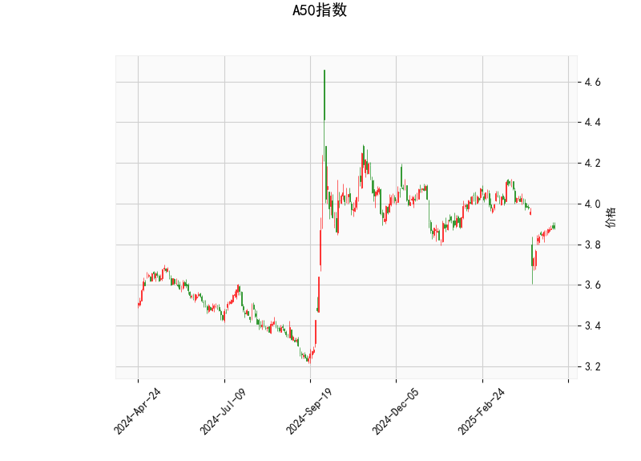

### A50指数技术分析结果分析

#### 1. 对技术分析结果的详细解读
以下是对A50指数当前技术指标的分析，这些指标基于提供的实时数据。整体来看，指标显示市场可能处于一个相对弱势但潜在反弹的阶段。

- **当前价格（3.882）**：  
  当前价格位于布林带的下半部分，具体在下轨（3.787）和中轨（3.975）之间，距离下轨仅0.096点。这表明价格可能接近短期支撑位，市场波动性较高。如果价格进一步下跌，可能测试下轨支撑；反之，如果反弹，则可能向中轨（3.975）靠拢。

- **RSI（45.525）**：  
  RSI（相对强弱指数）当前值为45.525，处于中性偏弱区域（RSI在30以下为超卖，70以上为超买）。这个水平暗示市场短期内可能没有明显的超买或超卖信号，但RSI低于50表示卖方力量稍占上风。如果RSI开始上升（例如超过50），这可能预示着潜在的买入机会；反之，如果跌破30，则可能进一步确认弱势。

- **MACD指标**：  
  - MACD线（-0.0305）高于信号线（-0.0391），且MACD直方图（0.0086）为正值。这是一个微弱的看涨信号，因为MACD线向上穿越信号线（金叉）通常表示短期动量转强。尽管整体MACD仍为负（表明熊市趋势未完全逆转），但直方图的正值暗示卖方势头可能正在减弱，潜在的反弹机会正在显现。如果MACD线继续上升并保持在信号线之上，可能会强化多头信号。

- **布林带（Bollinger Bands）**：  
  - 上轨（4.163）、中轨（3.975）和下轨（3.786）。当前价格接近下轨，这往往是市场波动加剧的信号。布林带收窄或价格触及下轨时，通常预示着潜在的均值回归（即价格可能反弹向中轨）。如果价格突破上轨（4.163），可能进入强势区域；反之，如果跌破下轨，则可能进一步下行。

- **K线形态（CDLMATCHINGLOW）**：  
  这是一个经典的看涨形态，通常出现在价格底部，表明市场可能形成双底或短期支撑。CDLMATCHINGLOW暗示卖方力量耗尽，买方可能开始介入。这与RSI和MACD的信号相呼应，整体支持短期反弹的可能性。

总体技术面分析：A50指数当前处于弱势整理阶段，但多个指标（如MACD直方图正值和K线形态）显示潜在的转强信号。市场可能在布林带下轨附近寻找支撑，如果RSI回升，这将进一步确认反弹。

#### 2. 近期可能存在的投资或套利机会和策略判断
基于上述技术分析，以A50指数的当前状态，近期可能存在一些短期投资机会，特别是围绕潜在反弹的策略。以下是针对可能的投资和套利机会的分析与建议，需结合市场整体环境（如全球经济数据、政策变化）进行评估。注意，投资涉及风险，建议结合基本面分析和风险管理。

- **可能的投资机会**：  
  - **短期反弹机会**：指标显示A50指数可能从当前弱势中反弹，尤其是CDLMATCHINGLOW形态和MACD的正直方图暗示潜在多头信号。如果价格稳定在上方布林带下轨（3.787）以上，并RSI向上突破50，这可能是一个入场点。预计反弹目标可设在中轨（3.975）附近，潜在涨幅约2-4%。  
  - **风险因素**：如果全球市场不确定性增加（如地缘政治事件），价格可能进一步下探至布林带下轨以下，导致短期损失。因此，机会主要适合短期交易者，而非长期投资者。

- **可能套利机会**：  
  - **布林带均值回归套利**：价格接近下轨时，可考虑基于均值回归的套利策略。例如，利用A50指数期货或相关ETF进行多头套利（如买入现货或期货，同时卖出看跌期权）。如果价格反弹向中轨，预计可获利1-3%的价差。但需注意，布林带收窄可能预示更大波动，增加套利风险。  
  - **跨品种套利**：如果A50指数与相关资产（如中国A股或全球指数）存在相关性偏差，可探索统计套利。例如，如果A50相对A股估值偏低，可在A50上做多，同时在A股上做空，以捕捉回归机会。但这需要实时数据支持，当前指标显示A50的弱势可能提供短期套利窗口。

- **推荐策略**：  
  - **多头交易策略**：在价格稳定于3.787以上时，考虑买入A50指数ETF或期货。止损位可设在下轨以下（例如3.750），目标位在中轨（3.975）。结合RSI监控，如果RSI升至50以上，可加仓。  
  - **风险控制策略**：采用仓位控制（如总仓位不超过20%）和动态止损，避免单向风险。短期内，优先观察MACD是否确认金叉；如果失败，及时转向空头或观望。  
  - **套利具体建议**：对于经验丰富的投资者，可使用期权策略（如买入看涨期权、卖出看跌期权）来放大反弹收益，同时限制下行风险。预计套利周期为1-2周，需密切跟踪K线形态变化。  
  - **总体建议**：当前机会适中，但市场不确定性高（如经济数据发布），建议保守操作。优先选择流动性强的工具（如ETF），并结合技术面与基本面（如中国经济政策）综合决策。

请注意，以上分析基于历史数据和技术指标推断，并非投资建议。实际操作前，应咨询专业顾问，并考虑个人风险承受能力。