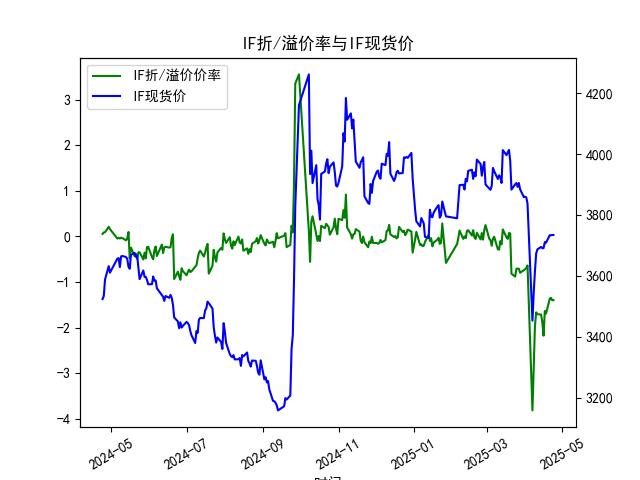
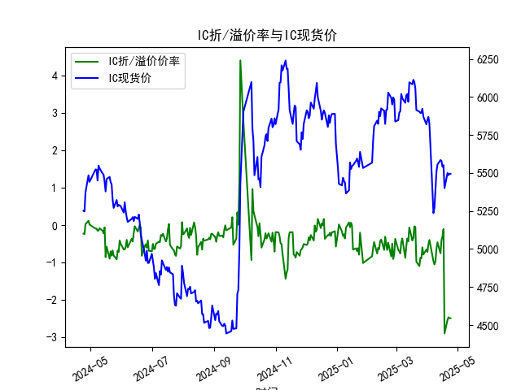
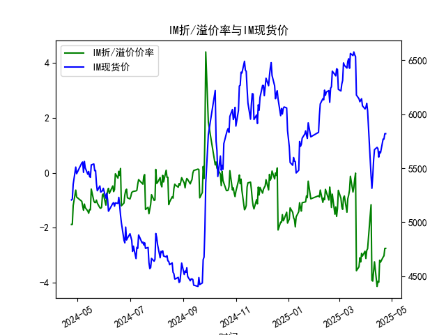

|            |   IF折/溢价率 |   IF现货价 |   IH折/溢价率 |   IH现货价 |   IC折/溢价率 |   IC现货价 |   IH折/溢价率 |   IH现货价 |
|:-----------|--------------:|-----------:|--------------:|-----------:|--------------:|-----------:|--------------:|-----------:|
| 2025-03-27 |     -0.707243 |     3904.6 |     -0.594227 |     5922.2 |     -0.594227 |     5922.2 |      -2.92895 |     6143.4 |
| 2025-03-28 |     -0.796038 |     3884   |     -0.78484  |     5869.6 |     -0.78484  |     5869.6 |      -3.02986 |     6078.4 |
| 2025-03-31 |     -0.738445 |     3858.6 |     -0.651649 |     5819.6 |     -0.651649 |     5819.6 |      -2.85304 |     6049   |
| 2025-04-01 |     -0.722386 |     3859.6 |     -0.716974 |     5850.6 |     -0.716974 |     5850.6 |      -3.11981 |     6064.2 |
| 2025-04-02 |     -0.689576 |     3857.6 |     -0.5168   |     5868.6 |     -0.5168   |     5868.6 |      -2.82374 |     6100   |
| 2025-04-03 |     -0.634556 |     3837   |     -0.395252 |     5822.4 |     -0.395252 |     5822.4 |      -2.76398 |     6031.8 |
| 2025-04-07 |     -3.81231  |     3452.6 |     -0.961471 |     5236.2 |     -0.961471 |     5236.2 |      -1.16153 |     5432.6 |
| 2025-04-08 |     -2.92977  |     3543.8 |     -1.04965  |     5271   |     -1.04965  |     5271   |      -3.91353 |     5313.6 |
| 2025-04-09 |     -1.97446  |     3614   |     -0.96643  |     5387.2 |     -0.96643  |     5387.2 |      -3.9405  |     5429.6 |
| 2025-04-10 |     -1.663    |     3673   |     -0.632471 |     5509   |     -0.632471 |     5509   |      -3.56785 |     5578.2 |
| 2025-04-11 |     -1.70421  |     3686.6 |     -0.457211 |     5555.8 |     -0.457211 |     5555.8 |      -3.2409  |     5672.2 |
| 2025-04-14 |     -1.71162  |     3694.8 |     -0.752381 |     5584.8 |     -0.752381 |     5584.8 |      -4.13446 |     5693   |
| 2025-04-15 |     -1.88329  |     3690.4 |     -0.402211 |     5580   |     -0.402211 |     5580   |      -3.95041 |     5680.4 |
| 2025-04-16 |     -2.17398  |     3690.8 |     -0.296286 |     5540.4 |     -0.296286 |     5540.4 |      -3.98173 |     5603   |
| 2025-04-17 |     -1.63358  |     3710.6 |     -0.104562 |     5551.2 |     -0.104562 |     5551.2 |      -3.18113 |     5653.8 |
| 2025-04-18 |     -1.68913  |     3708.8 |     -2.89029  |     5400   |     -2.89029  |     5400   |      -3.25269 |     5642   |
| 2025-04-21 |     -1.36545  |     3733.2 |     -2.52696  |     5499.8 |     -2.52696  |     5499.8 |      -3.06818 |     5770   |
| 2025-04-22 |     -1.34653  |     3733   |     -2.45739  |     5486   |     -2.45739  |     5486   |      -3.02072 |     5769.6 |
| 2025-04-23 |     -1.39646  |     3734   |     -2.48358  |     5495   |     -2.48358  |     5495   |      -2.75012 |     5820   |
| 2025-04-24 |     -1.39646  |     3734   |     -2.48358  |     5495   |     -2.48358  |     5495   |      -2.75012 |     5820   |

### 1. 股指期货折/溢价率与现货价的相关性及影响逻辑

股指期货的折/溢价率（Basis Percent）是指期货价格相对于现货价格的百分比差异，通常计算为（期货价格 - 现货价格）/现货价格 × 100%。正值表示期货溢价（期货价格高于现货），负值表示期货折价（期货价格低于现货）。这一指标与现货价格之间存在密切的相关性，主要体现在定价机制、市场预期和套利行为上。以下是详细解释：

- **相关性分析**：
  - **正相关或负相关动态**：从提供的数据看，股指期货（如IF、IH、IC和IM）的折/溢价率与现货价格（CLOSE）往往呈现动态相关性。例如，在IF数据中，折/溢价率从2024年4月的正溢价（约0.06%）逐步转为2025年4月的显著折价（约-1.40%），而现货价格从3523.6上涨至3734.0。这表明，当现货价格上涨时，期货价格可能未能完全跟进，导致折价加深（如IH和IC从轻微负值转为-2.48%左右）。反之，如果现货价格下跌，折/溢价率可能趋于正值。总体上，折/溢价率与现货价格的变动呈负相关趋势，即现货价格上涨时，折价率可能扩大（期货相对低估）；现货价格下跌时，溢价率可能出现。
  
  - **统计观察**：在近一年的243行数据中，IF的折/溢价率从正转负，现货价格整体上涨；IH、IC和IM则从轻微负值转为深度负值（-2.75%至-3.25%），这反映了期货市场对现货价格的滞后响应。相关性强度可能因合约类型而异，例如IM的折价率更稳定地维持在负值，显示其与现货价格的关联较强。

- **影响逻辑**：
  - **基础定价理论**：股指期货价格理论上应等于现货价格加上持有成本（包括融资成本、股息调整和存储费用），这基于无套利原理。如果期货价格偏离这一水平，就会产生折/溢价。影响因素包括：
    - **市场预期**：如果投资者预期现货价格将上涨，期货可能被高估（溢价）；反之，如果预期下行，期货可能被低估（折价）。例如，数据中IH和IC的折价加深，可能反映市场对经济放缓的担忧，导致期货定价更谨慎。
    - **供需与流动性**：期货市场的交易量、投资者情绪和资金流动会放大折/溢价。例如，2024年4月IF的正溢价可能源于市场乐观情绪，而2025年4月的折价可能由于流动性不足或风险厌恶。
    - **时间与到期因素**：期货合约有到期日，临近到期时，折/溢价率往往收敛于零（移仓效应）。数据覆盖一年期，显示了季节性波动，如2024年底的正溢价可能与经济数据改善相关。
    - **外部事件**：宏观经济政策、全球事件（如利率变化或地缘政治风险）会影响现货价格，从而间接作用于折/溢价率。例如，IH和IC的深度折价可能与A股市场波动相关。
    
  总之，折/溢价率不是孤立存在的，而是现货价格的衍生指标。它的变化能揭示市场 inefficiencies，但长期来看，价格会趋向均衡，通过套利行为（如正向或反向套利）来修正差异。

### 2. 近期可能存在的投资或套利机会和策略

基于提供的数据，近期（尤其是2025年4月）股指期货整体呈现折价状态（IF约-1.40%，IH和IC约-2.48%，IM约-2.75%），这暗示潜在的投资或套利机会。以下分析判断机会和策略，重点关注折价率的异常扩大与现货价格的上涨趋势。

- **可能存在的机会**：
  - **反向套利机会**：当前数据显示所有合约均处于折价状态，这意味着期货价格相对现货被低估。如果折价率过大（如IH和IC的-2.5%以上），投资者可通过买入期货、卖出现货的策略获利，待价格回归均衡。原因在于，历史数据显示折/溢价率往往是暂时的，市场会通过套利行为推动其收敛。例如，IF的现货价格从3523.6上涨至3734.0，但折价率加深，表明期货可能被低估，存在回归均值的潜力。
  - **投资机会**：现货价格整体上涨（如IM的CLOSE从5205.8至5820.0），结合折价，买入折价期货（如IM）可能捕捉市场反弹。风险较低的合约（如IF，折价率较小）适合保守投资者。
  - **潜在风险**：如果经济数据恶化，现货价格可能回调，导致折价进一步扩大；合约到期需注意移仓成本。

- **策略建议**：
  - **反向套利策略**：
    - **买入期货、卖出现货**：针对IH和IC的深度折价（约-2.48%），投资者可买入这些期货合约，同时卖出等额现货（如IH现货价格5495.0）。预期折价收敛时平仓获利。门槛：需有足够的资金和风险管理工具（如止损）。
    - **时机选择**：监控折/溢价率是否扩大到历史极端（如IH的-2.89%），并结合现货价格趋势（如IF现货持续上涨）。建议在市场稳定期（如非节假日）执行。
    
  - **投资策略**：
    - **多头期货投资**：鉴于IM的现货价格上涨且折价稳定，选择买入IM期货，持有至折价率缩小。理由：数据显示IM折价从-1.88%转为-2.75%，但现货已涨至5820.0，潜在回报率高。
    - **组合策略**：将套利与投资结合，例如在IF上进行小额反向套利，同时增持现货以对冲风险。长期持有IF期货，等待市场情绪改善。
    
  - **风险控制与注意事项**：
    - **止损机制**：设置折/溢价率阈值（如IF折价率超过-2.0%时止损），避免市场剧烈波动。
    - **成本考虑**：注意交易费用、融资成本和合约到期风险。数据中，2025年4月的重复值（如2025-04-24）可能表示数据延迟，需实时验证。
    - **整体建议**：适合经验丰富的投资者，保守型可等待折价率稳定后入场。结合宏观环境（如中国经济数据），若正向信号增多，机会更大。

总体而言，近期折价主导的市场为反向套利提供了窗口，但需谨慎评估市场波动性，以数据趋势为基础制定动态策略。

