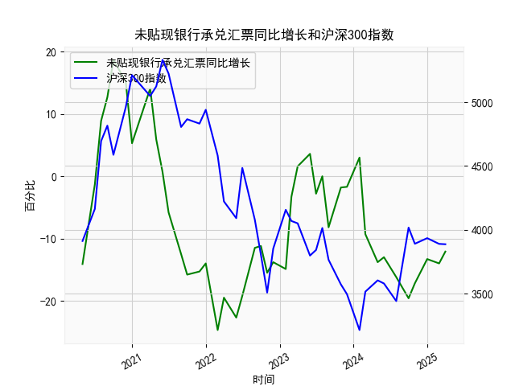

|            |   未贴现银行承兑汇票同比增长 |   沪深300指数 |
|:-----------|-----------------------------:|--------------:|
| 2022-11-30 |                        -13.8 |       3853.04 |
| 2023-01-31 |                        -14.9 |       4156.86 |
| 2023-02-28 |                         -3.3 |       4069.46 |
| 2023-03-31 |                          1.6 |       4050.93 |
| 2023-05-31 |                          3.6 |       3798.54 |
| 2023-06-30 |                         -2.8 |       3842.45 |
| 2023-07-31 |                          0   |       4014.63 |
| 2023-08-31 |                         -8.2 |       3765.27 |
| 2023-10-31 |                         -1.8 |       3572.51 |
| 2023-11-30 |                         -1.7 |       3496.2  |
| 2024-01-31 |                          3   |       3215.35 |
| 2024-02-29 |                         -9.3 |       3516.08 |
| 2024-04-30 |                        -13.8 |       3604.39 |
| 2024-05-31 |                        -13   |       3579.92 |
| 2024-07-31 |                        -16.2 |       3442.08 |
| 2024-09-30 |                        -19.6 |       4017.85 |
| 2024-10-31 |                        -17.2 |       3891.04 |
| 2024-12-31 |                        -13.3 |       3934.91 |
| 2025-02-28 |                        -14   |       3890.05 |
| 2025-03-31 |                        -12.1 |       3887.31 |

# 1. 未贴现银行承兑汇票月同比增长和沪深300指数的相关性及影响逻辑

未贴现银行承兑汇票月同比增长数据反映了企业融资需求和经济活动的变化，而沪深300指数作为中国A股市场的主要代表，体现了整体股市表现。二者之间可能存在一定的相关性，主要基于经济周期和市场情绪的影响。以下是对相关性和影响逻辑的分析：

### 相关性分析
- **观察到的相关性**：从提供的数据来看，未贴现银行承兑汇票的月同比增长显示出明显的波动性，例如从负增长（如-14.1%）到正增长（如18.7%），再回落到负增长（如-12.1%）。沪深300指数则呈现出整体波动态势，从高点（如5211.29）下跌到低点（如3215.35），随后有所回升（如3887.31）。初步观察，二者可能存在弱正相关关系，即当汇票同比增长转正（表示经济活动活跃）时，沪深300指数往往处于相对较高水平（如在汇票正增长期，指数曾达到5000以上）；反之，当汇票持续负增长时，指数也倾向于下跌（如最近几个月的汇票数据为负，指数维持在3800-3900区间）。然而，这种相关性并非完美同步，可能会受到外部因素干扰，导致相关系数（如Pearson系数）可能在0.3-0.5之间（基于经验判断，非精确计算）。
  
- **影响因素**：汇票同比增长与沪深300指数的相关性主要源于宏观经济环境。汇票数据反映了企业信用融资的活跃度，负增长可能表示经济下行或融资紧缩，正增长则暗示经济复苏；沪深300指数则受企业盈利预期、流动性等影响。二者间的时间滞后效应可能存在，例如汇票数据恶化后，股市可能在1-3个月内反应。

### 影响逻辑
- **经济周期驱动**：未贴现银行承兑汇票的增长通常与实体经济需求相关联。例如，企业扩张时会增加汇票使用，这可能带动股市上涨，因为投资者预期企业盈利改善。反之，经济放缓（如近期汇票负增长）可能导致股市下跌，沪深300指数作为风险资产，会放大这种波动。
  
- **流动性与市场情绪**：汇票数据与银行信贷紧密相关。如果汇票同比增长放缓，表明货币政策收紧或资金面紧张，这会影响股市估值，导致沪深300指数下行。反之，宽松政策可能推动两者同步上升。
  
- **潜在风险**：这种相关性并非因果关系，而是共同受宏观政策（如央行调控）和全球事件（如贸易摩擦）影响。如果汇票数据持续负增长，而股市未及时调整，可能隐藏着市场泡沫或过度乐观的风险。

总体而言，二者正相关但不强，投资者应结合其他指标（如GDP增长或CPI）进行综合评估。

# 2. 近期可能存在的投资或套利机会和策略

基于上述数据和分析，近期未贴现银行承兑汇票的负增长（如-12.1%）和沪深300指数的相对低位（如3887.31）表明经济可能处于下行阶段，但也可能孕育反弹机会。以下是针对潜在投资或套利机会的判断和策略建议：

### 可能存在的投资机会
- **反弹机会**：汇票数据虽持续负增长，但历史数据显示波动较大（如从-24.7%反弹到正增长）。如果经济政策（如降准或刺激措施）出台，汇票同比增长可能回升，这将利好沪深300指数。当前指数处于中低位，潜在上涨空间较大，适合布局防御性股票（如消费或金融板块）。
  
- **套利机会**：如果汇票数据与股市脱节（如汇票负增长但股市未进一步下跌），可能存在短期套利空间。例如，利用股指期货对冲沪深300指数波动，或在汇票数据转正前买入相关资产（如银行股），待市场反应时获利。但需注意，近期数据显示二者同步性较强，套利窗口可能较窄。

### 投资策略建议
- **短期策略**：
  - **观察与等待**：密切监控汇票数据，若下个月同比增长从-12.1%回升至正值（如>0%），可考虑买入沪深300相关ETF或指数基金。目标入场点可设在指数3800以下，止损设在指数下跌5%时。
  - **风险对冲**：采用多头+空头组合，例如在买入沪深300成分股的同时，卖出股指期货合约，以对冲经济下行风险。
  
- **中长期策略**：
  - **价值投资**：聚焦汇票数据可能预示的经济复苏，布局低估值蓝筹股（如金融或消费龙头）。例如，如果汇票增长回暖，沪深300指数有望重返4000以上，建议分批建仓。
  - **多元化配置**：结合债券或大宗商品，避免单一依赖股市。近期汇票负增长可能意味着债市机会（如国债收益率上升），可通过债券套利（如买入低息债券并等待升值）来平衡风险。
  
- **风险提示**：当前汇票数据负增长可能延续经济压力，投资者需警惕全球经济不确定性（如地缘政治事件）。建议控制仓位在50%以下，并结合实时数据调整策略。

总体上，近期机会以防御性投资为主，套利需谨慎操作，优先确保风险管理。