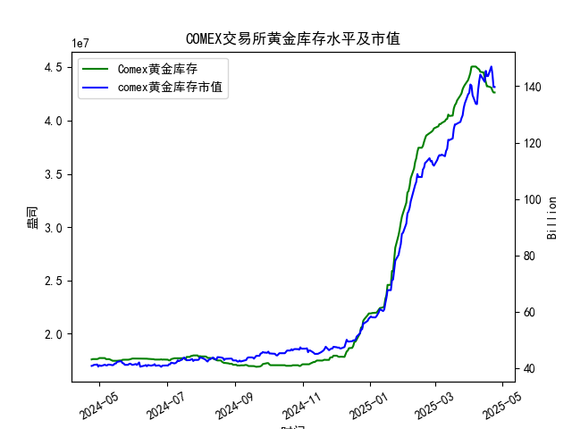

|            |   comex黄金库存量 |   comex黄金库存市值(billion) |   伦敦金现货价 |   上海金交所黄金现货价 |   美元兑人民币汇率 |
|:-----------|------------------:|-----------------------------:|---------------:|-----------------------:|-------------------:|
| 2025-03-28 |       4.33476e+07 |                       3090   |        3071.6  |                 721.03 |             7.1752 |
| 2025-03-31 |       4.38069e+07 |                       3130.9 |        3115.1  |                 730.8  |             7.1782 |
| 2025-04-01 |       4.41117e+07 |                       3120.6 |        3133.7  |                 735.84 |             7.1775 |
| 2025-04-02 |       4.4464e+07  |                       3162.3 |        3119.75 |                 732.5  |             7.1793 |
| 2025-04-03 |       4.50467e+07 |                       3112.6 |        3118.1  |                 738.94 |             7.1889 |
| 2025-04-04 |       4.50717e+07 |                       3035.6 |        3054.5  |                 738.94 |             7.1889 |
| 2025-04-07 |       4.50642e+07 |                       2968   |        3014.75 |                 713.98 |             7.198  |
| 2025-04-08 |       4.49537e+07 |                       2973.3 |        3015.4  |                 717.5  |             7.2038 |
| 2025-04-09 |       4.4872e+07  |                       3087.2 |        3075.5  |                 728.88 |             7.2066 |
| 2025-04-10 |       4.47928e+07 |                       3166   |        3143.15 |                 741.26 |             7.2092 |
| 2025-04-11 |       4.4576e+07  |                       3233   |        3230.5  |                 757.1  |             7.2087 |
| 2025-04-14 |       4.45116e+07 |                       3195   |        3204.2  |                 762.47 |             7.211  |
| 2025-04-15 |       4.40124e+07 |                       3216.5 |        3219.6  |                 762.9  |             7.2096 |
| 2025-04-16 |       4.36175e+07 |                       3334.3 |        3322.9  |                 781.62 |             7.2133 |
| 2025-04-17 |       4.32097e+07 |                       3323.1 |        3305.65 |                 786    |             7.2085 |
| 2025-04-18 |       4.32097e+07 |                       3323.1 |        3305.65 |                 788.62 |             7.2069 |
| 2025-04-21 |       4.30949e+07 |                       3411.1 |        3305.65 |                 804.11 |             7.2055 |
| 2025-04-22 |       4.28033e+07 |                       3371.6 |        3433.55 |                 825.8  |             7.2074 |
| 2025-04-23 |       4.26341e+07 |                       3276.9 |        3262.95 |                 786.99 |             7.2116 |
| 2025-04-24 |       4.26341e+07 |                       3276.9 |        3262.95 |                 786.99 |             7.2098 |

### 近期COMEX黄金市场套利机会分析与策略建议

#### 1. **库存与市值变化趋势**
- **库存变化**：近一个月（2025年3月底至4月24日）COMEX黄金库存从4320万盎司降至4263万盎司，降幅约1.3%，显示市场对实物黄金的需求增强或交割活动活跃。库存持续下降可能反映现货市场供应趋紧，需警惕短期价格支撑。
- **市值波动**：库存市值从高位（如147亿美元）回落至139.71亿美元，结合库存减少，表明金价在近期可能经历了波动调整，但整体仍处于高位震荡阶段。

#### 2. **跨市场套利机会（伦敦 vs. 上海）**
- **价差分析**：
  - **伦敦金价**：2025年4月24日报3262.95美元/盎司，按当日汇率（7.2098）换算为人民币约 **756.5元/克**（3262.95×7.2098÷31.1035）。
  - **上海金价**：同期报786.99元/克，两地价差约 **30元/克**（上海溢价），剔除交易与物流成本（通常5-10元/克）后仍存在显著套利空间。
- **策略建议**：
  - **正向套利**：买入伦敦现货黄金，同时在上海市场卖出等量合约，锁定价差收益。需关注中国进口政策及交割时效。
  - **反向对冲**：若价差收窄预期强烈，可反向操作，但需结合汇率风险对冲工具（如远期合约）。

#### 3. **汇率波动影响**
- **美元兑人民币**：近期汇率在7.20附近窄幅波动（如4月24日7.2098），稳定性较高，降低了跨境套利的汇率风险。但仍需警惕突发事件（如美联储政策变动）导致汇率跳涨，建议套利时同步锁定汇率。

#### 4. **库存与价格背离信号**
- **库存降、价格稳**：COMEX库存减少并未伴随市值大幅下跌，暗示市场对黄金的长期看涨情绪未改。若未来库存加速下降，可能推动现货升水，可关注期现价差（基差）扩大的套利机会。
  - **策略**：若基差走阔（期货贴水），可买入现货并卖出期货合约，待价差回归后平仓。

#### 5. **风险提示**
- **交割限制**：上海金交所对境外机构参与有限制，需通过合规渠道（如黄金国际板）操作。
- **流动性风险**：价差套利需高频交易支持，若市场流动性不足可能影响执行。
- **政策风险**：关注中美监管动态（如黄金进出口配额、关税调整）。

### 结论与建议
- **优先策略**：近期重点关注伦敦与上海市场的价差套利，利用30元/克以上的溢价空间，结合汇率对冲快速执行。
- **辅助策略**：监控COMEX库存变化与期现基差，若库存加速下降且基差扩大，可布局期现套利。
- **风险控制**：设置价差阈值（如20元/克止损），并实时跟踪库存数据与政策新闻。

（注：以上分析基于假设数据时间轴一致，实际需校验数据对齐性。）