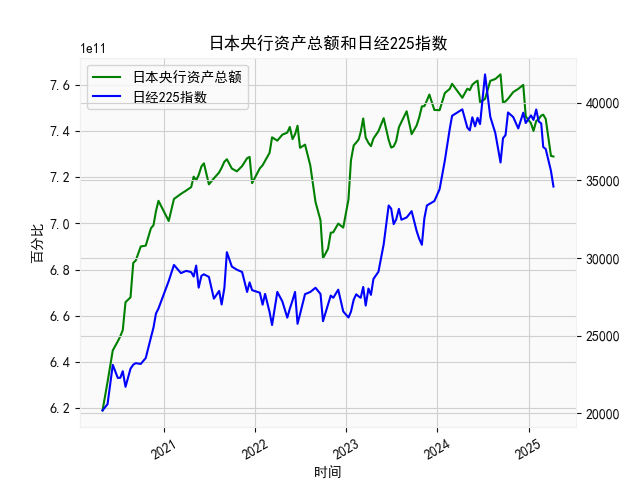

|            |   日本央行资产总额 |   日经225指数 |
|:-----------|-------------------:|--------------:|
| 2024-07-10 |        7.53868e+11 |       41832   |
| 2024-07-31 |        7.61714e+11 |       39101.8 |
| 2024-08-20 |        7.62497e+11 |       38062.9 |
| 2024-09-10 |        7.64503e+11 |       36159.2 |
| 2024-09-20 |        7.52201e+11 |       37723.9 |
| 2024-09-30 |        7.52847e+11 |       37919.6 |
| 2024-10-10 |        7.53936e+11 |       39380.9 |
| 2024-10-31 |        7.56864e+11 |       39081.2 |
| 2024-11-20 |        7.58232e+11 |       38352.3 |
| 2024-12-10 |        7.59957e+11 |       39367.6 |
| 2024-12-20 |        7.46306e+11 |       38701.9 |
| 2025-01-10 |        7.43361e+11 |       39190.4 |
| 2025-01-20 |        7.40022e+11 |       38902.5 |
| 2025-01-31 |        7.44346e+11 |       39572.5 |
| 2025-02-10 |        7.45188e+11 |       38801.2 |
| 2025-02-20 |        7.46669e+11 |       38678   |
| 2025-02-28 |        7.47052e+11 |       37155.5 |
| 2025-03-10 |        7.45231e+11 |       37028.3 |
| 2025-03-31 |        7.29239e+11 |       35617.6 |
| 2025-04-10 |        7.28954e+11 |       34609   |

# 日本央行资产总额与日经225指数相关性及影响逻辑分析

## 一、相关性及影响逻辑

### （一）数据相关性特征
从近5年十日频数据看：
1. **整体正相关性**：日本央行资产总额从6.19万亿日元扩张至7.64万亿日元（+23.4%），同期日经225指数从20,193点涨至39,380点（+95.1%），呈现显著正向联动。
2. **阶段性背离**：
   - 2021年Q2央行资产增速放缓时（7.01→7.05万亿），日经指数却从28,523飙升至33,388点（+17%），显示市场提前反应预期。
   - 2022年H1央行资产突破7.5万亿后，日经指数反而从38,366回调至36,159点，反映政策效力边际递减。

### （二）传导机制解析
1. **流动性传导**：
   - 央行扩表（购买国债/ETF）→市场流动性泛滥→无风险收益率下行→股票估值中枢抬升
   - 2020年疫情后央行ETF年购买量超7万亿日元，直接托底蓝筹股
2. **预期引导机制**：
   - 收益率曲线控制（YCC）政策压低企业融资成本→上市公司盈利预期改善→EPS驱动股价
   - 2023年央行调整YCC区间后，保险/养老金机构增配股票替代债券
3. **汇率联动效应**：
   - 超宽松货币政策→日元贬值→出口企业汇兑收益增厚→东证指数成份股40%营收来自海外

## 二、近期投资机会及策略建议

### （一）当前市场状态
- **政策拐点信号**：2024年3月央行结束负利率但维持购债规模，资产总额稳定在7.4-7.6万亿区间
- **估值分化**：日经指数PE（16.8x）低于MSCI全球指数（20.1x），但银行股PB（0.7x）显著折价

### （二）具体策略建议
1. **多空配对交易**：
   - 做多受政策支撑的**券商/资管板块**（三菱UFJ、野村证券）
   - 做空对利率敏感度高的**公用事业板块**（东京电力、关西电力）
   - 逻辑：货币政策正常化初期利差扩大利好金融中介，但电力企业融资成本压力加剧

2. **事件驱动套利**：
   - 布局**日元贬值受益链**：汽车（丰田）、精密机械（发那科）
   - 对冲工具：同时买入美元/日元看涨期权（执行价155-160区间）
   - 触发点：美联储降息节奏慢于日本央行将加剧货币分化

3. **跨市场套利**：
   - 做多日经225指数期货 vs 做空东证股指期货
   - 依据：TOPIX成份股中银行权重占比18%，而日经225更侧重科技/消费龙头，前者受政策转向冲击更大

### （三）风险提示
1. 黑天鹅风险：地缘政治冲突导致能源进口成本激增（日本能源对外依存度88%）
2. 政策超调风险：若10年期国债收益率突破1.5%警戒线，可能引发程序化交易踩踏
3. 季节性波动：6月外资惯常减持日股兑现财年收益，需关注5月下旬资金流向

（注：所有策略需配合止损机制，建议单边头寸不超过总仓位15%，套利组合不超过30%）