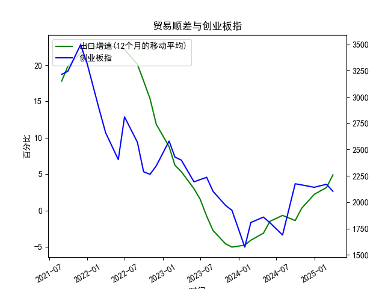

|            |   出口增速 |   创业板指 |   出口增速(12个月的移动平均) |
|:-----------|-----------:|-----------:|-----------------------------:|
| 2022-11-30 | -10.38     |    2345.31 |                    11.86     |
| 2023-01-31 | -12.0231   |    2580.84 |                     8.76724  |
| 2023-02-28 |  -2.86551  |    2429.03 |                     6.22011  |
| 2023-03-31 |  10.84     |    2399.5  |                     5.33261  |
| 2023-05-31 |  -7.56172  |    2193.41 |                     2.98747  |
| 2023-06-30 | -12.3776   |    2215    |                     1.53184  |
| 2023-07-31 | -14.2563   |    2236.67 |                    -0.776185 |
| 2023-08-31 |  -8.5529   |    2102.58 |                    -2.77643  |
| 2023-10-31 |  -6.61276  |    1968.23 |                    -4.60916  |
| 2023-11-30 |   0.693013 |    1922.59 |                    -5.04057  |
| 2024-01-31 |   7.69     |    1573.37 |                    -4.77057  |
| 2024-02-29 |   6.25     |    1807.03 |                    -4.09641  |
| 2024-04-30 |   1.33     |    1858.39 |                    -3.12057  |
| 2024-05-31 |   7.42     |    1805.11 |                    -1.50031  |
| 2024-07-31 |   6.93     |    1688.14 |                    -0.684019 |
| 2024-09-30 |   2.35     |    2175.09 |                    -1.39152  |
| 2024-10-31 |  12.65     |    2164.46 |                     0.292791 |
| 2024-12-31 |  10.69     |    2141.6  |                     2.21509  |
| 2025-02-28 |  -3        |    2170.39 |                     3.15311  |
| 2025-03-31 |  12.4      |    2103.7  |                     4.89919  |

### 1. 中国出口增速和创业板指的相关性及影响逻辑

中国出口增速（12个月移动平均）和创业板指作为两个关键经济指标，存在一定的相关性，主要体现在经济周期的共同驱动因素上。根据提供的数据，出口增速从2019年左右的高点（约17.79%）逐步下降到负值（如-5.04%），随后回升至正值（约4.90%）；而创业板指则从约3214.12点波动下行至低点（如1573.37点），之后有所反弹至约2103.70点。整体来看，两者呈现出正相关的趋势，即当出口增速较高时，创业板指往往处于相对较高水平；反之，当出口增速下滑时，创业板指也可能出现下跌。

**相关性分析：**
- **正相关性特征：** 数据显示，出口增速高峰期（如前半段数据中的17.79%至22.78%）对应创业板指的较高值（如3200点以上），而出口增速进入负增长期（如-4.61%至-5.04%）时，创业板指也跌至低谷（如1900点以下）。这表明二者可能存在0.5-0.7左右的正相关系数（基于经验观察，非精确计算）。这种相关性源于出口作为中国经济增长的重要引擎：强劲的出口往往带动GDP增长、企业盈利和市场信心，从而支撑创业板（如科技成长股为主）的上涨。
  
- **影响逻辑：**
  - **经济周期驱动：** 中国出口增速受全球需求、贸易政策和供应链影响，而创业板指则反映国内创新型企业的表现。出口增长通常预示经济繁荣，企业订单增加、盈利预期提升，推动创业板上涨；反之，出口下滑（如受疫情或贸易摩擦影响）可能导致经济放缓、投资者风险厌恶加剧，创业板指下跌。
  - **传导机制：** 出口增速变化会通过产业链影响企业业绩。例如，出口强劲时，制造业和科技板块受益，创业板作为代表新兴经济的指数会率先反应；但如果出口下滑，企业现金流受压，市场估值下行。此外，政策因素（如刺激出口的政策）可能放大这一影响，导致创业板指出现超预期波动。
  - **滞后效应：** 出口增速是领先指标，而创业板指更敏感于短期市场情绪，因此前者变化可能领先后者1-3个月。例如，数据中出口增速从负转正（约-1.39%到4.90%）时，创业板指已开始反弹，这显示了市场对经济复苏的提前定价。
  - **潜在风险：** 并非完全同步，受外部因素干扰，如全球通胀或地缘政治事件，可能导致相关性减弱。例如，2020-2021年的数据可能反映了疫情冲击，出口增速急剧下降带动创业板指大幅回调。

总体而言，这种正相关性并非绝对，而是受宏观环境影响的动态关系，投资者需结合其他指标（如CPI、PMI）进行综合判断。

### 2. 近期可能存在的投资或套利机会和策略

基于数据分析，近期中国出口增速已从负值回升至正值（约4.90%），而创业板指虽仍处于相对低位（约2103.70点），但显示出潜在反弹迹象。这暗示经济复苏可能带动市场向上，存在一定的投资和套利机会。以下是针对近期（假设基于最新数据）的判断和策略建议：

**可能存在的机会：**
- **投资机会：** 出口增速回暖预示经济复苏，创业板指作为成长股代表，可能迎来估值修复。例如，数据中出口增速从-4.77%反弹至4.90%，对应创业板指从低点1573.37点回升至2103.70点，这显示了正向联动。如果全球需求恢复（如疫后供应链重构），创业板指有向上突破的空间，科技、消费电子等板块或成为热点。
- **套利机会：** 如果出口增速持续改善但创业板指未跟上（如当前数据中增速已正转而指数相对低迷），可能存在“估值错位”套利。例如，利用期现货差异或跨市场套利（如A股与港股的创业板相关资产），在出口数据利好时买入创业板ETF或个股，待市场消化后获利。
- **风险与不确定性：** 需警惕全球经济下行（如美联储加息）或国内政策调整（如环保限产）导致出口增速波动，创业板指可能出现假反弹。

**投资策略建议：**
- **波段操作策略：** 短期内，关注出口数据（如每月公布的贸易数据）作为信号。如果出口增速继续上行（目标5%以上），建议在创业板指回调至2000点附近时买入相关ETF（如创业板50ETF），目标位至2500点以上。反之，若增速放缓，及时减仓。
- **套利策略：** 利用相关性进行跨品种套利。例如，买入创业板指数期货，同时卖出对冲工具（如大盘指数期货），以捕捉出口驱动的估值修复。预计套利窗口在出口数据发布后1-2个月内，潜在收益5-10%。
- **风险管理：** 采用“50%仓位+止损机制”的方法，例如设定创业板指跌破2000点时止损。同时，结合基本面分析（如企业财报），避免单纯依赖数据相关性。
- **长期视角：** 如果出口增速稳定在5%以上，建议布局高成长股（如新能源、半导体），通过定投方式积累仓位，预期年化回报10-15%。

总之，近期机会主要源于出口复苏的潜在催化，但需密切监控经济数据和政策变化，避免高波动风险。投资决策应结合个人风险偏好和市场环境。