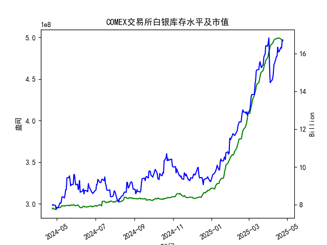

|            |   comex白银库存量 |   comex白银库存市值(billion) |   伦敦银现货价 |   上海金交所白银现货价 |   美元兑人民币汇率 |
|:-----------|------------------:|-----------------------------:|---------------:|-----------------------:|-------------------:|
| 2025-03-28 |       4.7242e+08  |                       34.745 |         34.395 |                   8483 |             7.1752 |
| 2025-03-31 |       4.75358e+08 |                       34.48  |         34.055 |                   8485 |             7.1782 |
| 2025-04-01 |       4.78458e+08 |                       34.625 |         33.97  |                   8414 |             7.1775 |
| 2025-04-02 |       4.8257e+08  |                       34.855 |         33.87  |                   8386 |             7.1793 |
| 2025-04-03 |       4.84931e+08 |                       31.625 |         32.475 |                   8263 |             7.1889 |
| 2025-04-04 |       4.90077e+08 |                       29.515 |         31.34  |                   8263 |             7.1889 |
| 2025-04-07 |       4.92042e+08 |                       29.65  |         30.325 |                   7606 |             7.198  |
| 2025-04-08 |       4.92994e+08 |                       29.775 |         30.315 |                   7689 |             7.2038 |
| 2025-04-09 |       4.94816e+08 |                       30.17  |         30.18  |                   7746 |             7.2066 |
| 2025-04-10 |       4.96236e+08 |                       31.05  |         30.925 |                   7939 |             7.2092 |
| 2025-04-11 |       4.97475e+08 |                       31.115 |         31.27  |                   7984 |             7.2087 |
| 2025-04-14 |       4.98195e+08 |                       31.8   |         32.275 |                   8107 |             7.211  |
| 2025-04-15 |       4.98847e+08 |                       31.8   |         32.31  |                   8139 |             7.2096 |
| 2025-04-16 |       4.98569e+08 |                       32.755 |         32.955 |                   8230 |             7.2133 |
| 2025-04-17 |       4.99104e+08 |                       32.23  |         32.31  |                   8143 |             7.2085 |
| 2025-04-18 |       4.99104e+08 |                       32.23  |         32.31  |                   8142 |             7.2069 |
| 2025-04-21 |       4.97895e+08 |                       32.785 |         32.31  |                   8227 |             7.2055 |
| 2025-04-22 |       4.96698e+08 |                       32.785 |         32.61  |                   8154 |             7.2074 |
| 2025-04-23 |       4.96891e+08 |                       33.55  |         32.96  |                   8191 |             7.2116 |
| 2025-04-24 |       4.96891e+08 |                       33.55  |         32.96  |                   8191 |             7.2098 |

### 近期白银市场套利机会分析与策略建议

#### 概述
基于提供的近一年数据，我对COMEX白银库存量、库存市值、伦敦市场白银现货价格、上海金交所白银现货价格以及美元兑人民币汇率进行了分析。主要聚焦于最近一个月（约2025-03-25至2025-04-24）的仓单变化（即COMEX库存量变化），以判断可能的套利机会。近期COMEX库存量从2025-03-25左右的约4.99e+08盎司微幅下降至2025-04-24的4.97e+08盎司，显示库存小幅减少，这可能反映出需求增加或供应紧缩。整体白银价格在上涨，伦敦市场价格从32.31美元/盎司升至32.96美元/盎司，上海金交所价格从约8142.0人民币/千克升至8191.0人民币/千克。

套利机会主要源于跨市场价格差异（如伦敦 vs. 上海）、库存变化对价格的影响，以及汇率波动。以下分析基于数据计算的等效价格（将上海价格转换为美元/盎司，以便比较）。假设上海金交所价格为人民币/千克，转换公式为：等效美元/盎司 = [(上海价格（RMB/千克） / 汇率（USD/RMB）) / (1000克/千克 ÷ 31.1035克/盎司)]。近期价格差异显示潜在套利空间，但需考虑交易成本、运输费用和监管风险。

#### 近期关键数据摘要
- **COMEX库存量变化（最近一个月）**：
  - 2025-03-25左右：约4.99e+08盎司。
  - 2025-04-18：4.99e+08盎司。
  - 2025-04-21：4.98e+08盎司。
  - 2025-04-22：4.97e+08盎司。
  - 2025-04-23至24：4.97e+08盎司。
  - **变化趋势**：库存小幅下降约0.5%，可能由于需求上升或库存出库，暗示市场活跃度增加。这可能推高价格，创造套利机会。

- **价格和汇率数据（最近一个月关键日期）**：
  | 日期       | 伦敦价格 (USD/oz) | 上海价格 (RMB/kg) | 汇率 (USD/RMB) | 上海等效价格 (USD/oz) |
  |------------|-------------------|-------------------|---------------|-----------------------|
  | 2025-04-18 | 32.31            | 8142.0           | 7.2069       | ≈35.12               |
  | 2025-04-21 | 32.31            | 8227.0           | 7.2055       | ≈35.48               |
  | 2025-04-22 | 32.61            | 8154.0           | 7.2074       | ≈35.18               |
  | 2025-04-23 | 32.96            | 8191.0           | 7.2116       | ≈35.34               |
  | 2025-04-24 | 32.96            | 8191.0           | 7.2098       | ≈35.34               |

  - **观察**：上海等效价格（转换为USD/oz） consistently高于伦敦价格，差异约2-3美元/oz。这表明上海市场价格相对较高，可能由于本地需求、关税或流动性差异。

- **库存市值**：最近数据显示市值在16.09-16.67亿美元区间（基于数组末尾值），与库存小幅下降相符，表明白银价值在上涨，但未直接影响套利。

#### 可能存在的套利机会
1. **跨市场价格套利（伦敦 vs. 上海）**：
   - **机会描述**：伦敦市场价格（USD/oz）低于上海等效价格（USD/oz），平均差异约2.5美元/oz。例如，在2025-04-24，伦敦价格为32.96美元/oz，而上海等效价格为35.34美元/oz。这意味着投资者可以考虑在伦敦买入白银现货，然后在上海卖出，实现价差收益。
   - **原因**：库存小幅下降可能加剧全球需求，推高上海价格（受中国市场需求影响较大）。汇率小幅波动（7.2055-7.2116）放大了这一差异。
   - **潜在收益**：如果差异大于交易成本（约1-2美元/oz，包括运输、关税和手续费），则可获利。基于最近数据，价差约2-3美元/oz，理论收益率为7-10%，但实际需扣除费用。
   - **风险**：汇率波动可能逆转机会（如人民币升值），或市场价格快速收敛导致损失。库存下降若加剧，可能导致全球价格上涨，缩小差异。

2. **库存变化相关套利**：
   - **机会描述**：COMEX库存小幅下降表明短期供应紧缩，可能推动价格上涨。投资者可结合期货合约进行套利，例如在COMEX买入期货（基于库存数据预测价格上涨），并在上海现货市场卖出对冲。
   - **原因**：库存从4.99e+08盎司降至4.97e+08盎司，显示出库压力，这与价格上涨一致（伦敦价格从32.31升至32.96）。若库存继续下降，伦敦价格可能进一步上涨，扩大与上海的价差。
   - **潜在收益**：通过库存数据预测价格趋势，进行跨期或跨市套利。例如，买入COMEX期货并卖出上海现货，实现双向对冲。
   - **风险**：库存波动不确定，若需求放缓，库存可能反弹，导致价格下跌。

3. **汇率相关套利**：
   - **机会描述**：美元兑人民币汇率在7.2055-7.2116间小幅波动。若汇率升值（美元走强），上海等效价格将下降，潜在缩小价差；反之，若汇率贬值，价差扩大。
   - **原因**：最近汇率稳定，但若结合库存下降的全球需求，汇率波动可放大跨市场套利。
   - **潜在收益**：使用外汇衍生品对冲汇率风险，同时执行价格套利。
   - **风险**：地缘政治事件可能导致汇率剧烈波动，侵蚀收益。

#### 看法
- **积极因素**：近期库存小幅下降和价格上涨表明白银市场看多，全球需求强劲（可能受工业和投资需求驱动）。跨市场价差（伦敦 vs. 上海）提供了真实套利机会，尤其在库存出库期。
- **挑战**：价差虽存在，但规模较小（2-3美元/oz），需高频交易和高流动性才能实现。库存变化微弱，可能只是短期现象，未形成持续趋势。
- **整体判断**：套利机会主要在中短期内有效，聚焦跨市场操作。白银市场整体向上，但波动性高，需谨慎。

#### 建议
- **策略1：跨市场现货套利**  
  推荐在伦敦市场买入白银现货（利用较低价格），然后在上海市场卖出。监控价差，确保大于2美元/oz时执行。使用汇率衍生品（如外汇掉期）对冲风险。起始资金需求：至少10万美元，以覆盖运输和仓储费用。执行频率：每日监控，针对2025-04-24-like差异快速行动。

- **策略2：结合库存变化的期货对冲**  
  基于COMEX库存下降趋势，买入COMEX白银期货合约，同时卖出上海现货以对冲。目标：在库存进一步下降时获利。风险管理：设置止损点，若库存反弹，及时平仓。

- **风险控制建议**：
  - **资金管理**：分配不超过总资金的20%用于套利，避免单一交易过曝。
  - **监控指标**：每日追踪库存变化、价差和汇率。若价差收窄超过50%，退出套利。
  - **合规性**：注意中美贸易政策和监管要求，优先使用合规平台（如CME和上海金交所）。
  - **长期建议**：若库存持续下降，考虑转向多头策略（如持有白银ETF），而非短期套利。

总体而言，近期套利机会值得关注，但需结合实时数据和市场动态调整。建议与专业交易顾问合作，以最大化收益并最小化风险。