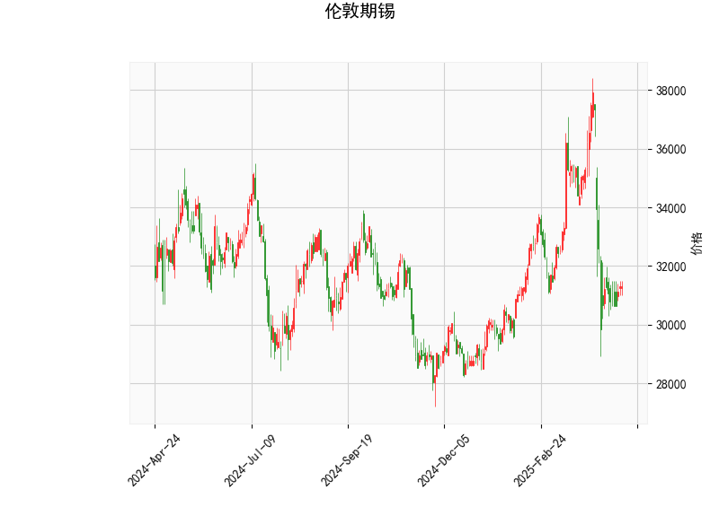

### 伦敦期锡技术分析结果详解

#### 1. 对技术分析结果的整体分析
伦敦期锡（Tin futures in London）的当前价格为 31314.0，基于提供的指标，我们可以从多个维度评估其市场趋势和技术信号。以下是对关键指标的逐一分析：

- **RSI（Relative Strength Index，相对强弱指数）**：当前值为 41.91。这是一个低于 50 的水平，表明期锡可能处于超卖状态。RSI 低于 30 通常被视为强烈的超卖信号，而 41.91 的位置暗示市场可能已经过度抛售，潜在的反弹机会正在酝酿。但如果RSI继续下降，将强化看跌趋势。

- **MACD（Moving Average Convergence Divergence，移动平均收敛散度）**：MACD线为 -829.89，信号线为 -667.58，MACD直方图（Hist）为 -162.31。这些值均为负，且MACD线低于信号线，显示出明显的看跌信号。这表明短期内卖方力量占优，价格可能继续下行。直方图的负值进一步确认了熊市动量，但如果直方图开始收窄或转为正值，将是潜在的逆转迹象。

- **布林带（Bollinger Bands）**：上轨为 37053.05，中轨为 33005.24，下轨为 28957.42。目前价格 31314.0 位于中轨和下轨之间，接近下轨水平。这暗示价格可能正在测试支撑位。如果价格跌破下轨（28957.42），将加剧下行风险；反之，如果反弹至中轨以上，可能形成短期回升。布林带的收窄或扩张可以反映市场波动性，目前的带宽显示出一定的波动，但整体处于收缩状态，预示不确定性。

- **K线形态**：检测到的形态包括 CDLDOJI、CDLGAPSIDESIDEWHITE、CDLHIGHWAVE、CDLLONGLEGGEDDOJI、CDLSHORTLINE 和 CDLSPINNINGTOP。这些形态多为中性或看跌信号：
  - CDLDOJI 和 CDLLONGLEGGEDDOJI 表示市场不确定性，可能预示逆转或盘整。
  - CDLGAPSIDESIDEWHITE 和 CDLHIGHWAVE 暗示价格跳空后波动较大，潜在的疲软信号。
  - CDLSHORTLINE 和 CDLSPINNINGTOP 反映小实体K线，表明买卖力量均衡，可能处于犹豫期。
  总体上，这些形态显示市场缺乏清晰方向，短期内可能出现盘整或小幅回调。

综合来看，技术指标呈现出混合信号：RSI 和布林带下轨显示超卖和潜在支撑，而MACD和K线形态则偏向看跌。整体趋势偏弱，但超卖状况可能引发技术性反弹。投资者需关注价格是否突破关键水平（如布林中轨33005.24）来确认方向。

#### 2. 近期可能存在的投资或套利机会和策略判断
基于上述分析，伦敦期锡的近期市场环境显示出一定的机会，但风险较高。以下是对潜在投资或套利机会的判断，以及相应的策略建议：

- **投资机会判断**：
  - **反弹机会**：RSI处于超卖区（41.91），且价格接近布林下轨（28957.42），这可能触发技术反弹。K线形态的犹豫信号（如Doji）进一步支持短期修正的可能性。如果外部因素（如全球经济数据或金属需求回暖）出现正面催化，价格可能向上测试中轨（33005.24）。然而，MACD的看跌信号提醒，任何反弹都可能是短暂的，需警惕假突破。
  - **下行风险**：MACD负值和K线波动形态表明，价格可能进一步下探至布林下轨以下。如果跌破28957.42，目标可能指向更低水平（如30000以下）。这为看跌策略提供机会，但需注意超卖后的潜在回弹。
  - **套利机会**：期锡与其他金属（如铜或锌）的价格相关性较高，可能存在跨品种套利。例如，如果期锡相对于铜的价差扩大（当前期锡价格偏低），投资者可考虑在期锡买入的同时卖出铜期货，以捕捉价差收敛。但需结合全球商品市场（如LME交易所数据）进行评估。目前数据未显示明显套利窗口，更多依赖宏观因素（如中国需求或供应链中断）。

- **投资策略建议**：
  - **短期多头策略**：如果RSI反弹至50以上或价格站稳布林中轨，考虑小仓位买入期锡期货或多头期权。止损设在下轨以下（如29000），目标为中轨或上轨。适合风险偏好中性的投资者，结合RSI回升作为入场信号。
  - **短期空头策略**：基于MACD看跌信号，投资者可卖出期货或买入看跌期权。如果价格跌破当前水平（31314.0），目标指向28500-29000。止盈设在中轨以上，以避免超卖反弹。适用于谨慎投资者，监控K线形态变化。
  - **套利策略**：探索跨市场套利，如伦敦期锡与上海期货交易所锡价的价差。如果伦敦价格相对低估（当前31314.0低于历史均值），可考虑买入伦敦锡并卖出上海锡（反之亦然）。但需注意汇率和交易成本，确保价差大于0.5%才执行。建议使用量化工具跟踪价差。
  - **风险管理建议**：无论多空，均应控制仓位（不超过总资金的10-20%），并设置严格止损（如基于布林带5%波动）。市场不确定性高，结合基本面分析（如全球锡矿供应和电动车需求）以增强决策。总体而言，近期适合观望为主，等待更清晰的突破信号。

请注意，技术分析并非绝对预测，实际投资应结合实时市场数据、宏观经济和个人风险承受能力。建议咨询专业金融顾问以制定个性化策略。