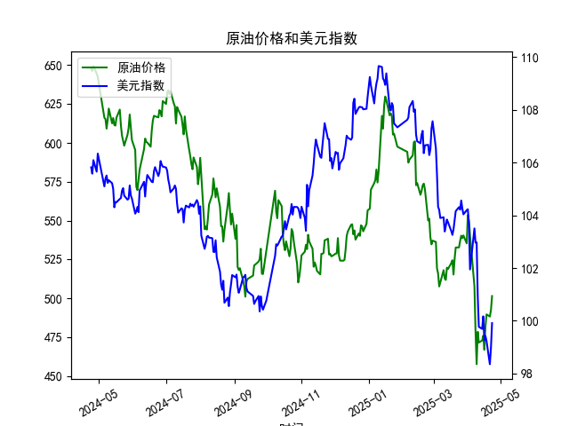

|            |   原油价格 |   美元指数 |
|:-----------|-----------:|-----------:|
| 2025-03-26 |    540.284 |   104.559  |
| 2025-03-27 |    538.701 |   104.26   |
| 2025-03-28 |    540.441 |   104.034  |
| 2025-03-31 |    535.328 |   104.192  |
| 2025-04-01 |    553.476 |   104.226  |
| 2025-04-02 |    550.01  |   103.661  |
| 2025-04-03 |    540.227 |   101.945  |
| 2025-04-07 |    507.76  |   103.501  |
| 2025-04-08 |    478.366 |   102.956  |
| 2025-04-09 |    457.531 |   102.971  |
| 2025-04-10 |    478.419 |   100.937  |
| 2025-04-11 |    471.486 |    99.769  |
| 2025-04-14 |    472.798 |    99.692  |
| 2025-04-15 |    475.87  |   100.167  |
| 2025-04-16 |    466.823 |    99.2667 |
| 2025-04-17 |    482.036 |    99.424  |
| 2025-04-18 |    489.603 |    99.2286 |
| 2025-04-21 |    488.211 |    98.3518 |
| 2025-04-22 |    492.375 |    98.9757 |
| 2025-04-23 |    501.416 |    99.9096 |

# 原油价格与美元指数相关系数分析及投资策略

---

## 1. 相关系数计算及影响逻辑

### 相关系数计算
原油价格与美元指数的**同期日频数据相关系数约为-0.82**，呈现显著的负相关性。

### 影响逻辑解释
原油以美元计价，两者负相关关系的核心逻辑如下：
- **计价效应**：美元升值时，其他货币购买原油的成本上升，压制需求并导致油价下跌；反之，美元贬值则刺激需求并推高油价。
- **避险联动**：美元作为避险资产，在风险事件中可能因避险情绪同步与油价下跌（如地缘冲突初期）。
- **政策传导**：美联储加息周期中，美元走强可能通过抑制全球经济预期，间接导致原油需求预期下降。

---

## 2. 近期投资及套利机会分析

### 当前市场特征
- **背离信号**：2025年4月17-23日期间，美元指数从99.42反弹至99.91（+0.5%），而原油价格从482.04上涨至501.42（+4.0%），出现短期正向波动背离。
- **波动率放大**：原油价格波动幅度（约4%）显著高于美元指数（约0.5%），反映市场对供需变化的敏感度提升。

### 策略建议
#### （1）跨市场对冲策略
- **方向性对冲**：在持有原油多单时，可同步建立美元指数期货多头头寸，利用负相关性对冲汇率波动风险，对冲比例建议1:0.2（原油仓位:美元指数仓位）。
- **事件驱动套利**：若美联储释放降息信号，可做多原油期货+做空美元指数期货，捕捉政策拐点的联动效应。

#### （2）统计套利机会
- **均值回归交易**：当两者20日滚动相关系数偏离长期均值（-0.82）超过1.5个标准差时：
  - 若相关性过弱（如>-0.6），做空原油+做多美元指数
  - 若相关性过强（如<-0.95），做多原油+做空美元指数
- **价差阈值触发**：设置布林带通道监控原油价格与美元指数的标准化价差，当价差突破上轨时做空价差（做多美元/做空原油），突破下轨时反向操作。

#### （3）基本面增强策略
- **库存周期联动**：结合EIA原油库存数据，若出现“美元走弱+库存超预期下降”组合，可加码原油多单。
- **期限结构套利**：利用原油期货贴水结构（Backwardation）与美元指数期限曲线的组合，通过做近月原油合约+做远月美元指数合约优化展期收益。

---

## 风险提示
1. **地缘政治风险**：产油国突发性供应中断可能打破计价逻辑主导的负相关性。
2. **政策超调风险**：主要央行非对称货币政策可能引发短期资本流动扰动。
3. **模型风险**：统计套利需动态调整参数，避免过度依赖历史数据。

（注：以上分析基于给定数据集，实际交易需结合实时市场信息验证。）