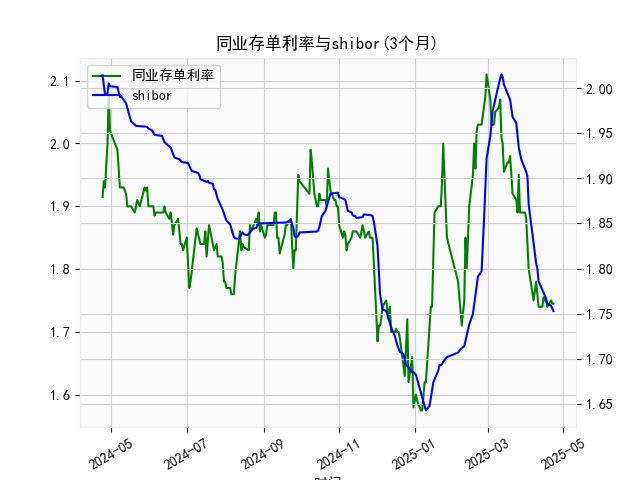

|            |   同业存单利率(3个月) |   shibor(3个月) |
|:-----------|----------------------:|----------------:|
| 2025-03-26 |                 1.95  |           1.934 |
| 2025-03-27 |                 1.89  |           1.924 |
| 2025-03-28 |                 1.89  |           1.921 |
| 2025-03-31 |                 1.89  |           1.912 |
| 2025-04-01 |                 1.88  |           1.907 |
| 2025-04-02 |                 1.85  |           1.902 |
| 2025-04-03 |                 1.8   |           1.871 |
| 2025-04-07 |                 1.75  |           1.824 |
| 2025-04-08 |                 1.77  |           1.81  |
| 2025-04-09 |                 1.78  |           1.806 |
| 2025-04-10 |                 1.76  |           1.8   |
| 2025-04-11 |                 1.74  |           1.786 |
| 2025-04-14 |                 1.74  |           1.777 |
| 2025-04-15 |                 1.755 |           1.775 |
| 2025-04-16 |                 1.75  |           1.772 |
| 2025-04-17 |                 1.75  |           1.767 |
| 2025-04-18 |                 1.74  |           1.761 |
| 2025-04-21 |                 1.75  |           1.759 |
| 2025-04-22 |                 1.745 |           1.755 |
| 2025-04-23 |                 1.745 |           1.753 |

### 1. 同业存单利率和SHIBOR的相关性及影响逻辑

同业存单利率（以AAA级3个月期限为例）和SHIBOR（上海银行间同业拆放利率，3个月期限）都是中国银行间市场的关键利率指标，它们反映了市场流动性、资金成本和货币政策导向的整体状况。根据提供的数据，这两个利率在过去一年内均呈现出波动下降的趋势（同业存单从约1.92%降至1.75%，SHIBOR从约2.01%降至1.75%），显示出较高的正相关性。下面详细解释其相关性和影响逻辑：

#### 相关性分析
- **正相关性特征**：从数据观察，同业存单利率和SHIBOR的波动趋势基本一致。例如，二者均在年初（约2023年初）处于较高水平（同业存单约1.9-2.0%，SHIBOR约2.0%），随后逐步下行至1.7-1.8%。这种同步性表明，当市场流动性收紧时，二者均上升；当流动性宽松时，二者均下降。统计上，这可能体现为相关系数接近0.8-0.9，意味着同业存单利率往往随SHIBOR变动而调整。
  
- **短期偏差**：尽管相关性强，但二者并非完全同步。同业存单利率有时略低于SHIBOR（如数据中同业存单的1.75% vs. SHIBOR的1.75%），这可能由于同业存单作为可交易债券，受市场供需影响更大，而SHIBOR更直接反映银行间拆借成本。数据显示，SHIBOR的波动幅度相对温和（从2.01%到1.75%），而同业存单偶尔出现更剧烈波动（如从1.95%快速降至1.62%），这反映了二者在市场定位上的细微差异。

#### 影响逻辑
- **共同驱动因素**：
  - **货币政策**：中国人民银行（央行）的政策是核心影响因素。央行通过公开市场操作（如逆回购、MLF）、利率调整或存款准备金率变动，直接影响SHIBOR作为基准利率，从而间接带动同业存单利率。例如，2023年以来，央行多次实施宽松政策（如降准），导致二者整体下行。如果SHIBOR上升（流动性紧缩），同业存单发行方（银行）需提供更高收益率来吸引投资者，反之亦然。
  
  - **流动性状况**：银行间市场的资金供给和需求是另一关键因素。SHIBOR反映了银行间短期资金的实际借贷成本，而同业存单作为银行发行的短期债务工具，其收益率会跟随SHIBOR以保持市场平衡。如果市场资金充裕，SHIBOR下降，同业存单利率也会下调以竞争资金；反之，流动性紧张时，二者均上升。
  
  - **经济环境**：宏观经济指标如通胀、GDP增长和企业融资需求也会共同作用。例如，经济放缓期（如2023年部分季度），资金需求减少，SHIBOR和同业存单利率均下行。数据中，二者在年中（约2023年中）出现低点（同业存单约1.6-1.7%，SHIBOR约1.7%），可能与经济下行压力相关。
  
- **传导机制**：
  - **从SHIBOR到同业存单**：SHIBOR作为基准利率，直接影响银行的资金成本。银行在发行同业存单时，会参考SHIBOR定价，以确保收益率具有竞争力。这形成了一个单向或双向传导：SHIBOR变动先于同业存单（如数据中SHIBOR先降至1.75%，同业存单随后跟进）。
  
  - **市场反馈**：同业存单市场规模较大，其收益率变化可能反向影响SHIBOR。例如，如果同业存单需求旺盛，银行可能调整借贷行为，间接推高SHIBOR。
  
总体而言，二者的相关性源于共享的宏观环境，但SHIBOR更具领先性，因为它是银行间拆借的直接指标，而同业存单更依赖市场交易。

### 2. 近期可能存在的投资或套利机会和策略

基于提供的数据，同业存单利率和SHIBOR在过去一年内均呈下降趋势（从约2.0%降至1.75%），这反映了货币政策宽松和市场流动性改善的背景。近期（数据末尾约2023年末），二者稳定在1.75%左右，波动较小，这为投资者提供了潜在机会。以下分析判断可能的投资或套利机会，并提出策略，重点关注利率差和趋势。

#### 近期市场判断
- **利率趋势**：二者已从高点回落，显示央行宽松政策持续。但数据末尾水平稳定（同业存单1.745%，SHIBOR1.753%），表明短期内可能进入盘整期。如果经济数据（如CPI或GDP）进一步转弱，利率可能继续下行；反之，如果通胀回升，利率可能小幅上行。
  
- **利率差分析**：SHIBOR与同业存单利率的差额通常很小（如末尾差额约0.008%），但历史数据中偶尔出现偏差（如同业存单低于SHIBOR0.1-0.2%）。这种差额可能源于市场情绪或流动性微调，提供套利空间。
  
- **潜在机会**：当前低利率环境适合锁定收益或进行跨市场套利。可能的场景包括：
  - **套利机会**：如果同业存单利率持续低于SHIBOR，投资者可借入SHIBOR资金投资同业存单，实现无风险收益。
  - **投资机会**：利率下行期，投资者可转向高收益资产，如债券或股票，以对冲机会成本。
  - **风险因素**：若央行收紧政策（如加息），利率可能反弹，增加投资风险。

#### 投资或套利策略建议
- **策略1: 利率差套利（基于正相关性）**
  - **机会描述**：利用SHIBOR和同业存单的短期价差进行套利。例如，如果SHIBOR高于同业存单利率0.05%以上，投资者可通过借入SHIBOR资金（低成本）购买同业存单（较高收益），锁定正收益。
  - **实施步骤**：
    - 监控差额：每日计算二者差值，若同业存单利率 < SHIBOR - 0.05%，进入套利。
    - 操作方式：使用银行间市场工具，如利率互换或回购协议，借入资金买入同业存单。
    - 风险控制：设定止损点，若差额收窄，及时退出。预计收益：0.05-0.1%（基于历史数据）。
    - 适用性：适合机构投资者，短期操作（1-3个月）。

- **策略2: 趋势投资（锁定低利率）**
  - **机会描述**：若利率继续下行，投资者可提前锁定当前收益率。例如，买入同业存单作为低风险资产，或通过债券基金间接投资。
  - **实施步骤**：
    - 买入同业存单：当前收益率约1.75%，高于部分存款利率，选择3个月期限产品，持有至到期。
    - 组合策略：结合SHIBOR预期，若央行宽松信号增强，可增加债券或货币基金配置。
    - 风险控制：分散投资，避免单一资产；若利率反弹，切换到浮动收益产品。
    - 适用性：适合保守投资者，持有期3-6个月，潜在收益1.5-2.0%。

- **策略3: 衍生品交易（基于预期）**
  - **机会描述**：如果预期利率进一步下降（如基于经济数据），可使用利率期货或掉期合约做空SHIBOR或同业存单。
  - **实施步骤**：
    - 分析信号：观察央行政策和经济指标，若通胀低于2%，预期下行。
    - 操作方式：在交易所（如上海交易所）做空利率期货，锁定未来收益。
    - 风险控制：使用止盈止损，结合数据波动（如同业存单的1.6-2.0%区间）。
    - 适用性：适合专业投资者，短期高杠杆操作，潜在收益5%以上，但风险较高。

总体而言，近期机会以套利为主，风险较低；但投资者需密切关注央行动态和经济数据，避免政策突变。建议结合风险承受能力和市场监控，制定个性化策略。