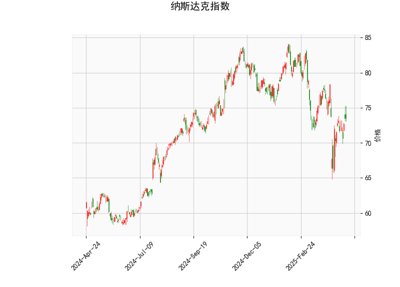

## 纳斯达克指数技术分析及策略建议

### 一、技术指标解析

#### 1. 价格与布林通道
- **当前价73.5**处于布林通道下轨（68.02）与中轨（76.42）之间，靠近下轨支撑区域。价格已跌破中轨（76.42），暗示短期趋势偏弱，但接近下轨可能触发技术性反弹。
- **通道宽度**显示上下轨间距约16.79点，当前波动率处于中等水平，价格若突破中轨可能加速向上轨（84.81）运行。

#### 2. 动量指标
- **RSI（49.83）**接近50中性线，显示多空力量暂时均衡，但未进入超卖区域（30以下），暗示下跌动能未完全释放。
- **MACD指标**：MACD线（-0.88）位于信号线（-1.23）上方，柱状图首次转正（+0.35），形成“潜在金叉”雏形。若MACD持续上穿信号线，可能确认短期底部。

#### 3. K线形态
- **CDLMATCHINGLOW（匹配低形态）**出现在下跌趋势末端，暗示空头力量衰竭。该形态需配合成交量放大或阳线确认，否则可能成为下跌中继。

### 二、机会判断与策略建议

#### 1. 短期波段机会
- **多头策略**（适合风险偏好者）：
  - **入场条件**：价格站稳中轨76.42且MACD形成金叉
  - **目标位**：上轨84.81（潜在空间15.4%）
  - **止损位**：下轨68.02下方（风险约7.5%）
  - **增强信号**：若出现放量长阳线或RSI突破55，可加仓
- **空头策略**（谨慎操作）：
  - **触发条件**：价格跌破下轨68.02且MACD柱重新转负
  - **目标位**：前低支撑区域（需结合更大周期分析）
  - **止损位**：重回下轨上方

#### 2. 套利机会
- **波动率套利**：
  - 布林通道收窄（当前宽度16.79）后可能出现突破行情，可构建**跨式期权组合**，买入平值看涨/看跌期权，捕捉波动率扩张收益。
- **期现套利**：
  - 若期货贴水幅度超过融资成本，可买入期货同时卖出现货ETF，锁定无风险收益（需实时监控基差）

#### 3. 风险提示
- **假突破风险**：MACD柱状图首次转正可能反复，需等待连续3根阳柱确认趋势
- **宏观面干扰**：美联储政策、科技股财报等事件可能改变技术形态
- **流动性风险**：接近下轨时市场深度可能下降，需注意滑点

### 三、关键观察节点
1. **价格与中轨关系**：连续2日收盘站上76.42可确认趋势反转
2. **MACD金叉确认**：需观察未来3个交易日指标走向
3. **成交量配合**：反弹过程中需出现明显放量（至少20%增量）

（注：以上分析基于静态技术指标，实际交易需结合实时市场动态与资金管理原则）