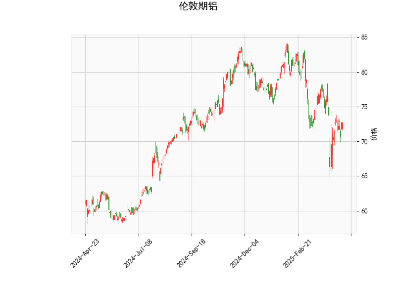

### 伦敦期铝技术分析结果解读

#### 1. 指标分析
- **当前价（72.69）与布林轨道**：
  - 当前价位于布林下轨（68.02）与中轨（76.57）之间，且明显低于中轨，表明价格处于**短期弱势区间**。
  - 布林轨道开口向下扩张（上轨85.13→中轨76.57→下轨68.02），显示**波动率上升且趋势偏空**，但价格接近下轨可能触发短期超卖反弹。

- **RSI（47.78）**：
  - 接近中性值50，但略低于该水平，暗示市场短期**多空力量均衡偏弱**，未进入超卖（<30）或超买（>70）区间，可能处于盘整阶段。

- **MACD（-1.10）与信号线（-1.33）**：
  - MACD柱状图（0.225）转正，显示**空头动能减弱**，MACD线有上穿信号线的潜在金叉迹象，可能预示**短期反弹机会**。
  - 但MACD与信号线仍位于零轴下方，表明**中长期趋势尚未反转**，需警惕反弹后延续下跌。

- **K线形态**：
  - **CDLGAPSIDESIDEWHITE**：此形态通常表示价格在整理后出现方向性突破，结合当前低位可能暗示**短期多头反扑**。
  - **CDLSHORTLINE**：短实体K线反映市场犹豫，需结合后续价格确认方向。

---

#### 2. 投资/套利机会与策略

##### **短期反弹机会**
- **逻辑**：
  - 价格触及布林下轨，MACD柱转正，且K线形态显示潜在多头信号，存在技术性反弹需求。
  - 目标可看至中轨76.57附近（约5.3%空间），若突破则进一步看向上轨85.13（需基本面配合）。
- **策略**：
  - **多头入场**：若价格站稳布林下轨（68.02）且RSI回升至50以上，可轻仓试多。
  - **止损**：设于下轨下方（如67.00），防止破位下跌。
  - **止盈**：分阶段平仓（中轨附近部分止盈，剩余仓位观察动能）。

##### **趋势性空头延续**
- **逻辑**：
  - 布林中轨持续下移，MACD仍处零轴下方，若价格反弹至中轨后承压，可能延续下行趋势。
- **策略**：
  - **空头入场**：若价格反弹至中轨76.57附近受阻，且RSI回落至45以下，可逢高做空。
  - **止损**：设于中轨上方（如77.50）。
  - **目标**：下轨68.02或更低（若开口持续扩张）。

##### **套利机会**
- **跨期套利**（需更多数据）：
  - 若近月合约贴水（价格低于远月），可考虑“买近卖远”，但需结合库存和交割成本。
- **波动率套利**：
  - 布林轨道开口扩大，可卖出期权（如宽跨式组合），赚取波动率溢价，但需对冲Delta风险。

---

#### 3. 风险提示
- **基本面关联性**：铝价受全球制造业PMI、能源价格（电解铝成本）及库存数据影响，需关注宏观事件（如LME仓单变化）。
- **技术指标局限**：MACD金叉可能滞后，若价格快速跌破下轨需及时止损。
- **仓位管理**：当前市场处于震荡偏空环境，建议总仓位不超过30%，避免单边重仓。