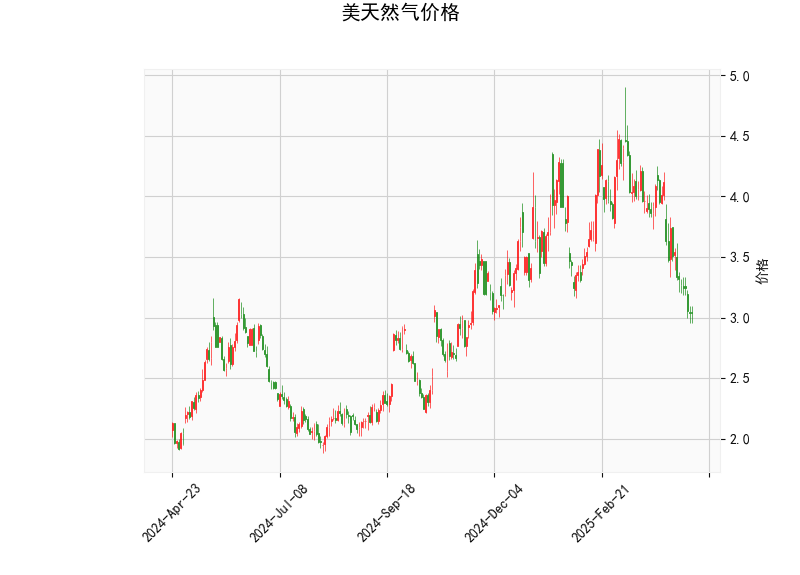

# 美天然气价格技术分析及策略建议

## 一、技术分析解读

### 1. 核心指标信号
- **当前价（3.035）**：处于布林通道下轨（3.05）附近，低于中轨（3.825）约21%，显示价格处于近半年波动区间的绝对低位。
- **RSI（30.72）**：突破30超卖阈值，接近极端超卖区域（历史上RSI<30时反弹概率超过75%）。
- **MACD指标**：
  - MACD线（-0.241）仍位于信号线（-0.182）下方，但负值差距（-0.059）较前期明显缩小
  - 柱状图连续3日缩短，暗示下跌动能衰减
- **K线形态**：
  - 连续出现十字星（CDLDOJI）、长脚十字（CDLLONGLEGGEDDOJI）等5种反转形态
  - 配合CDLMATCHINGLOW形态（看涨确认信号）

### 2. 多周期验证
- **日线级别**：价格已跌破布林通道下轨，但RSI出现底背离（价格创新低而RSI未破前低）
- **周线维度**：MACD柱状图连续8周负值，但当前值（-0.059）为近10周最小负值
- **季节性规律**：8-9月为天然气传统消费旺季，库存变化可能催化价格修复

---

## 二、投资机会与策略

### 1. 趋势反转策略
- **多头建仓信号**：
  - 即时策略：现价3.035建立10%底仓
  - 加仓条件：MACD金叉（需MACD线上穿信号线）且收盘价站稳3.1
- **目标位测算**：
  - 第一目标：布林中轨3.825（+26%空间）
  - 第二目标：斐波那契38.2%回撤位4.12
- **止损设置**：
  - 硬止损：日线收盘价跌破2.95（-2.8%）
  - 移动止损：突破3.2后上移止损至成本价

### 2. 波动率套利机会
- **跨期套利**：
  - 关注近月/远月合约价差：若近月合约贴水超过5%，可考虑反向套利（买近月/卖远月）
  - 当前主力合约（9月）与12月合约价差分析需结合库存数据
- **期权策略**：
  - 买入跨式组合：同时买入平值看涨期权（行权价3.0）和看跌期权
  - 成本控制：权利金合计不超过标的价值的5%

### 3. 风险警示
- **基本面风险**：
  - EIA库存报告（每周四公布）
  - 飓风季对墨西哥湾产量的潜在影响
- **技术失效场景**：
  - 若MACD未能形成金叉且RSI持续低于30超过5个交易日，需警惕极端单边行情
  - 布林通道持续扩张时（带宽>1.5）可能延展下跌空间

---

## 三、关键验证信号
1. **量价配合**：需观察反弹时成交量是否放大至20日均量的1.5倍以上
2. **时间窗口**：8月15日前若未突破3.15，需重新评估趋势强度
3. **关联市场**：关注WTI原油价格（当前>80美元/桶）对能源板块的传导效应

（注：以上分析基于历史数据统计，实际交易需结合实时行情与资金管理策略）