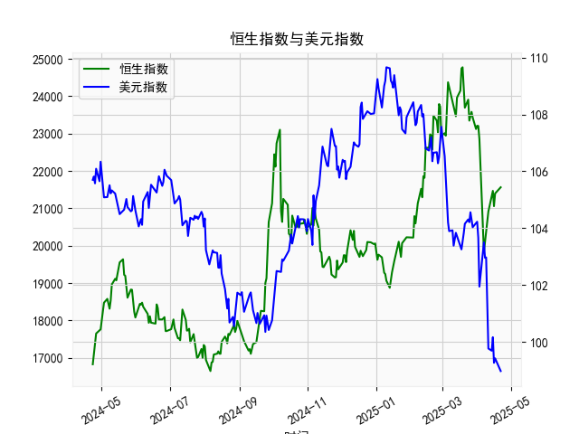

|            |   恒生指数 |   美元指数 |
|:-----------|-----------:|-----------:|
| 2025-03-21 |    23689.7 |   104.154  |
| 2025-03-24 |    23905.6 |   104.307  |
| 2025-03-25 |    23344.2 |   104.21   |
| 2025-03-26 |    23483.3 |   104.559  |
| 2025-03-27 |    23578.8 |   104.26   |
| 2025-03-28 |    23426.6 |   104.034  |
| 2025-03-31 |    23119.6 |   104.192  |
| 2025-04-01 |    23206.8 |   104.226  |
| 2025-04-02 |    23202.5 |   103.661  |
| 2025-04-03 |    22849.8 |   101.945  |
| 2025-04-07 |    19828.3 |   103.501  |
| 2025-04-08 |    20127.7 |   102.956  |
| 2025-04-09 |    20264.5 |   102.971  |
| 2025-04-10 |    20681.8 |   100.937  |
| 2025-04-11 |    20914.7 |    99.769  |
| 2025-04-14 |    21417.4 |    99.692  |
| 2025-04-15 |    21466.3 |   100.167  |
| 2025-04-16 |    21057   |    99.2667 |
| 2025-04-17 |    21395.1 |    99.424  |
| 2025-04-22 |    21562.3 |    98.9757 |

### 任务1：恒生指数与美元指数的相关性及影响逻辑

#### 相关性分析
恒生指数与美元指数通常呈现**负相关性**，主要原因包括：
1. **汇率机制与资金流动**  
   - 香港实行联系汇率制度（港币与美元挂钩），美元走强时，港元被动升值，可能导致国际资本流出香港市场（因美元资产吸引力上升），从而压低恒生指数。
   - 美元走弱时，资金更倾向于流入新兴市场（包括港股），推高恒生指数。

2. **企业盈利与出口影响**  
   - 恒生指数中许多成分股为中资企业（如金融、科技、消费），其收入以人民币计价。美元走强时，人民币相对贬值可能增加企业的外债成本，或压缩出口利润，拖累股价。

3. **全球风险偏好**  
   - 美元作为避险货币，当市场避险情绪升温（如地缘冲突、经济衰退预期），美元指数上涨，而风险资产（包括港股）往往下跌，反之亦然。

#### 影响逻辑
- **利率传导**：美元指数走强常伴随美联储加息，香港金管局被迫跟随加息，导致港股融资成本上升、估值承压。
- **跨境套利**：美元走强时，套利资金从港元资产转向美元资产，流动性收紧抑制港股表现。
- **经济预期**：美元强弱反映全球经济周期预期，若美元走弱伴随中国经济复苏，港股（尤其是中资股）可能受益于双重利好。

---

### 任务2：近期投资或套利机会及策略

#### 当前数据分析
1. **美元指数趋势**  
   - 美元指数近期呈现震荡下行（例如从109高位回落至103附近），可能反映美联储加息周期接近尾声的预期，叠加美国经济数据边际走弱。
   - 若美元延续弱势，港股流动性环境有望改善。

2. **人民币存贷差走势**  
   - 人民币存贷差近期小幅扩张（如数据中从最低16,698升至21,562），表明贷款增速快于存款，反映信贷需求回暖，可能预示中国经济复苏动能增强，利好港股中资企业盈利预期。

#### 潜在机会与策略
1. **做多港股（恒生指数）**  
   - **逻辑**：美元弱势+中国经济复苏预期共振，恒生指数可能迎来估值修复。
   - **标的**：关注金融（受益信贷扩张）、消费（疫后复苏）、科技（流动性敏感）板块。

2. **跨市场套利**  
   - **策略**：做多恒生指数期货，同时做空美元指数相关衍生品（如美元指数期货），对冲汇率波动风险。
   - **风险控制**：需监测美联储政策转向节奏及中国宏观经济数据。

3. **AH股溢价套利**  
   - **机会**：若港股相对A股折价持续扩大，可买入H股同时做空对应A股，等待价差收敛。

4. **高股息防御策略**  
   - **背景**：若美元指数短期反弹（如地缘风险升温），港股可能承压。
   - **配置**：选择公用事业、电信等高股息板块，对冲市场波动。

#### 风险提示
- **美元反弹风险**：若美国通胀超预期或地缘冲突升级，美元可能短期走强，压制港股。
- **中国经济复苏不及预期**：若信贷扩张未能有效传导至实体经济，港股上行空间受限。
- **政策不确定性**：中美关系、香港本地政策（如印花税调整）可能引发市场波动。

---

### 结论
结合美元指数下行趋势及人民币信贷扩张信号，短期可侧重布局港股反弹，优先选择受益于中国经济复苏的行业，并通过跨市场对冲降低汇率风险。中长期需跟踪美联储政策转向及中国稳增长政策落地效果。