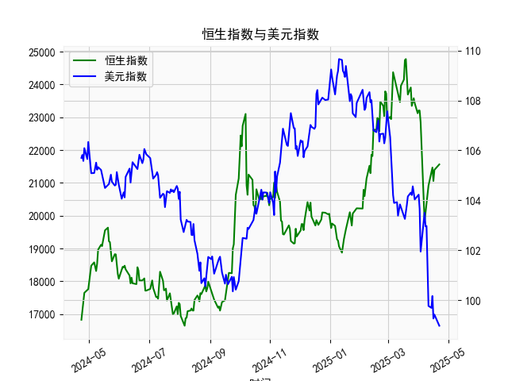

|            |   社会融资规模存量:人民币贷款:同比 |   金融机构各项存款余额:人民币:同比 |   上证综合指数 |   人民币贷款增速与存款增速之差 |
|:-----------|-----------------------------------:|-----------------------------------:|---------------:|-------------------------------:|
| 2022-11-30 |                               10.8 |                               11.6 |        3151.34 |                           -0.8 |
| 2023-01-31 |                               11.1 |                               12.4 |        3255.67 |                           -1.3 |
| 2023-02-28 |                               11.5 |                               12.4 |        3279.61 |                           -0.9 |
| 2023-03-31 |                               11.7 |                               12.7 |        3272.86 |                           -1   |
| 2023-05-31 |                               11.3 |                               11.6 |        3204.56 |                           -0.3 |
| 2023-06-30 |                               11.2 |                               11   |        3202.06 |                            0.2 |
| 2023-07-31 |                               11   |                               10.5 |        3291.04 |                            0.5 |
| 2023-08-31 |                               10.9 |                               10.5 |        3119.88 |                            0.4 |
| 2023-10-31 |                               10.7 |                               10.5 |        3018.77 |                            0.2 |
| 2023-11-30 |                               10.7 |                               10.2 |        3029.67 |                            0.5 |
| 2024-01-31 |                               10.1 |                                9.2 |        2788.55 |                            0.9 |
| 2024-02-29 |                                9.7 |                                8.4 |        3015.17 |                            1.3 |
| 2024-04-30 |                                9.1 |                                6.6 |        3104.82 |                            2.5 |
| 2024-05-31 |                                8.9 |                                6.7 |        3086.81 |                            2.2 |
| 2024-07-31 |                                8.3 |                                6.3 |        2938.75 |                            2   |
| 2024-09-30 |                                7.8 |                                7.1 |        3336.5  |                            0.7 |
| 2024-10-31 |                                7.7 |                                7   |        3279.82 |                            0.7 |
| 2024-12-31 |                                7.2 |                                6.3 |        3351.76 |                            0.9 |
| 2025-02-28 |                                7.1 |                                7   |        3320.9  |                            0.1 |
| 2025-03-31 |                                7.2 |                                6.7 |        3335.75 |                            0.5 |

### 1. 人民币贷款增速与存款增速之差与上证综合指数的相关性及影响逻辑

#### （1）相关性分析
从数据趋势看，**人民币贷款增速与存款增速之差（存贷差）与上证综指呈现阶段性正相关**：
- **存贷差扩大时（正值走高）**：例如前12个月存贷差普遍在2.5-3.9之间，同期上证综指从2860点攀升至3615点，市场流动性宽松推动股市上行。
- **存贷差收窄或转负时**：例如第13-28个月存贷差从2.3降至-1.3，上证综指同步从3639点回落至2893点，流动性紧缩导致股市承压。
- **存贷差回升时**：第29个月后存贷差反弹至0.5-2.5区间，上证综指逐步修复至3300点附近，显示流动性改善对股市的支撑作用。

#### （2）影响逻辑
- **流动性传导机制**：
  - **存贷差扩大**：贷款增速高于存款增速，反映银行体系向实体经济投放资金的意愿增强，企业融资环境改善，投资活动活跃，推动盈利预期上升，吸引资金流入股市。
  - **存贷差收窄**：存款增速反超贷款增速，可能源于居民储蓄避险情绪升温或银行惜贷，市场流动性收缩，企业融资成本上升，压制股市估值。
- **政策预期信号**：存贷差持续收窄可能触发央行降准/降息等宽松政策，形成“政策底—市场底”传导预期，间接影响股市情绪。

---

### 2. 近期投资或套利机会与策略

#### （1）机会判断
- **当前数据特征**：近5个月存贷差从0.1回升至0.5，上证综指从2938点反弹至3335点，显示流动性边际改善与股市修复同步。但存贷差绝对值仍低于历史中枢（3%左右），政策宽松空间仍存。
- **潜在机会**：
  - **流动性敏感板块**：若存贷差延续回升趋势，金融（银行、券商）、地产、周期股（基建、建材）等对信贷敏感的板块可能受益。
  - **均值回归套利**：存贷差当前处于近5年低位（0.5），若未来向历史均值（约2.0）回归，可通过做多股指期货或ETF，同时对冲利率风险。

#### （2）策略建议
- **多头策略**：
  - **配置方向**：优先关注金融股（银行受益于信贷扩张）、科技成长股（宽松流动性下估值弹性更高）。
  - **工具选择**：沪深300ETF、券商ETF或股指期货多单，捕捉流动性驱动的指数级行情。
- **事件驱动套利**：
  - **政策博弈**：若存贷差再次转负，押注央行出台降准/结构性工具，提前布局国债期货多头或高股息防御板块。
  - **跨市场对冲**：利用A股与港股金融股的估值差，做多A/H溢价收窄（如买入A股银行股+做空港股银行股）。

#### （3）风险提示
- **外部冲击**：美联储加息周期延长可能制约国内宽松力度，削弱存贷差回升持续性。
- **数据滞后性**：存贷差为滞后指标，需结合PMI、社融等高频数据交叉验证经济复苏强度。