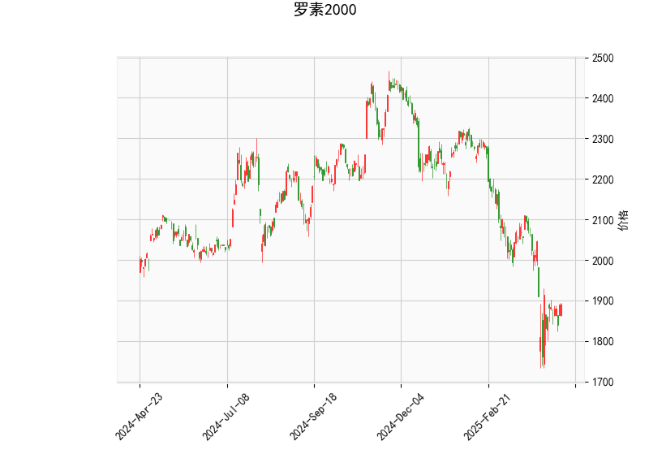

# 罗素2000指数技术分析及策略建议

## 一、技术指标解析

### 1. 价格与布林通道
- **当前价（1890.28）**显著低于**中轨（2069.27）**，且接近**下轨（1767.16）**，表明短期处于超卖区域。
- 布林带开口扩大（上轨2371.39 vs 下轨1767.16），显示市场波动率上升，但价格尚未突破下轨支撑。

### 2. 动量指标
- **RSI（43.81）**位于中性区间，未进入超卖（<30），但结合价格位置可能暗示潜在反弹需求。
- **MACD柱状图（7.75）**出现正值，显示空头动能衰减，MACD线（-52.45）上穿信号线（-60.21）形成"潜在金叉"，需关注后续确认。

### 3. K线形态
- **CDLGAPSIDESIDEWHITE**：两侧缺口的长白蜡烛，常见于趋势反转初期，暗示空头衰竭。
- **CDLSHORTLINE**：短实体线显示市场犹豫，需结合后续K线确认方向。

---

## 二、机会判断与策略建议

### （一）短期交易机会
1. **超跌反弹策略**
   - **触发条件**：价格站稳布林下轨（1767附近）+ MACD金叉确认
   - **操作逻辑**：利用均值回归特性，短期目标看至中轨2069
   - **风险控制**：跌破下轨3%止损

2. **波动率套利**
   - **跨式期权组合**：基于布林带扩张预期，同时买入平值看涨/看跌期权
   - **时间窗口**：重点关注3-5个交易日内的突破信号

### （二）中期布局机会
1. **趋势反转确认**
   - **观察指标**：连续三日收盘站上中轨 + RSI突破55
   - **仓位管理**：分步建仓，首仓不超过20%

2. **配对交易**
   - **对冲逻辑**：做多罗素2000期货+做空标普500期货，捕捉小盘股补涨机会
   - **触发条件**：小盘股相对大盘股的估值差修复至历史均值

---

## 三、风险提示
1. **流动性风险**：小盘股指数波动率通常高于大盘，需控制单笔交易规模
2. **宏观面干扰**：本周非农数据可能引发短期剧烈波动
3. **技术失效可能**：若MACD金叉未获量能配合，可能形成"假突破"

建议结合明晚CPI数据和美联储会议纪要验证技术信号的有效性，优先选择高盈亏比的右侧交易机会。