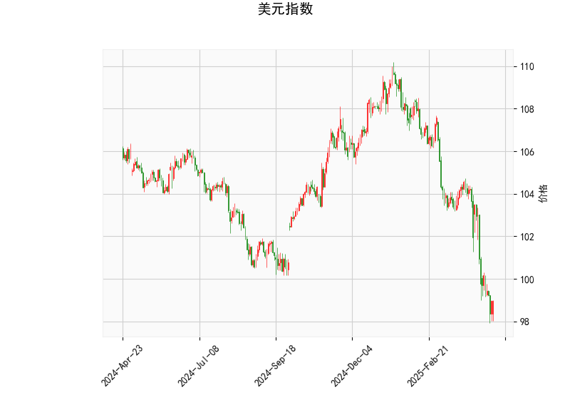

### 美元指数技术分析解读

#### 1. 美元指数当前技术面特征
- **价格位置与布林轨道**：  
  当前价（98.9757）低于布林中轨（104.19），且接近布林下轨（98.67），显示美元指数处于短期超卖状态，存在技术性反弹的可能性，但整体仍处于下行趋势中。

- **RSI指标**：  
  RSI值为30.22，低于30超卖阈值，短期可能触发反弹修复，但若持续低于30则需警惕进一步下跌风险。

- **MACD指标**：  
  MACD线（-1.54）位于信号线（-1.34）下方且柱状图（-0.19）为负值，表明下跌动能仍在延续，但MACD与信号线差值缩小，需关注是否形成“底背离”信号。

- **K线形态**：  
  当前无明确反转形态，需结合后续走势确认方向。

**结论**：美元指数短期可能因超卖反弹，但中期趋势偏弱，需关注布林下轨支撑有效性及MACD能否形成金叉。

---

### 近期A股/港股投资机会与策略

#### 1. **美元走弱对新兴市场的传导**  
   - **外资流入预期**：若美元反弹乏力，人民币汇率企稳，北向资金可能回流A股，关注外资偏好板块（如消费、新能源、科技）。  
   - **港股流动性改善**：港元与美元挂钩，美元走弱或缓解港股流动性压力，恒生科技指数及高股息蓝筹股（如能源、电信）或受益。

#### 2. **A股板块机会**  
   - **出口链修复**：若美元反弹后再度走弱，出口占比较高的行业（家电、机械）可能因汇率压力缓解而修复。  
   - **超跌成长股**：半导体、医药等前期超跌板块或迎估值修复，结合业绩确定性筛选标的。  
   - **政策驱动主题**：关注“新质生产力”相关（AI、机器人）及设备更新政策受益行业（工业母机、环保设备）。

#### 3. **港股套利策略**  
   - **AH溢价收敛**：当前AH溢价指数处于高位，可关注A/H价差较大的金融、能源股，布局H股折价收窄机会。  
   - **高股息防御**：美联储降息预期下，港股高股息资产（中资银行、公用事业）或成避险选择，同时对冲汇率波动风险。

#### 4. **风险提示**  
   - 若美元指数超预期反弹，需警惕外资流出压力及人民币汇率波动对A股的冲击。  
   - 港股需关注地缘政治及流动性风险，建议分散配置并控制仓位。

**策略总结**：短期可布局超跌反弹（A股成长股、港股科技股），中期关注高股息防御及政策主题，同时利用AH溢价套利机会，需密切跟踪美元指数走势及国内政策落地节奏。