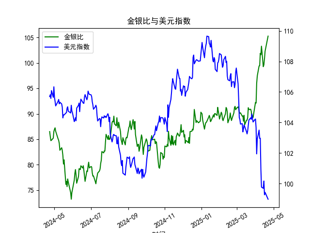

|            |    金价 |   银价 |   美元指数 |   金银比 |
|:-----------|--------:|-------:|-----------:|---------:|
| 2025-03-24 | 3007.75 | 33.085 |   104.307  |  90.9098 |
| 2025-03-25 | 3025.2  | 33.435 |   104.21   |  90.48   |
| 2025-03-26 | 3013.25 | 33.76  |   104.559  |  89.255  |
| 2025-03-27 | 3056.55 | 34.11  |   104.26   |  89.6086 |
| 2025-03-28 | 3071.6  | 34.395 |   104.034  |  89.3037 |
| 2025-03-31 | 3115.1  | 34.055 |   104.192  |  91.4726 |
| 2025-04-01 | 3133.7  | 33.97  |   104.226  |  92.249  |
| 2025-04-02 | 3119.75 | 33.87  |   103.661  |  92.1095 |
| 2025-04-03 | 3118.1  | 32.475 |   101.945  |  96.0154 |
| 2025-04-04 | 3054.5  | 31.34  |   102.919  |  97.4633 |
| 2025-04-07 | 3014.75 | 30.325 |   103.501  |  99.4147 |
| 2025-04-08 | 3015.4  | 30.315 |   102.956  |  99.4689 |
| 2025-04-09 | 3075.5  | 30.18  |   102.971  | 101.905  |
| 2025-04-10 | 3143.15 | 30.925 |   100.937  | 101.638  |
| 2025-04-11 | 3230.5  | 31.27  |    99.769  | 103.31   |
| 2025-04-14 | 3204.2  | 32.275 |    99.692  |  99.2781 |
| 2025-04-15 | 3219.6  | 32.31  |   100.167  |  99.6472 |
| 2025-04-16 | 3322.9  | 32.955 |    99.2667 | 100.831  |
| 2025-04-17 | 3305.65 | 32.31  |    99.424  | 102.31   |
| 2025-04-22 | 3433.55 | 32.61  |    98.9757 | 105.291  |

# 金银比与美元指数的相关性及影响逻辑分析

## 一、金银比与美元指数的相关性
从近一年数据看，**金银比与美元指数存在阶段性负相关性**，但并非严格线性关系。例如：
- **美元指数从105.7跌至98.9**（最后数据点）期间，**金银比从86.5攀升至105.3**，呈现明显背离；
- 但在中期波动中（如美元指数102-104区间震荡时），金银比同步出现80-90区间震荡，显示局部正相关性。

**核心逻辑**：
1. **美元作为定价货币的传导效应**：美元走弱→以美元计价的黄金/白银价格上涨，但白银因工业属性对经济敏感度更高，经济衰退预期会压制白银需求，导致黄金涨幅更显著→金银比扩大。
2. **避险情绪的双向驱动**：当市场风险偏好下降（如地缘冲突），美元与黄金可能同时作为避险资产上涨，而白银因工业需求萎缩表现弱势→美元指数与金银比同步上升。
3. **利率预期的差异化影响**：美联储加息预期升温→美元走强→黄金承压，但白银因工业需求受经济增速放缓拖累更明显→金银比可能先升后降。

---

## 二、近期投资机会与策略建议

### 观察到的信号
1. **金银比极端值**：当前金银比达105.3，接近近一年峰值（102-105区间），显著高于80-95的历史均值区间。
2. **美元指数超跌**：美元指数跌至98.97，接近一年最低点，且RSI指标显示超卖。
3. **背离窗口**：金银比与美元指数同步创出年内极值，存在均值回归动力。

### 策略建议
#### 1. 金银比均值回归套利
- **做空金银比**：买入白银期货/ETF + 卖出黄金期货/ETF。
- **逻辑**：105以上的金银比处于统计学极端区域，历史上超过100的比值通常难以持续。若经济复苏预期升温，白银工业需求回升将加速比值回落。
- **风控**：比值突破110止损，目标区间90-95。

#### 2. 美元指数反弹联动交易
- **做多美元指数衍生品** + **做多黄金/白银比**。
- **逻辑**：美元超卖后技术性反弹概率增大，若反弹伴随风险偏好回落（如股市回调），黄金可能相对白银更抗跌→金银比短期或维持高位。
- **风控**：美元指数跌破98.5离场，黄金/白银比跌破100止盈。

#### 3. 事件驱动对冲
- **关注美联储议息会议**：若释放暂停加息信号，美元或进一步走弱→优先执行策略1；若强调抗通胀决心，美元反弹→优先执行策略2。
- **经济数据联动**：若ISM制造业PMI回升，加码白银多头；若非农就业恶化，黄金多头占比需提升。

---

**注**：以上策略需结合仓位管理和实时市场动态调整，建议搭配波动率衍生品（如VIX期货）对冲尾部风险。