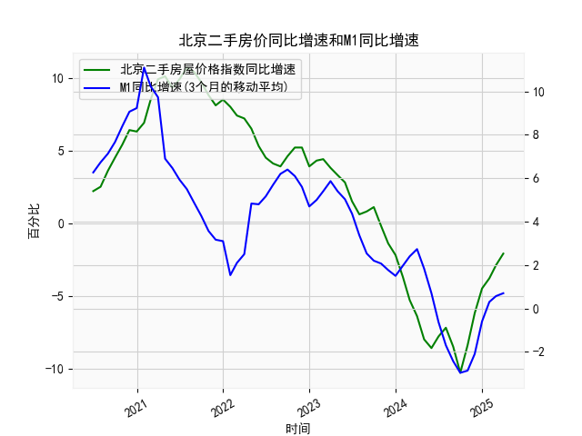

|            |   北京二手房屋价格指数同比增速 |   M1同比增速 |   M1同比增速(3个月的移动平均) |
|:-----------|-------------------------------:|-------------:|------------------------------:|
| 2023-08-31 |                            0.8 |          2.2 |                      2.53333  |
| 2023-09-30 |                            1.1 |          2.1 |                      2.2      |
| 2023-10-31 |                           -0.2 |          1.9 |                      2.06667  |
| 2023-11-30 |                           -1.4 |          1.3 |                      1.76667  |
| 2023-12-31 |                           -2.2 |          1.3 |                      1.5      |
| 2024-01-31 |                           -3.7 |          3.3 |                      1.96667  |
| 2024-02-29 |                           -5.3 |          2.6 |                      2.4      |
| 2024-03-31 |                           -6.4 |          2.3 |                      2.73333  |
| 2024-04-30 |                           -8   |          0.6 |                      1.83333  |
| 2024-05-31 |                           -8.6 |         -0.8 |                      0.7      |
| 2024-06-30 |                           -7.8 |         -1.7 |                     -0.633333 |
| 2024-07-31 |                           -7.2 |         -2.6 |                     -1.7      |
| 2024-08-31 |                           -8.5 |         -3   |                     -2.43333  |
| 2024-09-30 |                          -10.3 |         -3.3 |                     -2.96667  |
| 2024-10-31 |                           -8.4 |         -2.3 |                     -2.86667  |
| 2024-11-30 |                           -6.2 |         -0.7 |                     -2.1      |
| 2024-12-31 |                           -4.5 |          1.2 |                     -0.6      |
| 2025-01-31 |                           -3.8 |          0.4 |                      0.3      |
| 2025-02-28 |                           -2.9 |          0.1 |                      0.566667 |
| 2025-03-31 |                           -2.1 |          1.6 |                      0.7      |

### 1. 北京二手房价同比增速与M1同比增速的相关性及影响逻辑

#### **相关性分析**
从数据趋势看，**北京二手房价同比增速与M1同比增速呈现较强的正相关性**，但存在约**6-12个月的滞后效应**。具体表现为：
- **同步性**：在M1增速扩张阶段（如前20个月），二手房价增速同步上行（如从2.2%升至10.1%）；当M1增速收缩（如第30个月后进入负增长），房价增速也快速下滑至负区间（最低-10.3%）。
- **滞后性**：M1增速的拐点通常领先房价增速约半年。例如：
  - M1增速在数据中段（第24个月）触底反弹至4.8%，而房价增速在约6个月后（第30个月）开始企稳回升。
  - M1增速近期从-2.96%回升至0.7%（最后6个月），但房价增速仍处于低位（-8.5%至-2.1%），暗示未来可能跟随修复。

#### **影响逻辑**
- **流动性传导**：M1增速反映市场流动性强弱。M1扩张时，银行信贷宽松、居民购房能力增强，推动房价上涨；反之，M1收缩抑制购房需求。
- **政策联动**：中国M1增速常受货币政策（如降准、利率调整）影响，而房地产政策（如限购、贷款限制）会进一步放大或削弱流动性对房价的传导效果。例如，2021年M1收缩叠加“三条红线”政策，导致房价加速下跌。
- **预期效应**：M1扩张释放经济刺激信号，提振市场对房地产的增值预期，吸引投资性需求。

---

### 2. 近期投资机会与策略

#### **潜在机会**
- **房价触底反弹窗口**：当前M1增速已触底回升（从-2.96%升至0.7%），而二手房价增速仍处于历史低位（-2.1%），滞后修复概率较高，未来6-12个月可能形成价格反弹周期。
- **政策套利空间**：若后续货币政策进一步宽松（如降息），或房地产限制性政策边际放松（如降低首付比例），房价增速与M1增速的背离可能快速收敛。

#### **策略建议**
- **中长期布局**：在M1增速回升初期，优先关注核心地段二手房或关联资产（如REITs），利用价格低谷期介入。
- **波段操作**：若房价增速短期超跌（如因情绪扰动），可结合M1增速持续性和政策信号，进行阶段性低吸高抛。
- **风险对冲**：若M1回升不及预期（如经济复苏乏力），需警惕房价二次探底，可配置避险资产（如国债）或通过期货工具对冲。

#### **风险提示**
- **政策不确定性**：房地产调控政策可能滞后于M1变化，需密切关注“房住不炒”基调下的局部政策调整。
- **流动性陷阱**：若M1回升未有效传导至居民收入或信贷，房价反弹力度可能受限。