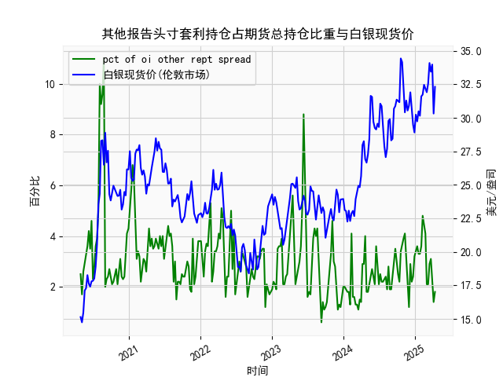

|            |   人民币汇率 |   美元指数 |
|:-----------|-------------:|-----------:|
| 2025-03-25 |       7.1788 |   104.21   |
| 2025-03-26 |       7.1754 |   104.559  |
| 2025-03-27 |       7.1763 |   104.26   |
| 2025-03-28 |       7.1752 |   104.034  |
| 2025-03-31 |       7.1782 |   104.192  |
| 2025-04-01 |       7.1775 |   104.226  |
| 2025-04-02 |       7.1793 |   103.661  |
| 2025-04-03 |       7.1889 |   101.945  |
| 2025-04-07 |       7.198  |   103.501  |
| 2025-04-08 |       7.2038 |   102.956  |
| 2025-04-09 |       7.2066 |   102.971  |
| 2025-04-10 |       7.2092 |   100.937  |
| 2025-04-11 |       7.2087 |    99.769  |
| 2025-04-14 |       7.211  |    99.692  |
| 2025-04-15 |       7.2096 |   100.167  |
| 2025-04-16 |       7.2133 |    99.2667 |
| 2025-04-17 |       7.2085 |    99.424  |
| 2025-04-18 |       7.2069 |    99.2286 |
| 2025-04-21 |       7.2055 |    98.3518 |
| 2025-04-22 |       7.2074 |    98.9757 |

### 1. 人民币汇率与美元指数的相关性及影响逻辑

#### （1）相关性分析  
人民币汇率（USD/CNY）与美元指数（DXY）通常呈现**正相关关系**。从数据中可观察到以下规律：  
- **美元走强**：当美元指数因美国经济数据强劲、美联储加息预期等因素上升时，人民币对美元汇率往往同步上行（即人民币贬值）。例如，当美元指数突破105时，USD/CNY汇率多次突破7.15关口。  
- **美元走弱**：若美元指数因美国经济疲软或降息预期下跌（如近期美元指数从109跌至103附近），人民币汇率可能回落（人民币升值）。  

这种相关性源于**美元在全球货币体系中的主导地位**。美元指数反映美元对欧元、日元等一篮子货币的强弱，而人民币汇率虽受中国央行政策影响，但在资本流动和国际贸易中仍与美元联动。

#### （2）影响逻辑  
- **资本流动效应**：美元指数上升时，全球资本倾向于回流美国市场，新兴市场（包括中国）面临资金外流压力，导致人民币贬值。  
- **利差驱动**：美联储加息会推高美元指数，同时扩大中美利差，人民币资产的吸引力相对下降，汇率承压。  
- **政策干预**：中国央行可能通过逆周期因子、外汇储备操作等手段平滑汇率波动，导致短期内相关性减弱。  

---

### 2. 近期投资或套利机会及策略

#### （1）趋势性机会  
- **人民币短期升值窗口**：近期美元指数已从109高位回落至103附近（因市场押注美联储降息），但人民币汇率（USD/CNY）仍处于7.18-7.19区间，存在滞后性。若美元指数进一步走弱，可关注**做多人民币（卖出USD/CNY）**的机会。  
- **美元反弹波段**：若美国通胀数据超预期或地缘风险升温，美元指数可能反弹，可顺势**做空人民币（买入USD/CNY）**。  

#### （2）套利策略  
- **离岸-在岸价差套利**：若离岸人民币（CNH）与在岸人民币（CNY）价差扩大（如CNH显著弱于CNY），可通过跨境贸易结算或远期合约进行价差收敛套利。  
- **利差交易（Carry Trade）**：借入低息美元（当前美国利率或见顶），兑换成人民币后投资中国国债（收益率约2.5%），赚取利差。  

#### （3）风险提示  
- **政策风险**：中国央行可能通过中间价引导或逆周期措施抑制单边波动。  
- **数据冲击**：美国非农就业、中国PMI等关键数据可能引发汇率短期剧烈波动，需设置严格止损。  

---

### 结论  
当前市场环境下，建议**逢低布局人民币升值波段**（USD/CNY目标7.10-7.15），并关注离岸与在岸市场的价差套利机会。同时需警惕美元指数超跌反弹风险，保持灵活仓位管理。