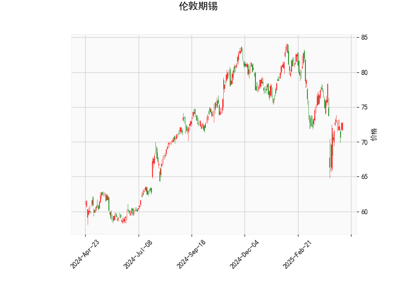

### 伦敦期锡技术分析解读

#### 1. 技术指标综合分析
**当前价与布林轨道**  
- 当前价（72.69）位于布林下轨（68.02）和中轨（76.57）之间，接近下轨，显示价格处于短期弱势区间。  
- 布林带开口向下发散（上轨85.13，中轨76.57，下轨68.02），表明市场波动性增加，但当前价未突破下轨，需警惕超跌反弹可能。

**RSI（相对强弱指标）**  
- RSI为47.78，略低于中性值50，反映市场短期动能偏空，但未进入超卖区（通常低于30），暗示下行压力有限，但缺乏明确反转信号。

**MACD指标**  
- MACD线（-1.10）与信号线（-1.33）均为负值，但MACD柱状图（0.225）已转正且向上收敛，形成“金叉”雏形，提示短期可能止跌反弹。

**K线形态**  
- **CDLGAPSIDESIDEWHITE**：两侧缺口与长白实体组合，通常预示趋势延续或反转前的犹豫。结合当前低位，可能暗示空头动能减弱。  
- **CDLSHORTLINE**：短实体K线，显示市场交投清淡，多空力量暂时平衡，需关注后续方向选择。

---

#### 2. 潜在机会与策略建议

**机会1：超跌反弹（短线）**  
- **逻辑**：价格靠近布林下轨，MACD柱状图转正，RSI未超卖但接近中性，可能触发技术性反弹。  
- **策略**：  
  - **入场**：若价格站稳布林下轨（68.02）或突破5日均线，轻仓试多。  
  - **目标**：中轨76.57（阻力位），突破后可看向上轨85.13。  
  - **止损**：下轨下方2%-3%（如66.00附近）。

**机会2：趋势延续（中短期）**  
- **逻辑**：若价格有效跌破布林下轨且MACD柱状图重新转负，可能加速下行。  
- **策略**：  
  - **入场**：跌破68.02后追空，或等待反弹至中轨附近做空。  
  - **目标**：前低或布林带向下扩张后的新支撑位。  
  - **止损**：布林下轨上方1%-2%（如69.50）。

**套利策略：跨期套利（需流动性支持）**  
- **逻辑**：若近月合约超跌而远月合约贴水收窄，可买入近月、卖出远月，捕捉价差回归机会。  
- **风险**：需关注库存变化与供需基本面，避免单边波动风险。

---

**风险提示**  
- **基本面干扰**：需结合宏观数据（如美元指数、工业需求）及库存变动验证技术信号。  
- **假突破风险**：短期K线形态显示市场犹豫，建议等待价格确认方向后跟进。  
- **仓位管理**：当前波动率较高，建议分批建仓并严格止损。