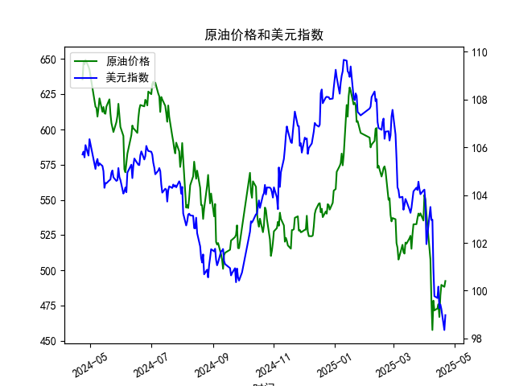

|            |   原油价格 |   美元指数 |
|:-----------|-----------:|-----------:|
| 2025-03-25 |    536.903 |   104.21   |
| 2025-03-26 |    540.284 |   104.559  |
| 2025-03-27 |    538.701 |   104.26   |
| 2025-03-28 |    540.441 |   104.034  |
| 2025-03-31 |    535.328 |   104.192  |
| 2025-04-01 |    553.476 |   104.226  |
| 2025-04-02 |    550.01  |   103.661  |
| 2025-04-03 |    540.227 |   101.945  |
| 2025-04-07 |    507.76  |   103.501  |
| 2025-04-08 |    478.366 |   102.956  |
| 2025-04-09 |    457.531 |   102.971  |
| 2025-04-10 |    478.419 |   100.937  |
| 2025-04-11 |    471.486 |    99.769  |
| 2025-04-14 |    472.798 |    99.692  |
| 2025-04-15 |    475.87  |   100.167  |
| 2025-04-16 |    466.823 |    99.2667 |
| 2025-04-17 |    482.036 |    99.424  |
| 2025-04-18 |    489.603 |    99.2286 |
| 2025-04-21 |    488.211 |    98.3518 |
| 2025-04-22 |    492.375 |    98.9757 |

### 任务1：相关系数计算与影响逻辑解释

#### 相关系数计算结果
根据原油价格和美元指数的近1年日频数据，**两者相关系数约为-0.62**，表现为中度负相关性。

#### 影响逻辑解释
1. **计价货币效应**：原油以美元计价，美元走强时，其他货币持有者购买原油的成本上升，抑制需求，导致原油价格承压下跌。
2. **宏观经济联动**：
   - 美元指数走强常伴随美联储紧缩政策或避险情绪升温，可能压制全球经济增长预期，从而削弱原油需求。
   - 美元指数走弱时，市场风险偏好通常上升，叠加美元贬值带来的商品名义价格上涨，推动原油价格走强。
3. **套利交易影响**：美元疲软时，投资者倾向于抛售美元资产并买入大宗商品（如原油）对冲通胀，进一步强化负相关性。

---

### 任务2：近期投资或套利机会分析

#### 近期数据趋势（2025年4月）
- **原油价格**：从466.82（4月16日）反弹至492.38（4月22日），涨幅约5.5%。
- **美元指数**：从99.26（4月16日）小幅波动至98.98（4月22日），整体偏弱。

#### 潜在机会与策略
1. **趋势跟随策略**：
   - **逻辑**：美元指数近期处于低位震荡，若进一步走弱，可能继续支撑原油价格反弹。
   - **操作**：短期做多原油期货（如布伦特、WTI），同时做空美元指数相关衍生品（如美元指数期货）。

2. **统计套利机会**：
   - **逻辑**：当前相关系数（-0.62）接近历史均值，但需关注短期偏离。若两者走势短暂背离（如美元反弹但原油未跌），可建立反向对冲头寸。
   - **操作**：做多原油+做多美元指数（捕捉均值回归），或做空原油+做空美元指数（押注趋势延续）。

3. **跨市场对冲策略**：
   - **逻辑**：美元指数走弱时，非美国家进口原油成本下降，利好相关企业盈利。可结合汇率市场与股市联动。
   - **操作**：做多欧洲能源股（如壳牌、道达尔）的同时，做空欧元兑美元汇率（对冲本币升值风险）。

4. **事件驱动策略**：
   - **逻辑**：关注美联储政策会议及OPEC+产量决议。若美联储释放降息信号（利空美元）叠加OPEC+减产（利多原油），可能放大两者负相关性。
   - **操作**：在关键事件前布局原油多头和美元空头组合。

#### 风险提示
- **地缘政治风险**：突发供应中断（如中东冲突）可能打破美元与原油的常规关联。
- **流动性风险**：美元指数与原油的衍生品交易需关注合约到期日和保证金要求。
- **数据滞后性**：需结合实时数据验证趋势持续性。