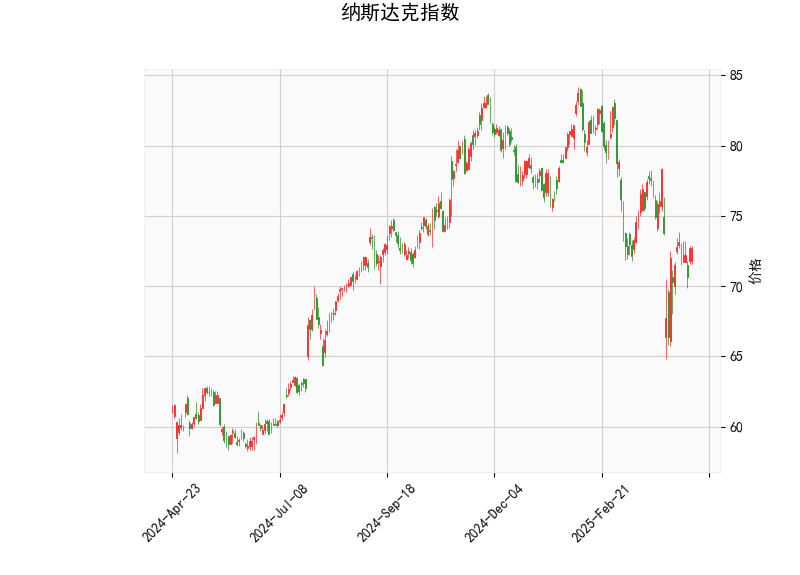

### 纳斯达克指数技术分析解读

#### 1. 技术指标分析
- **当前价（72.69）**：价格低于布林带中轨（76.57），接近下轨（68.02），显示市场短期处于弱势区间。若未跌破下轨，可能形成支撑；若反弹突破中轨，则可能转为上行趋势。
  
- **RSI（47.78）**：中性区域（接近50），表明市场无显著超买或超卖压力，短期方向需结合其他指标判断。

- **MACD指标**：
  - MACD线（-1.10）高于信号线（-1.33），且MACD柱（0.225）由负转正，暗示空头动能减弱，可能形成短期反弹信号（潜在金叉）。
  - 但MACD与信号线仍处于负值区域，整体趋势尚未脱离空头主导。

- **布林带**：
  - 价格位于中轨和下轨之间，波动率较低。若后续价格站稳中轨（76.57），可能开启上行通道；若跌破下轨（68.02），则可能加速下跌。
  - 当前布林带收窄，表明市场处于盘整阶段，需警惕突破后的趋势性机会。

- **K线形态**：
  - **CDLGAPSIDESIDEWHITE**：两侧跳空缺口的白色蜡烛，通常表示价格波动后的犹豫或趋势反转可能。
  - **CDLSHORTLINE**：短实体线，反映市场缺乏方向性共识。
  - 两者结合，提示短期市场处于震荡整理阶段，需关注后续突破信号。

---

#### 2. 投资机会与策略建议

##### **潜在机会**：
1. **短期反弹交易**：
   - **触发条件**：若价格站稳布林带下轨（68.02）并伴随RSI回升至50以上，可尝试轻仓做多，目标看向中轨（76.57）。
   - **验证信号**：MACD柱持续扩大且金叉确认（MACD线突破信号线），可增强反弹概率。

2. **趋势突破策略**：
   - **上行突破**：若价格放量突破中轨（76.57），可能开启上涨趋势，可顺势追多，目标布林带上轨（85.13）。
   - **下行破位**：若价格跌破下轨（68.02）且RSI低于40，可能加速下跌，可考虑顺势做空。

3. **区间震荡策略**：
   - 在布林带下轨（68.02）至中轨（76.57）之间高抛低吸，结合RSI超卖（<40）时买入，超买（>60）时卖出。

##### **风险提示**：
- **假突破风险**：当前布林带收窄，需警惕突破后回踩确认。建议配合成交量验证（如放量突破中轨）。
- **MACD背离风险**：若价格反弹但MACD未同步走强，可能形成背离，需及时止损。

##### **套利机会**：
- **跨期套利**：若短期技术面反弹但中长期趋势未改（如MACD仍处负值），可尝试做多近月合约、做空远月合约。
- **期权策略**：若预期波动率上升，可买入跨式组合（同时买入看涨和看跌期权），博弈突破行情。

---

#### 总结
**短期操作**以区间震荡为主，关注布林带中轨和下轨的支撑/阻力转换；**中期趋势**需等待MACD金叉或价格站稳中轨后确认。风险控制建议设置严格止损（如下轨下方3%-5%），并密切关注市场情绪与基本面事件（如美联储政策、财报季等）。