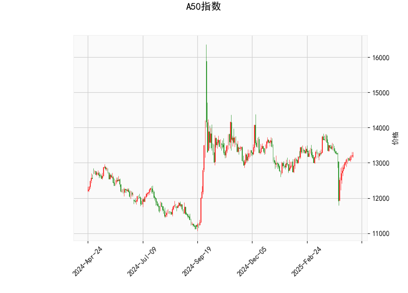

### A50指数技术分析解读

#### 1. 技术指标分析
- **当前价与布林轨道**：当前价（13,202）接近布林线中轨（13,214.84），表明价格处于短期均衡状态。上方压力位为**13,803**（上轨），下方支撑位为**12,626**（下轨）。若价格突破中轨并站稳，可能向上测试上轨；若跌破中轨，则可能向下轨靠拢。
  
- **RSI（52.64）**：处于中性区间（50附近），未进入超买（>70）或超卖（<30）区域，暗示市场短期缺乏明确方向，但需警惕潜在趋势反转信号。

- **MACD指标**：MACD线（-23.28）与信号线（-66.17）均位于零轴下方，显示整体趋势仍偏弱，但**MACD柱状图（42.89）**为正值且显著放大，表明空头动能减弱，短期可能出现反弹或震荡修复。

- **K线形态**：
  - **十字星类形态（CDLDOJI、CDLLONGLEGGEDDOJI）**：反映多空力量僵持，常见于趋势反转初期。
  - **纺锤线（CDLSPINNINGTOP）与长脚十字线（CDLHIGHWAVE）**：进一步强化市场犹豫情绪，需结合成交量确认方向。
  - **两侧缺口白蜡烛（CDLGAPSIDESIDESWHITE）**：暗示跳空后多空争夺激烈，可能伴随波动率上升。

---

#### 2. 投资机会与策略

##### **短期趋势策略**
- **突破交易**：
  - **向上突破中轨（13,214）**：若价格站稳中轨且MACD柱状图持续扩张，可轻仓试多，目标看向上轨（13,803），止损设于中轨下方（如13,100）。
  - **向下跌破中轨**：若价格放量跌破中轨，可能打开下行空间至下轨（12,626），可考虑短线做空，止损设于中轨上方（如13,300）。

- **区间震荡策略**：
  - **下轨附近低吸**：若价格回落至12,600附近且RSI未超卖（>30），可尝试波段反弹，止损设于下轨下方（如12,500）。
  - **上轨附近高抛**：若价格反弹至13,800附近且RSI接近70，可逢高减仓或做空。

##### **套利与风控**
- **波动率套利**：布林带收窄后可能伴随波动率爆发，可布局跨式期权组合（Long Straddle），捕捉突破行情。
- **事件驱动对冲**：若宏观数据（如中国PMI、美联储政策）临近，需警惕价格跳空风险，可对冲持仓或降低杠杆。

##### **风险提示**
- **假突破风险**：当前K线形态显示市场分歧较大，需结合成交量放大确认突破有效性。
- **MACD背离可能**：若价格反弹但MACD未同步回升，需警惕反弹失败。