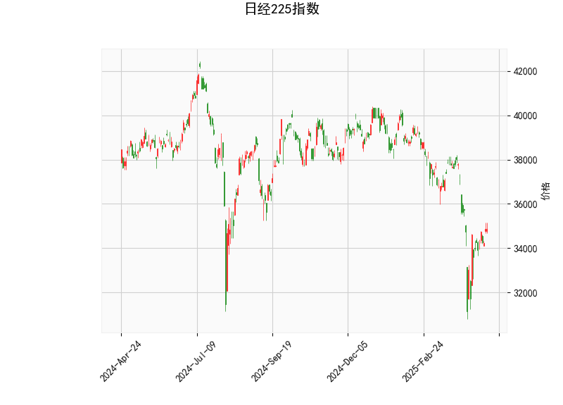

### 日经225指数技术分析结果解读

#### 1. 技术指标分析
- **当前价（34868.63）与布林轨道**：  
  当前价格位于布林带**中轨（36769.29）与下轨（32689.85）之间**，且接近中轨，表明市场处于**中性偏弱区间**。价格未触及下轨，短期下跌压力有限，但需关注是否可能向上突破中轨以确认趋势反转。

- **RSI（48.16）**：  
  接近50的中性值，显示市场**无明显超买或超卖**，短期内可能延续震荡格局。

- **MACD指标**：  
  - MACD线（-608.85）与信号线（-833.74）均为负值，但**MACD柱（224.89）转正**，表明**下跌动能减弱**，可能出现短期反弹信号。
  - MACD线（快线）上穿信号线（慢线），形成潜在的“金叉”雏形，需后续确认。

- **K线形态**：  
  - **CDLGAPSIDESIDEWHITE**（并列阳线）：通常出现在趋势末期，暗示多空力量平衡，可能进入盘整或反转阶段。  
  - **CDLSPINNINGTOP**（纺锤线）：反映市场犹豫不决，需结合后续走势判断方向。

#### 2. 投资机会与策略建议

##### **短期机会**：
- **反弹交易策略**：  
  - **触发条件**：若价格站稳中轨（36769）或MACD柱持续扩大，可视为短期反弹信号。  
  - **目标**：上轨（40848）附近，潜在涨幅约17%。  
  - **风险控制**：止损设于下轨（32689）下方，或跌破当前低点时离场。

- **区间波动策略**：  
  - 当前价格处于布林带中轨与下轨之间，可尝试**高抛低吸**：在接近下轨时轻仓买入，反弹至中轨附近止盈。

##### **中长期趋势**：
- **潜在反转信号**：  
  MACD柱转正与K线形态的“并列阳线”可能暗示下跌趋势放缓，但需价格突破中轨并站稳才能确认趋势反转。

- **风险提示**：  
  - 若MACD柱未能持续放大或价格跌破下轨，可能延续下行趋势。  
  - 全球宏观经济（如美联储政策、日元汇率）可能对日经指数产生较大影响，需结合基本面分析。

##### **套利机会**：
- **跨期套利**：  
  若期货市场显示远月合约贴水（价格低于近月），可关注正套机会（买入远月、卖出近月），但需结合流动性及持仓成本。

- **期权波动率策略**：  
  当前布林带带宽较宽（上轨与下轨差值约8160点），隐含波动率可能较高，可考虑**卖出宽跨式期权组合**（Short Strangle）以赚取时间价值。

#### 总结
日经225指数短期内可能处于**震荡筑底阶段**，MACD动能修复与K线形态的博弈信号值得关注。建议以**轻仓短线交易**为主，重点观察价格对中轨的突破情况，并严格设置止损。中长期投资者需等待趋势明确信号（如放量突破中轨）后再布局。