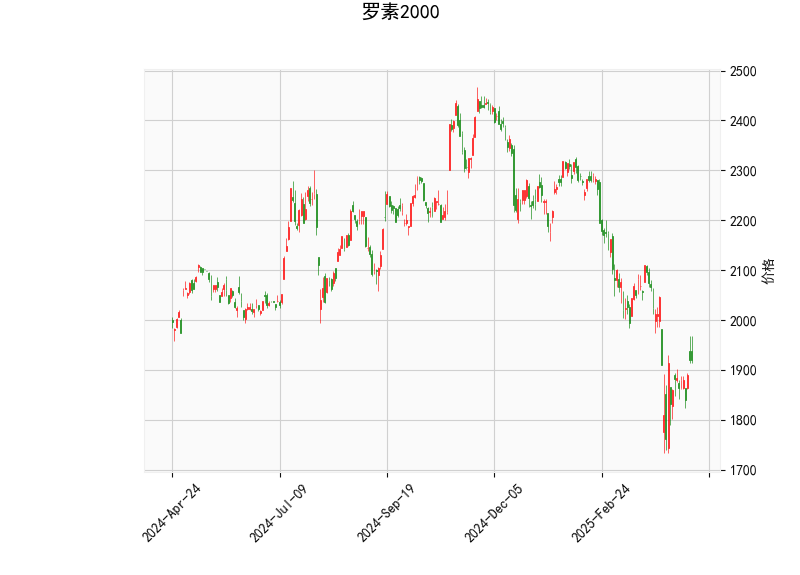

# 罗素2000指数技术分析及策略建议

## 一、技术指标解析

### 1. 关键指标现状
- **价格水平**：当前价1919.14，显著低于布林带中轨（2062.58），接近下轨（1766.59）
- **RSI指标**：47.01处于中性区间（30-70），未显示超买超卖信号
- **MACD结构**：MACD线（-44.38）上穿信号线（-56.67），柱状图正值（+12.29）持续放大
- **K线形态**：出现CDLMATCHINGLOW（低位匹配线），预示潜在止跌信号

### 2. 指标间协同验证
- **布林带与价格关系**：价格贴下轨运行，布林带宽度达到591.97点（2358.56-1766.59），显示波动率处于高位
- **MACD与RSI背离**：MACD柱状图连续走强但RSI未同步突破50中线，暗示反弹动能尚未完全确认
- **量价形态配合**：CDLMATCHINGLOW需配合成交量验证，需关注后续两个交易日的量能变化

## 二、潜在机会与策略建议

### 1. 趋势反转博弈
- **建仓条件**：价格站上5日均线且MACD柱连续三日扩大
- **目标设定**：第一目标中轨2062（+7.4%），突破后上看2150（+12%）
- **止损设置**：跌破布林带下轨1766（-8.0%）严格止损

### 2. 波动率套利策略
- **跨式期权组合**：同时买入平值看涨/看跌期权，隐含波动率（IV）当前约23%，低于历史波动率（HV）30天均值26%
- **执行要点**：需在布林带收口前（预计未来5-8个交易日）完成建仓

### 3. 区间震荡策略
- **网格交易参数**：
  - 基础仓位：20%资金量
  - 网格间距：设置50点（约2.6%）为触发间隔
  - 加仓梯度：每下跌50点加仓10%，每上涨50点减仓15%

## 三、风险提示
1. **流动性风险**：罗素2000成分股流动性差异较大，需注意中小盘股流动性陷阱
2. **宏观事件敏感**：需特别关注本周五非农数据和FOMC会议纪要
3. **技术指标失效**：若价格持续位于下轨下方超过3个交易日，需重新评估趋势判断

## 四、操作建议
**短期（1-3日）**：建议观望等待MACD金叉确认，若出现成交量放大突破1930可轻仓试多  
**中期（1-2周）**：重点关注1975压力位突破情况，建议配置2:1的多头跨期价差组合  
**对冲策略**：持有现货可同时买入3个月期限、执行价1750的看跌期权进行保护  

（注：以上分析基于历史数据，实际交易需结合实时市场动态调整）