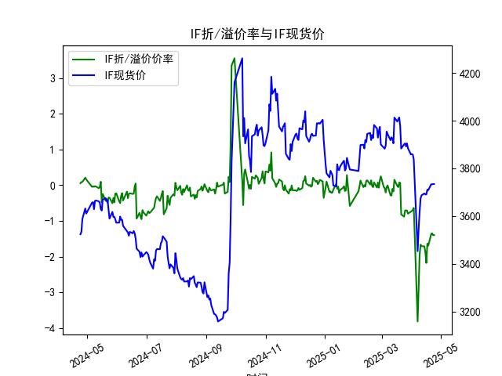
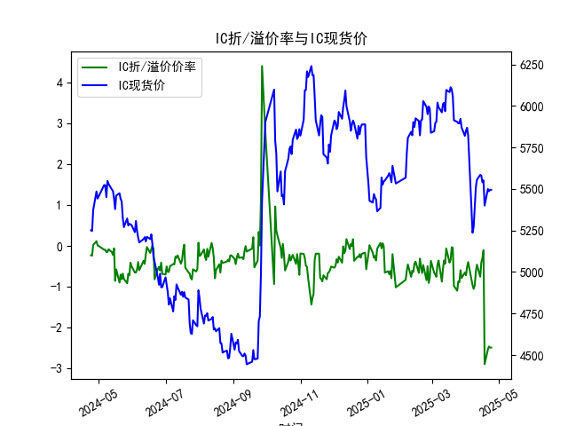
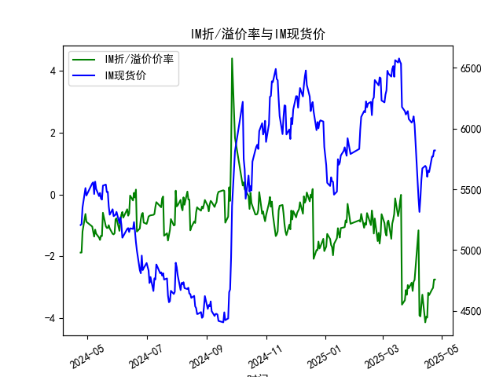

|            |   IF折/溢价率 |   IF现货价 |   IH折/溢价率 |   IH现货价 |   IC折/溢价率 |   IC现货价 |   IH折/溢价率 |   IH现货价 |
|:-----------|--------------:|-----------:|--------------:|-----------:|--------------:|-----------:|--------------:|-----------:|
| 2025-03-27 |     -0.707243 |     3904.6 |     -0.594227 |     5922.2 |     -0.594227 |     5922.2 |      -2.92895 |     6143.4 |
| 2025-03-28 |     -0.796038 |     3884   |     -0.78484  |     5869.6 |     -0.78484  |     5869.6 |      -3.02986 |     6078.4 |
| 2025-03-31 |     -0.738445 |     3858.6 |     -0.651649 |     5819.6 |     -0.651649 |     5819.6 |      -2.85304 |     6049   |
| 2025-04-01 |     -0.722386 |     3859.6 |     -0.716974 |     5850.6 |     -0.716974 |     5850.6 |      -3.11981 |     6064.2 |
| 2025-04-02 |     -0.689576 |     3857.6 |     -0.5168   |     5868.6 |     -0.5168   |     5868.6 |      -2.82374 |     6100   |
| 2025-04-03 |     -0.634556 |     3837   |     -0.395252 |     5822.4 |     -0.395252 |     5822.4 |      -2.76398 |     6031.8 |
| 2025-04-07 |     -3.81231  |     3452.6 |     -0.961471 |     5236.2 |     -0.961471 |     5236.2 |      -1.16153 |     5432.6 |
| 2025-04-08 |     -2.92977  |     3543.8 |     -1.04965  |     5271   |     -1.04965  |     5271   |      -3.91353 |     5313.6 |
| 2025-04-09 |     -1.97446  |     3614   |     -0.96643  |     5387.2 |     -0.96643  |     5387.2 |      -3.9405  |     5429.6 |
| 2025-04-10 |     -1.663    |     3673   |     -0.632471 |     5509   |     -0.632471 |     5509   |      -3.56785 |     5578.2 |
| 2025-04-11 |     -1.70421  |     3686.6 |     -0.457211 |     5555.8 |     -0.457211 |     5555.8 |      -3.2409  |     5672.2 |
| 2025-04-14 |     -1.71162  |     3694.8 |     -0.752381 |     5584.8 |     -0.752381 |     5584.8 |      -4.13446 |     5693   |
| 2025-04-15 |     -1.88329  |     3690.4 |     -0.402211 |     5580   |     -0.402211 |     5580   |      -3.95041 |     5680.4 |
| 2025-04-16 |     -2.17398  |     3690.8 |     -0.296286 |     5540.4 |     -0.296286 |     5540.4 |      -3.98173 |     5603   |
| 2025-04-17 |     -1.63358  |     3710.6 |     -0.104562 |     5551.2 |     -0.104562 |     5551.2 |      -3.18113 |     5653.8 |
| 2025-04-18 |     -1.68913  |     3708.8 |     -2.89029  |     5400   |     -2.89029  |     5400   |      -3.25269 |     5642   |
| 2025-04-21 |     -1.36545  |     3733.2 |     -2.52696  |     5499.8 |     -2.52696  |     5499.8 |      -3.06818 |     5770   |
| 2025-04-22 |     -1.34653  |     3733   |     -2.45739  |     5486   |     -2.45739  |     5486   |      -3.02072 |     5769.6 |
| 2025-04-23 |     -1.39646  |     3734   |     -2.48358  |     5495   |     -2.48358  |     5495   |      -2.75012 |     5820   |
| 2025-04-24 |     -1.39646  |     3734   |     -2.48358  |     5495   |     -2.48358  |     5495   |      -2.75012 |     5820   |

# 股指期货折/溢价率与现货价的相关性及影响逻辑分析

## 一、折/溢价率与现货价的相关性及影响逻辑

### 1. **折溢价率的本质与市场预期**
折溢价率反映期货价格与现货价格的偏离程度：
- **溢价（正）**：期货价格 > 现货价格，隐含市场对未来的乐观预期（如经济复苏、政策利好）。
- **折价（负）**：期货价格 < 现货价格，隐含市场对未来的悲观预期（如经济下行、流动性收紧）。

### 2. **动态相关性逻辑**
- **正向反馈**：当市场情绪一致时，折溢价率与现货价可能呈现**正相关**。例如，现货上涨推动期货溢价扩大（预期强化），反之折价加深（避险情绪升温）。
- **均值回归**：当折溢价率偏离历史中枢（如套利边界）时，会通过**套利机制**反向修正，形成**负相关**。例如，期货大幅折价时，套利者买入期货、卖出现货，压低现货价格并收敛价差。

### 3. **核心影响因素**
- **资金成本**：持有成本模型（期货理论价 = 现货价 + 融资成本 - 股息）决定折溢价的合理区间。若实际价差显著偏离理论值，触发套利。
- **市场结构**：
  - **分红周期**：A股集中分红期（5-7月），股指期货因扣除预期分红而天然折价。
  - **多空力量**：机构对冲需求（如用期货对冲现货持仓）可能扭曲短期价差。
- **政策与流动性**：例如，降息降低融资成本，可能推动期货溢价率上升。

---

## 二、近期投资或套利机会分析

### 1. **数据观察（2024-2025年）**
- **IF/IH/IC/IM共性**：2025年4月合约普遍呈现**深度折价**（IF:-1.4%、IH:-2.48%、IM:-2.75%），而2024年同期多为溢价或浅折价。
- **现货走势**：四大指数现货价格在一年内整体上涨（如IF现货从3523升至3734），但期货折价率扩大，隐含市场对后续上涨动能的怀疑。

### 2. **潜在机会与策略**

#### **(1) 期现套利（正向套利）**
- **逻辑**：期货深度折价时，买入期货+卖空现货组合，待价差收敛后平仓。
- **适用场景**：
  - **IH/IM折价显著**：IH折价率-2.48%、IM-2.75%，若扣除分红影响后仍超阈值（如年化2%），则存在套利空间。
  - **交割月临近**：2025年4月合约临近到期时，折价率收敛概率更高。
- **风险**：需精确计算分红扣除（尤其IH含高股息蓝筹股）及融券成本。

#### **(2) 跨品种套利**
- **逻辑**：折价率分化反映市场风格差异。例如：
  - **IM vs IF**：IM折价更深（-2.75% vs -1.4%），若判断小盘股（IM）情绪过度悲观，可做多IM期货+做空IF期货。
  - **IH vs IC**：IH折价率（-2.48%）显著高于IC（假设数据未重复），可能反映大盘股（IH）避险需求更强，可反向布局。

#### **(3) 方向性交易**
- **多头策略**：若认为市场超跌（折价率隐含过度悲观），可逢低布局IF/IM期货，博弈现货反弹+折价率收敛的双重收益。
- **空头策略**：若判断经济数据不及预期，可利用期货折价率扩大（卖空现货+持有期货）对冲下行风险。

### 3. **关键验证点**
- **分红调整**：估算2025年成分股分红对期货理论价的影响（如IH需重点调整）。
- **市场情绪指标**：结合融资余额、波动率指数（VIX）判断折价是否反映短期恐慌。
- **政策信号**：关注货币政策（如LPR下调）或监管表态（如限制卖空）对流动性的冲击。

---

## 三、结论
近期IH、IM深度折价或提供期现套利窗口，但需精细化扣除分红影响；跨品种折价分化反映风格切换预期，可布局对冲组合。方向性交易需结合宏观数据验证市场情绪拐点，避免过度依赖均值回归假设。

