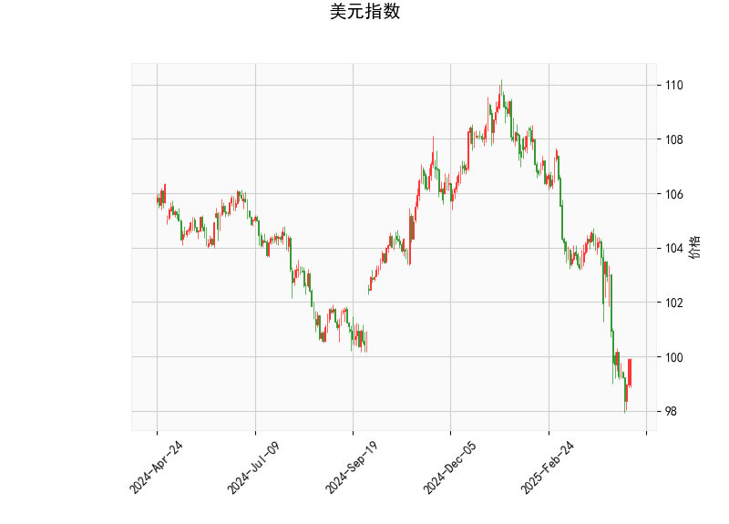

### 美元指数技术分析结果解读

#### 1. 美元指数技术指标分析
- **当前价（99.91）**：低于布林带中轨（104.07），接近下轨（98.57），显示美元处于弱势区域，短期可能延续震荡下行趋势。
- **RSI（38.12）**：接近超卖阈值（30），但未完全进入超卖区，暗示下跌动能可能减弱，但未出现明确反转信号。
- **MACD指标**：
  - MACD线（-1.38）低于信号线（-1.34），柱状图（-0.038）为负值，但两者差值较小，表明空头动能边际放缓，需警惕短期反弹可能性。
- **布林带**：价格贴近下轨运行，若未有效跌破下轨（98.57），可能触发技术性反弹，但中轨（104.07）构成强阻力。
- **K线形态**：
  - `CDLCLOSINGMARUBOZU`（光头光脚阳线）：出现在下跌趋势中可能暗示短期多头反扑。
  - `CDLLONGLINE`（长脚十字线）：反映多空博弈激烈，需结合后续价格确认方向。

**结论**：美元指数短期偏弱，但技术指标显示超卖修复需求，需关注98.5附近支撑是否有效，反弹需突破中轨（104）才能确认趋势反转。

---

### 近期A股/港股投资机会与策略

#### 1. **美元走弱对市场的影响**
- **人民币汇率联动**：美元弱势可能缓解人民币贬值压力，外资回流预期增强，利好A股（尤其是外资偏好板块如消费、新能源）及港股（流动性敏感标的）。
- **风险资产偏好提升**：美元走弱通常伴随全球资金转向新兴市场，港股（离岸市场）弹性可能高于A股。

#### 2. **潜在机会与策略**
- **跨市场套利**：
  - **A/H溢价收敛**：当前部分A/H股溢价率较高（如金融、科技），可做多H股同时做空A股，博弈价差回归。
  - **港股超跌反弹**：恒生科技指数成分股（如互联网龙头）受美元流动性敏感，若美元反弹乏力，可布局超跌估值修复。
- **行业配置**：
  - **出口敏感型行业（谨慎）**：美元贬值可能压制出口企业利润，但若美联储降息预期升温，可关注高外销占比且议价能力强的细分龙头（如家电、机械）。
  - **大宗商品相关**：美元弱势支撑以美元计价的大宗商品（黄金、铜），但需警惕需求端疲软风险，建议轻仓参与黄金ETF或资源股。
  - **高股息防御板块**：若市场波动加剧，电力、通信等低估值高股息标的（如港股央企）具备避险价值。
- **事件驱动策略**：
  - **政策预期博弈**：关注国内稳增长政策（如地产放松、消费补贴）对A股地产链、消费股的短期催化。
  - **财报季超预期个股**：聚焦港股中业绩超预期的医药、可选消费公司，利用市场情绪回暖获取超额收益。

#### 3. **风险提示**
- **美元反弹风险**：若美国经济数据超预期或地缘冲突推升避险情绪，可能逆转美元弱势逻辑。
- **国内政策力度不及预期**：A股反弹持续性依赖政策落地节奏及经济数据验证。
- **港股流动性冲击**：外资短期交易性回流可能导致港股波动放大，需控制仓位。

**策略总结**：短期可侧重港股超跌反弹及A/H溢价收敛机会，中期关注政策驱动的主线（如新质生产力、高股息），建议采用“低估值+景气改善”双因子筛选标的，动态调整股债配置比例以对冲波动风险。