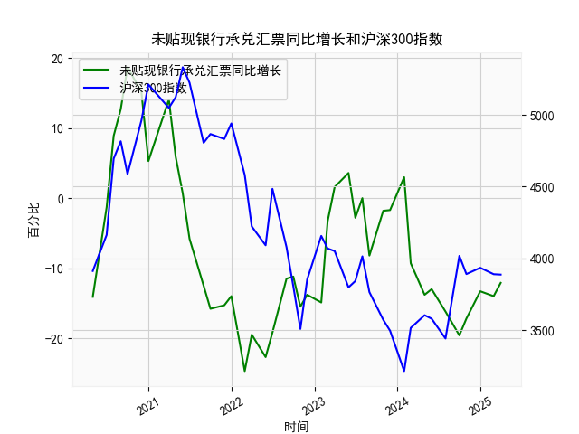

|            |   未贴现银行承兑汇票同比增长 |   沪深300指数 |
|:-----------|-----------------------------:|--------------:|
| 2022-11-30 |                        -13.8 |       3853.04 |
| 2023-01-31 |                        -14.9 |       4156.86 |
| 2023-02-28 |                         -3.3 |       4069.46 |
| 2023-03-31 |                          1.6 |       4050.93 |
| 2023-05-31 |                          3.6 |       3798.54 |
| 2023-06-30 |                         -2.8 |       3842.45 |
| 2023-07-31 |                          0   |       4014.63 |
| 2023-08-31 |                         -8.2 |       3765.27 |
| 2023-10-31 |                         -1.8 |       3572.51 |
| 2023-11-30 |                         -1.7 |       3496.2  |
| 2024-01-31 |                          3   |       3215.35 |
| 2024-02-29 |                         -9.3 |       3516.08 |
| 2024-04-30 |                        -13.8 |       3604.39 |
| 2024-05-31 |                        -13   |       3579.92 |
| 2024-07-31 |                        -16.2 |       3442.08 |
| 2024-09-30 |                        -19.6 |       4017.85 |
| 2024-10-31 |                        -17.2 |       3891.04 |
| 2024-12-31 |                        -13.3 |       3934.91 |
| 2025-02-28 |                        -14   |       3890.05 |
| 2025-03-31 |                        -12.1 |       3887.31 |

### 1. 未贴现银行承兑汇票月同比增长与沪深300指数相关性及影响逻辑

#### （1）相关性分析
未贴现银行承兑汇票的同比增长反映了企业的短期融资需求和银行表外信贷的活跃度，而沪深300指数代表股市对宏观经济和企业盈利的预期。两者之间存在**阶段性负相关性**，逻辑如下：
- **经济扩张期**：企业融资需求旺盛，银行可能收紧表内贷款，迫使企业通过未贴现承兑汇票融资（同比增长上升）。此时股市因经济向好上涨，两者可能呈现**弱正相关**。
- **经济收缩期**：企业现金流紧张，未贴现承兑汇票需求被动增加（同比增长上升），但股市因盈利预期恶化下跌，两者呈现**负相关**。
- **政策宽松期**：银行表内信贷放松（未贴现承兑汇票需求下降），流动性改善推动股市上涨，两者呈现**负相关**。

#### （2）影响传导路径
- **流动性逻辑**：未贴现承兑汇票增长过快可能反映表内信贷受限，市场流动性边际收紧，压制股市估值。
- **风险偏好逻辑**：企业依赖高成本的表外融资（如未贴现承兑汇票）可能暗示经营风险上升，引发股市避险情绪。
- **政策预期逻辑**：未贴现承兑汇票大幅波动可能触发货币政策调整预期（如降准），间接影响股市。

---

### 2. 近期投资/套利机会分析

#### （1）当前数据特征
- **未贴现承兑汇票**：近3个月同比为-14.0%、-12.1%（持续深度负增长），反映表内信贷宽松或企业融资需求萎缩。
- **沪深300指数**：近期在3887-3890区间窄幅波动，处于近5年中等偏低位置。

#### （2）潜在机会与策略
| 机会类型       | 逻辑依据                                                                 | 策略建议                                                                 |
|----------------|--------------------------------------------------------------------------|--------------------------------------------------------------------------|
| **均值回归**   | 未贴现承兑汇票同比已连续6个月低于-10%，历史极端值后常伴随政策宽松预期     | 1. 做多沪深300股指期货 2. 布局银行/周期股（受益宽信用预期）           |
| **跨市场套利** | 承兑汇票增速与股指背离持续扩大（近期增速创5年新低但股指未同步新低）       | 构建"多股指期货+空商品期货"组合（博弈金融资产修复 vs 商品需求走弱）      |
| **波动率交易** | 两者30日滚动相关系数接近-0.5，市场对信用扩张信号敏感度上升                 | 买入跨式期权组合（押注政策信号引发的波动率跳升）                          |

#### （3）风险提示
- **政策时滞风险**：宽信用政策传导可能需要2-3个月才能反映在未贴现数据中。
- **结构分化风险**：新能源/消费板块与周期股的融资需求弹性差异可能削弱指数级机会。
- **外部冲击风险**：美联储政策收紧可能抵消国内宽信用效果，需关注中美利差变化。