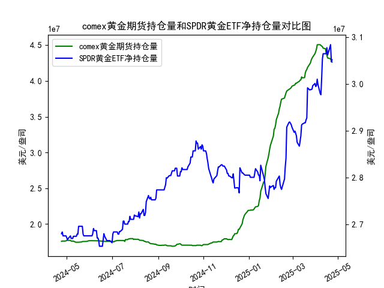

|            |   comex黄金期货持仓量 |   SPDR黄金ETF净持仓量 |
|:-----------|----------------------:|----------------------:|
| 2025-03-26 |           4.29362e+07 |           2.98798e+07 |
| 2025-03-27 |           4.31683e+07 |           2.98891e+07 |
| 2025-03-28 |           4.33476e+07 |           2.99628e+07 |
| 2025-03-31 |           4.38069e+07 |           3.0009e+07  |
| 2025-04-01 |           4.41117e+07 |           2.99444e+07 |
| 2025-04-02 |           4.4464e+07  |           2.99628e+07 |
| 2025-04-03 |           4.50467e+07 |           3.01012e+07 |
| 2025-04-04 |           4.50717e+07 |           2.99905e+07 |
| 2025-04-07 |           4.50642e+07 |           2.97969e+07 |
| 2025-04-08 |           4.49537e+07 |           2.97692e+07 |
| 2025-04-09 |           4.4872e+07  |           3.01284e+07 |
| 2025-04-10 |           4.47928e+07 |           3.05341e+07 |
| 2025-04-11 |           4.4576e+07  |           3.06448e+07 |
| 2025-04-14 |           4.45116e+07 |           3.06448e+07 |
| 2025-04-15 |           4.40124e+07 |           3.06448e+07 |
| 2025-04-16 |           4.36175e+07 |           3.07739e+07 |
| 2025-04-17 |           4.32097e+07 |           3.06171e+07 |
| 2025-04-21 |           4.30949e+07 |           3.08384e+07 |
| 2025-04-22 |           4.28033e+07 |           3.04696e+07 |
| 2025-04-23 |           4.26341e+07 |           3.05157e+07 |

### 1. MSCI新兴市场指数和铜价相关性及影响逻辑

#### 相关性
MSCI新兴市场指数与铜价通常呈现**正相关性**。这种关系源于新兴市场经济增长对工业金属（如铜）的需求依赖，以及铜价对全球经济周期的敏感性。

#### 影响逻辑
1. **经济周期驱动**：
   - **新兴市场增长**：新兴市场国家（如中国、印度、巴西）是铜的主要消费国，其工业化、基建投资和制造业活动直接影响铜的需求。当MSCI新兴市场指数上涨时，通常反映这些国家经济扩张，推动铜价上行。
   - **铜的工业属性**：铜被称为“经济晴雨表”，其价格与全球制造业PMI、工业生产数据高度相关。新兴市场的经济增长会直接拉动铜的消费。

2. **金融市场联动**：
   - **风险偏好**：MSCI新兴市场指数上涨往往伴随风险偏好上升，资金流向高风险资产（如股票和大宗商品），铜作为周期性商品同步受益。
   - **美元汇率**：铜以美元计价，当美元走弱时，新兴市场货币相对升值，降低进口成本，刺激需求，同时推高铜价和股市。

3. **供应链与政策因素**：
   - **新兴市场供给端**：部分新兴市场国家（如智利、秘鲁）是铜的主要生产国，其政策变动（如矿业税、环保限制）或供应中断会影响铜价，进而传导至股市。
   - **中国因素**：中国占全球铜消费的50%以上，其经济政策（如基建刺激、房地产调控）会同时影响MSCI新兴市场指数和铜价。

---

### 2. 近期投资或套利机会与策略

#### 数据分析
- **COMEX黄金期货持仓量**：近一年持仓量从约1750万盎司波动上升至4400万盎司以上，近期高位震荡，显示市场对黄金的配置需求强劲。
- **SPDR黄金ETF净持仓量**：从约2680万盎司逐步增至3000万盎司以上，近期持仓稳定，反映长期资金对黄金的避险需求。

#### 潜在机会
1. **黄金多头策略**：
   - **逻辑**：COMEX持仓量持续高位叠加SPDR ETF持仓稳定，表明机构与散户对黄金的看涨情绪。地缘政治风险（如俄乌冲突、中东局势）和美联储降息预期可能进一步推升金价。
   - **操作**：逢低买入黄金期货或ETF，目标看向历史高位（如2400美元/盎司以上）。

2. **期现套利**：
   - **逻辑**：若COMEX期货价格显著高于现货（正基差），可做空期货同时买入现货黄金（或ETF）锁定价差。
   - **风险**：需关注仓储成本和利率变动对套利空间的影响。

3. **跨品种对冲**：
   - **逻辑**：若铜价因新兴市场疲软（如中国需求放缓）而承压，可做空铜期货的同时做多黄金，对冲经济下行风险。
   - **验证指标**：关注中国PMI数据和MSCI新兴市场指数走势。

4. **波动率交易**：
   - **逻辑**：黄金价格近期波动加大，可卖出期权（如宽跨式组合）赚取权利金，但需警惕黑天鹅事件冲击。

#### 风险提示
- **美联储政策**：若通胀反弹导致降息预期落空，可能压制金价。
- **美元走势**：美元走强可能对黄金构成短期压力。
- **持仓集中度**：COMEX持仓量高位若出现多头平仓，可能引发价格回调。

---

### 总结
MSCI新兴市场指数与铜价的正相关性主要由新兴市场的经济周期和工业需求驱动。近期黄金市场的持仓数据显示看涨情绪浓厚，结合宏观环境的不确定性，可重点关注黄金的多头策略和期现套利机会，同时需密切关注美联储政策及美元走势的扰动。