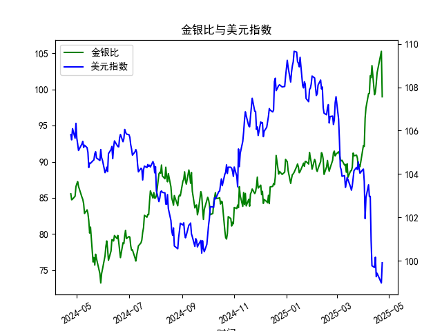

|            |    金价 |   银价 |   美元指数 |   金银比 |
|:-----------|--------:|-------:|-----------:|---------:|
| 2025-03-25 | 3025.2  | 33.435 |   104.21   |  90.48   |
| 2025-03-26 | 3013.25 | 33.76  |   104.559  |  89.255  |
| 2025-03-27 | 3056.55 | 34.11  |   104.26   |  89.6086 |
| 2025-03-28 | 3071.6  | 34.395 |   104.034  |  89.3037 |
| 2025-03-31 | 3115.1  | 34.055 |   104.192  |  91.4726 |
| 2025-04-01 | 3133.7  | 33.97  |   104.226  |  92.249  |
| 2025-04-02 | 3119.75 | 33.87  |   103.661  |  92.1095 |
| 2025-04-03 | 3118.1  | 32.475 |   101.945  |  96.0154 |
| 2025-04-04 | 3054.5  | 31.34  |   102.919  |  97.4633 |
| 2025-04-07 | 3014.75 | 30.325 |   103.501  |  99.4147 |
| 2025-04-08 | 3015.4  | 30.315 |   102.956  |  99.4689 |
| 2025-04-09 | 3075.5  | 30.18  |   102.971  | 101.905  |
| 2025-04-10 | 3143.15 | 30.925 |   100.937  | 101.638  |
| 2025-04-11 | 3230.5  | 31.27  |    99.769  | 103.31   |
| 2025-04-14 | 3204.2  | 32.275 |    99.692  |  99.2781 |
| 2025-04-15 | 3219.6  | 32.31  |   100.167  |  99.6472 |
| 2025-04-16 | 3322.9  | 32.955 |    99.2667 | 100.831  |
| 2025-04-17 | 3305.65 | 32.31  |    99.424  | 102.31   |
| 2025-04-22 | 3433.55 | 32.61  |    98.9757 | 105.291  |
| 2025-04-23 | 3262.95 | 32.96  |    99.9096 |  98.9973 |

### 1. 金银比与美元指数的相关性及影响逻辑

#### （1）相关性分析
从近1年数据来看，**金银比与美元指数整体呈现正相关性**，但阶段性波动中可能因市场情绪分化而出现背离。具体表现为：
- **美元走强时**，金银比倾向于扩大（如美元指数从103升至109时，金银比从85攀升至105以上）。
- **美元走弱时**，金银比可能收窄（如美元指数从109回落至99时，金银比从105跌至98.9）。

#### （2）影响逻辑
- **美元作为计价货币的传导效应**：  
  黄金和白银以美元计价，美元走强会压制两者价格。但白银因工业属性更强，在美元上涨周期中受需求抑制更明显，导致**白银跌幅大于黄金**，推高金银比。
  
- **避险与风险情绪的博弈**：  
  - 当市场避险情绪升温（如地缘冲突或经济衰退预期），黄金的避险属性优于白银，资金流入黄金推高金银比，同时美元作为避险资产同步走强，形成正相关。  
  - 当风险偏好回升（如经济复苏预期），白银的工业需求改善可能跑赢黄金，压低金银比，而此时美元可能因宽松政策预期走弱，二者负相关。

- **利率与通胀预期的联动**：  
  美联储加息周期中，美元走强且实际利率上升，对无息资产黄金的压制更直接，而白银因兼具工业品属性可能受供应链或新能源需求支撑，导致金银比波动复杂化。

---

### 2. 近期投资或套利机会与策略

#### （1）当前市场信号
- **金银比处于历史高位**：当前金银比接近105（历史均值约70-80），表明黄金相对白银估值偏高，存在均值回归可能。
- **美元指数短期回调**：美元指数从114高点回落至103附近，若美联储加息放缓预期升温，美元可能继续走弱，利好贵金属。

#### （2）潜在机会与策略
- **做空金银比（买入白银/卖出黄金）**：  
  - **逻辑**：高金银比隐含白银低估，若美元走弱与经济复苏预期共振，白银的工业需求弹性（如光伏、新能源）可能推动其跑赢黄金。  
  - **操作**：通过期货或ETF同步做多白银、做空黄金，或直接交易金银比价衍生品。

- **美元下行周期中的贵金属多头**：  
  - **逻辑**：美元走弱减轻贵金属计价压力，黄金和白银均受益，但白银弹性更大。  
  - **操作**：优先配置白银期货或ETF，辅以黄金对冲尾部风险。

- **跨市场套利（商品与汇率联动）**：  
  - **逻辑**：若美元指数与金银比背离（如美元反弹但金银比未同步上升），可做多白银并做空美元指数相关资产（如美元指数期货）。  
  - **风控**：需监控美联储政策信号及宏观经济数据（如非农就业、CPI）。

#### （3）风险提示
- **流动性冲击**：美联储政策超预期鹰派可能引发美元反弹，打压贵金属价格。
- **需求端扰动**：白银工业需求若不及预期（如新能源产业增速放缓），可能导致套利策略失效。
- **地缘风险**：突发性事件可能打破金银比与美元指数的常规联动关系，需动态调整头寸。