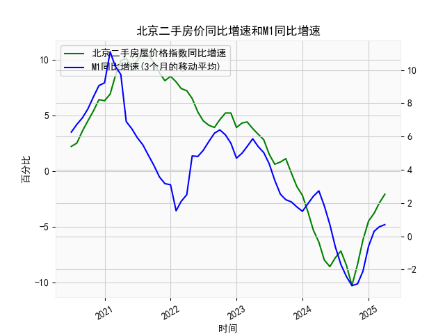

|            |   北京二手房屋价格指数同比增速 |   M1同比增速 |   M1同比增速(3个月的移动平均) |
|:-----------|-------------------------------:|-------------:|------------------------------:|
| 2023-08-31 |                            0.8 |          2.2 |                      2.53333  |
| 2023-09-30 |                            1.1 |          2.1 |                      2.2      |
| 2023-10-31 |                           -0.2 |          1.9 |                      2.06667  |
| 2023-11-30 |                           -1.4 |          1.3 |                      1.76667  |
| 2023-12-31 |                           -2.2 |          1.3 |                      1.5      |
| 2024-01-31 |                           -3.7 |          3.3 |                      1.96667  |
| 2024-02-29 |                           -5.3 |          2.6 |                      2.4      |
| 2024-03-31 |                           -6.4 |          2.3 |                      2.73333  |
| 2024-04-30 |                           -8   |          0.6 |                      1.83333  |
| 2024-05-31 |                           -8.6 |         -0.8 |                      0.7      |
| 2024-06-30 |                           -7.8 |         -1.7 |                     -0.633333 |
| 2024-07-31 |                           -7.2 |         -2.6 |                     -1.7      |
| 2024-08-31 |                           -8.5 |         -3   |                     -2.43333  |
| 2024-09-30 |                          -10.3 |         -3.3 |                     -2.96667  |
| 2024-10-31 |                           -8.4 |         -2.3 |                     -2.86667  |
| 2024-11-30 |                           -6.2 |         -0.7 |                     -2.1      |
| 2024-12-31 |                           -4.5 |          1.2 |                     -0.6      |
| 2025-01-31 |                           -3.8 |          0.4 |                      0.3      |
| 2025-02-28 |                           -2.9 |          0.1 |                      0.566667 |
| 2025-03-31 |                           -2.1 |          1.6 |                      0.7      |

### 1. 北京二手房屋价格指数同比增速与M1同比增速的相关性及影响逻辑

#### （1）相关性分析
从数据趋势来看，**北京二手房价同比增速与M1同比增速呈现显著的正相关性**。具体表现为：
- **同步性**：M1增速上升时，二手房价增速通常同步走高（例如前20个月M1增速从6.2%升至11.1%，二手房价增速从2.2%升至9.9%）；M1增速下降时，二手房价增速也随之下行（例如后30个月M1增速从5.8%降至-2.9%，二手房价增速从9.3%降至-10.3%）。
- **滞后效应**：M1增速的拐点往往领先二手房价增速1-3个月，表明货币供应变化对房价的影响存在传导时滞。

#### （2）影响逻辑
- **流动性驱动**：M1反映企业和居民的短期流动性资金。M1增速上升时，市场流动性充裕，购房者贷款能力增强，开发商融资成本降低，推动购房需求和房价上涨。
- **预期传导**：M1增速扩张释放货币政策宽松信号，市场对通胀和资产价格上涨的预期升温，资金加速流入房地产市场。
- **政策联动**：M1增速常受货币政策（如降准、降息）影响，而房地产政策（如限购、信贷支持）也会通过改变M1结构间接作用于房价。

---

### 2. 近期投资或套利机会与策略

#### （1）趋势性机会
- **触底反弹预期**：当前M1增速已从-2.9%（低点）回升至0.7%，而二手房价增速仍处于-2.1%的低位。若M1持续回升，房价可能滞后修复，可关注**超跌核心区域二手房**的左侧布局机会。
- **政策套利**：近期央行可能通过宽松政策（如降息）进一步推升M1增速，可提前布局**房地产ETF**或**头部房企债券**，博弈政策催化下的估值修复。

#### （2）结构性机会
- **区域分化**：北京核心区（如西城、海淀）房价抗跌性强，若M1回升带动市场情绪，这些区域可能率先反弹，可优先关注**学区房**或**地铁沿线房源**。
- **租赁替代**：当前二手房价低迷但租金稳定，可通过**“买租”策略**（低价购入房产并出租）获取现金流，等待房价回升后出售。

#### （3）风险提示
- **政策不确定性**：房地产调控政策可能压制M1对房价的传导效果。
- **流动性陷阱**：若M1回升未有效刺激信贷需求，房价可能持续低迷。
- **时滞风险**：M1增速向房价的传导周期可能长于预期，需控制仓位和资金成本。

---

### 总结
北京二手房价与M1增速高度联动，当前M1触底回升为房价修复提供流动性基础。建议结合政策信号和区域分化特征，优先布局超跌核心资产，并通过租赁策略降低持有成本。需密切关注货币政策动向和房地产调控细则，动态调整策略。