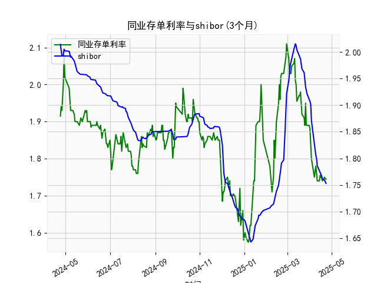

|            |   同业存单利率(3个月) |   shibor(3个月) |
|:-----------|----------------------:|----------------:|
| 2025-03-26 |                 1.95  |           1.934 |
| 2025-03-27 |                 1.89  |           1.924 |
| 2025-03-28 |                 1.89  |           1.921 |
| 2025-03-31 |                 1.89  |           1.912 |
| 2025-04-01 |                 1.88  |           1.907 |
| 2025-04-02 |                 1.85  |           1.902 |
| 2025-04-03 |                 1.8   |           1.871 |
| 2025-04-07 |                 1.75  |           1.824 |
| 2025-04-08 |                 1.77  |           1.81  |
| 2025-04-09 |                 1.78  |           1.806 |
| 2025-04-10 |                 1.76  |           1.8   |
| 2025-04-11 |                 1.74  |           1.786 |
| 2025-04-14 |                 1.74  |           1.777 |
| 2025-04-15 |                 1.755 |           1.775 |
| 2025-04-16 |                 1.75  |           1.772 |
| 2025-04-17 |                 1.75  |           1.767 |
| 2025-04-18 |                 1.74  |           1.761 |
| 2025-04-21 |                 1.75  |           1.759 |
| 2025-04-22 |                 1.745 |           1.755 |
| 2025-04-23 |                 1.745 |           1.753 |

### 1. 同业存单利率与SHIBOR的相关性及影响逻辑

#### （1）基本定义
- **同业存单利率**：是银行在银行间市场发行的固定利率同业存单的到期收益率，反映银行通过发行同业存单融资的成本。AAA级同业存单代表信用等级最高，风险溢价较低。
- **SHIBOR（上海银行间同业拆放利率）**：是银行间无抵押短期资金借贷的基准利率，反映银行体系的流动性状况和资金成本。

#### （2）相关性分析
同业存单利率与SHIBOR通常呈现**高度正相关性**，原因如下：
- **共同影响因素**：两者均受市场流动性、货币政策（如MLF利率、逆回购操作）、银行体系资金供需等因素驱动。例如：
  - **市场流动性紧张**时，SHIBOR上升，银行发行同业存单的融资成本（同业存单利率）也会同步上升。
  - **央行降准或释放流动性**时，两者均可能下行。
- **定价逻辑关联**：SHIBOR是银行间短期资金成本的基准，而同业存单利率作为市场化融资工具，其定价会参考SHIBOR并叠加信用风险溢价（AAA级溢价较低）。

#### （3）影响逻辑的分化
尽管两者高度相关，但在特定情况下可能出现**短期背离**：
- **信用风险事件**：若市场对某类银行的信用风险担忧上升（如中小银行流动性压力），同业存单利率可能因风险溢价上升而高于SHIBOR。
- **政策干预**：央行通过定向工具调节流动性时，可能对SHIBOR影响更直接，而同业存单利率反应滞后。
- **市场预期分化**：例如市场预期未来资金面趋紧，SHIBOR可能快速上行，而同业存单利率可能因发行期限较长（如3个月）而反应较慢。

---

### 2. 近期投资或套利机会及策略分析

#### （1）数据观察
从提供的数据看：
- **同业存单利率波动更大**：最低至1.575%，最高至2.11%，振幅显著高于SHIBOR（最低1.645%，最高2.015%）。
- **利差变化**：两者利差（同业存单利率 - SHIBOR）在某些时段扩大（如同业存单利率短期快速下行时），可能隐含套利机会。

#### （2）潜在机会与策略
##### 机会1：利差套利
- **逻辑**：当同业存单利率显著低于SHIBOR时，可通过“买入同业存单 + 融入SHIBOR资金”锁定正利差。
- **操作示例**：
  - 若同业存单利率为1.8%，SHIBOR为1.85%，利差为-0.05%，无套利空间。
  - 若同业存单利率为1.7%，SHIBOR为1.85%，利差为-0.15%，可通过买入同业存单并融入SHIBOR资金赚取0.15%的利差（需考虑交易成本和期限匹配）。

##### 机会2：趋势性交易
- **逻辑**：若SHIBOR与同业存单利率均处于上升通道，可做空债券（利率上升导致债券价格下跌）；反之则做多。
- **当前数据提示**：同业存单利率近期从低点1.74%反弹至2.07%，SHIBOR同步上行，可能反映资金面趋紧，可关注短端利率债的做空机会。

##### 机会3：事件驱动策略
- **逻辑**：关注央行政策（如降准、MLF操作）或季节性流动性波动（如季末资金紧张），提前布局利率衍生品（如利率互换）。
- **示例**：若市场预期央行将降准，可提前做多同业存单（利率下行预期）。

#### （3）风险提示
- **流动性风险**：同业存单市场流动性可能弱于SHIBOR市场，需关注买卖价差和冲击成本。
- **政策风险**：货币政策转向或监管政策变化可能导致利率走势逆转。
- **信用风险**：尽管AAA级同业存单风险较低，但仍需关注发行银行的信用状况。

---

### 总结
同业存单利率与SHIBOR的联动性为投资者提供了套利和趋势交易的机会，但需结合市场流动性、政策预期和信用风险动态调整策略。近期可重点关注利差扩大时的套利窗口，以及资金面收紧趋势下的利率上行交易机会。