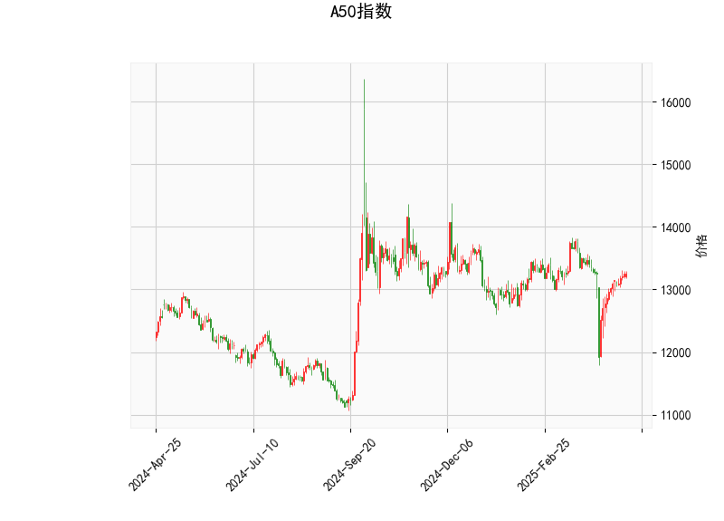

### 一、A50指数技术分析解读

#### 1. **RSI指标**  
当前RSI值为**53.88**，处于中性区间（50附近），表明市场多空力量暂时均衡，未出现明显超买（>70）或超卖（<30）信号，短期内可能延续震荡趋势。

#### 2. **MACD指标**  
- **MACD线**（-6.58）与**信号线**（-53.68）的负值差距较大，但**MACD柱状图**（47.1）为正值且显著放大，显示短期动能由空转多，可能形成“金叉”信号，需关注后续是否持续走强。

#### 3. **布林通道**  
- 当前价格（13,247）位于**中轨**（13,221.6）附近，略微高于中轨，但距离**上轨**（13,804.5）仍有4.2%的空间，距离**下轨**（12,638.7）有4.6%的潜在下行空间。  
- 价格贴近中轨表明市场处于方向选择阶段，若站稳中轨可能向上试探上轨，反之可能向下轨回落。

#### 4. **K线形态**  
- **CDLGAPSIDESIDEWHITE**：上下缺口并列的白色蜡烛，通常表示市场犹豫，需警惕短期波动。  
- **CDLSHORTLINE**：短实体线，反映价格波动收窄，可能进入盘整或反转前的蓄力阶段。

---

### 二、投资/套利机会与策略建议

#### 1. **短期波段交易**  
- **多头策略**：若价格站稳中轨（13,221.6）且MACD柱状图持续扩张，可轻仓做多，目标看向上轨（13,804.5），止损设在中轨下方（例如13,100）。  
- **空头策略**：若价格跌破中轨并伴随RSI回落至50以下，可试探性做空，目标看向下轨（12,638.7），止损设在13,250附近。

#### 2. **MACD动能套利**  
- 当前MACD柱状图快速走强，若确认金叉（MACD线上穿信号线），可结合成交量放大信号布局短期多头，利用动能延续性获利。

#### 3. **布林通道收敛突破**  
- 若价格在布林通道收窄后出现放量突破中轨，可跟随趋势方向（突破上轨追多，跌破下轨追空），捕捉波段行情。

#### 4. **风险提示**  
- **K线形态矛盾**：当前短实体线（CDLSHORTLINE）与缺口形态（CDLGAPSIDESIDEWHITE）显示市场分歧，需警惕假突破风险。  
- **宏观因素**：A50指数受中国政策及海外流动性影响较大，需结合基本面事件（如经济数据、美联储政策）综合判断。

---

**总结**：当前技术面偏向震荡，MACD动能修复可能支撑短期反弹，但需等待价格确认方向。建议以区间内高抛低吸为主，突破关键位后顺势操作，并严格设置止损。