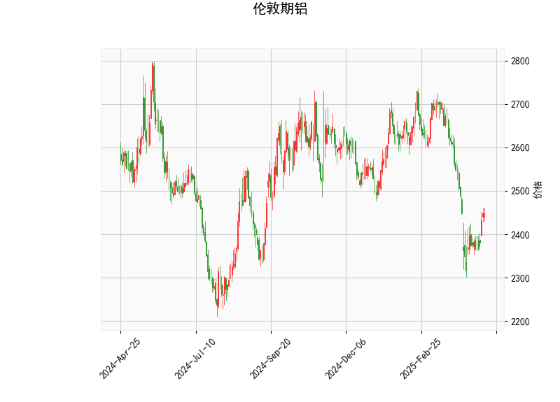

# 伦敦期铝技术分析与投资策略

## 一、技术指标分析

### 1. 价格与布林通道
- **当前价2449**：显著低于布林中轨（2565.25）且接近下轨（2315.95），表明价格处于短期弱势区间，但存在超卖可能。
- **布林带宽**：上下轨间距约500点（2814.56-2315.95），反映市场波动率较高，价格接近下轨可能触发反弹动能。

### 2. RSI指标
- **RSI 47.95**：中性区域（未超买或超卖），但较前期低点可能已出现背离，需结合其他指标确认方向信号。

### 3. MACD指标
- **MACD线（-41.85）上穿信号线（-57.43）**：形成金叉，柱状图（15.58）持续扩大，显示短期反弹动能增强。
- **绝对值仍为负值**：反映中长期趋势尚未逆转，当前属于下跌趋势中的修正行情。

### 4. K线形态
- **CDLGAPSIDESIDEWHITE（并列阴阳线）**：暗示多空力量均衡，可能延续震荡。
- **CDLSPINNINGTOP（纺锤线）**：显示市场犹豫不决，需警惕趋势反转风险。

---

## 二、投资机会与策略

### 1. 短期反弹机会
- **做多策略**：
  - **入场条件**：价格站稳下轨（2315）且MACD柱持续扩大。
  - **目标**：布林中轨2565（潜在6%空间）。
  - **止损**：有效跌破下轨（如2300下方）。

### 2. 趋势反转确认
- **突破中轨追多**：
  - **信号确认**：连续三日收盘价>2565，RSI突破55。
  - **目标**：上轨2814（潜在15%空间）。

### 3. 套利策略
- **跨期套利**：
  - 关注近远月合约价差：若近月超卖程度显著大于远月，可做多近月/做空远月。
- **波动率策略**：
  - 布林带收窄后突破时介入：当前带宽较大，可等待波动率收缩后布局突破行情。

### 4. 风险提示
- **下行风险**：若价格跌破下轨且MACD柱转弱，可能加速下跌至2200以下。
- **事件驱动**：需关注LME库存变化及中国电解铝产能政策扰动。

---

**结论**：当前市场处于超卖反弹窗口期，建议轻仓试多（止损严格），突破中轨可加仓；套利需结合跨期价差数据动态调整。